# Agent 设计模式与多 Agent 协作空间设计总结

> 本文整理 Agent 单体执行模式、多 Agent 交互模式，以及企业级 @Agent 协作空间设计。  
> 内容覆盖 ReAct、Loop Agent、Plan-and-Execute、Tool Use / Function Calling、Schema-driven Agent、Reflexion、RAG Agent、Skill-based Agent、Autonomous Agent、Orchestrator + Subagent、Supervisor、Parallel / Concurrent、Handoff、Group Chat、Swarm、Agent-as-Tool、Reducer / Aggregator、Judge / Evaluator、User Proxy / Human Proxy、Watcher / Safety Guard、Long-running Agent、@Agent 协作空间等模式，并结合 LangGraph、CrewAI、OpenAI Agents SDK、Google ADK、Microsoft Agent Framework、OpenClaw、AG2 / AutoGen 等框架进行对照。


---

## 0. Agent 设计模式总览

Agent 设计模式可以分成两大类：

1. **单 Agent 执行模式**：解决一个 Agent 内部如何思考、循环、调用工具、检索知识、结构化输出、反思修正。
2. **多 Agent 交互模式**：解决多个 Agent 之间如何分工、并行、协作、转交、辩论、汇总，以及如何与人类成员协同工作。
3. **平台治理与协作模式**：解决 Skills、权限审批、状态恢复、审计追踪、安全观察者、长期运行和企业协作空间等平台级问题。

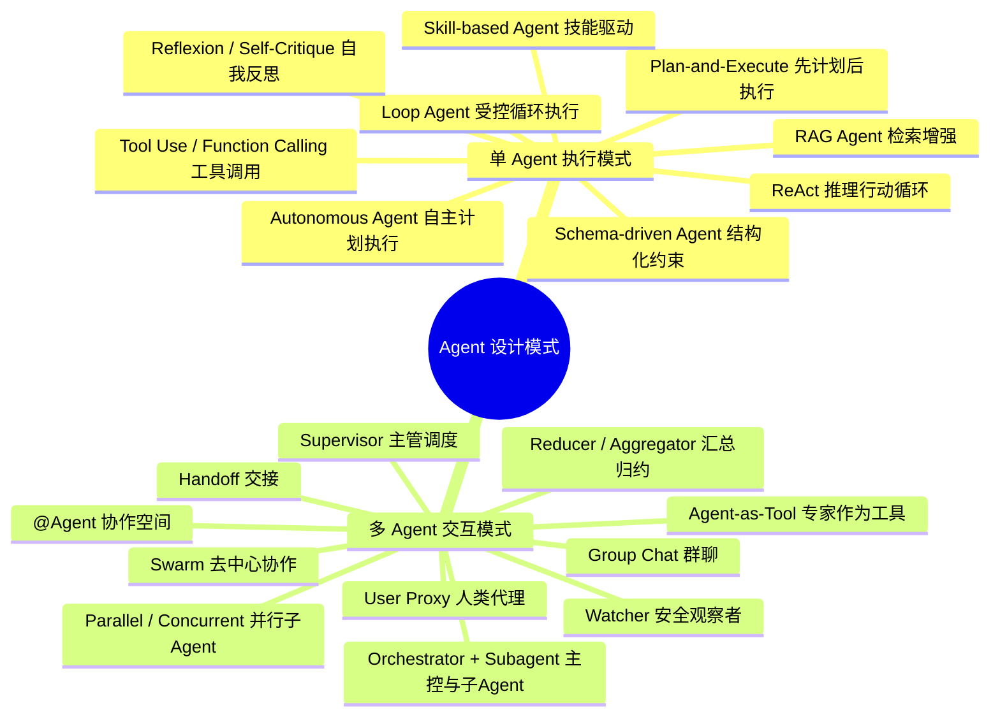

---

## 0.1 ReAct：推理 + 行动循环

ReAct 是 Agent 最经典的基础执行模式之一。  
它的核心是让模型不断循环执行：

```text
Thought → Action → Observation → Thought → Action → Observation → Final Answer
```

也就是：

- Thought：模型先思考下一步应该做什么
- Action：调用工具、检索知识、执行代码或访问接口
- Observation：获得工具返回结果
- 再次 Thought：基于观察结果继续判断
- 直到得到 Final Answer

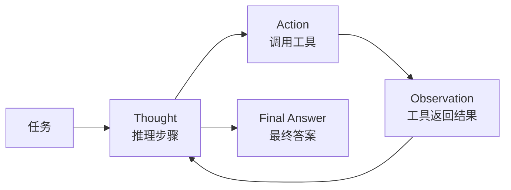

适合场景：

- 需要边想边查的问题
- 多工具调用
- 数据查询
- 简单自动化任务
- 问答 + 工具结合的 Agent

优点：

- 简单通用
- 适合工具调用
- 推理链路比较自然

缺点：

- 容易陷入过多循环
- 长任务规划能力弱
- 对复杂项目型任务不如 Plan-and-Execute 稳定

在启元 AI 平台中的定位：

> ReAct 可以作为单个 Agent 的基础执行策略，适合知识问答、工具调用、简单业务查询等场景。

---

## 0.1.1 Loop Agent：受控循环执行模式

Loop Agent 是对 ReAct 循环的工程化增强。  
它不是简单地让模型无限循环，而是在平台约束下持续执行：计划、动作、观察、评估、继续或停止。

```text
Plan / Think → Action → Observation → Evaluate → Continue / Finish
```

与 ReAct 相比，Loop Agent 更强调运行边界：

- 最大循环次数
- 最大工具调用次数
- 最大 RAG 检索轮数
- 最大执行时间
- 连续失败次数
- 是否需要人工审批
- 是否达到业务完成条件

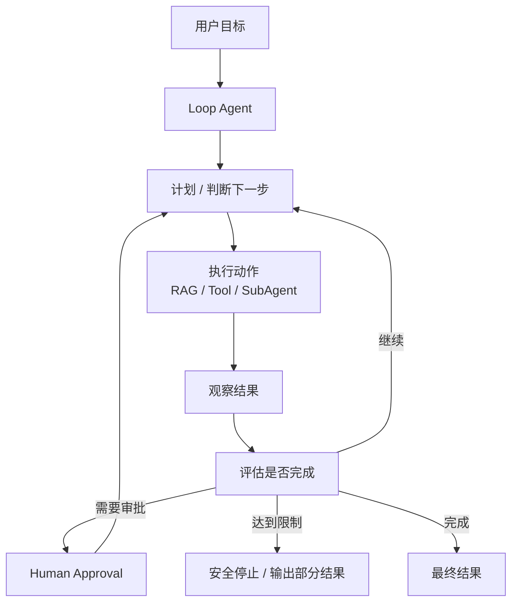

适合场景：

- 自主 RAG：一轮查不到，自动换关键词继续检索
- 工具调用：根据工具结果继续判断下一步
- 代码开发：修改、测试、修复、再测试
- 复杂报告：检索、分析、补充资料、汇总输出
- 方案审查：发现证据不足时继续检索规范或调用规则工具

优点：

- 具备较强自主性
- 能根据中间结果持续调整动作
- 适合复杂目标驱动任务
- 可与权限、审批、审计、状态恢复结合

缺点：

- 如果没有边界控制，容易无限循环
- 成本和耗时不可控
- 需要 Evaluator、Policy、Trace 等平台能力支撑

在启元 AI 平台中的定位：

> Loop Agent 是自主 Agent 的基础运行机制。平台应将其设计为“受控循环”，通过 max_iterations、max_tool_calls、max_rag_rounds、stop_conditions 等策略控制执行边界。

## 0.2 Plan-and-Execute：先计划后执行

Plan-and-Execute 是比 ReAct 更适合复杂任务的执行模式。  
它先由 Planner 生成整体计划，再由 Executor 按步骤执行，必要时由 Re-Planner 根据结果修正计划。

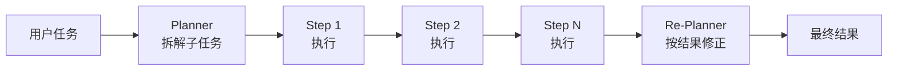

适合场景：

- 编程 Agent
- 复杂报告生成
- 多步骤业务办理
- 施工方案审查
- 长流程任务执行
- 自动化办公

优点：

- 更适合复杂任务
- 步骤清晰
- 便于审计和恢复
- 便于人工介入

缺点：

- 初始计划可能不准确
- 需要 Re-Planner 机制
- 状态管理比 ReAct 更复杂

在启元 AI 平台中的定位：

> Plan-and-Execute 适合作为复杂任务、工作流编排、代码开发 Agent、政务事项办理等场景的核心执行模式。

---

## 0.3 Tool Use / Function Calling：工具调用模式

Tool Use / Function Calling 是现代 Agent 的基础能力。  
Agent 不只是生成文本，而是可以根据任务需要调用外部工具、API、数据库、代码执行器、浏览器、MCP 工具等。

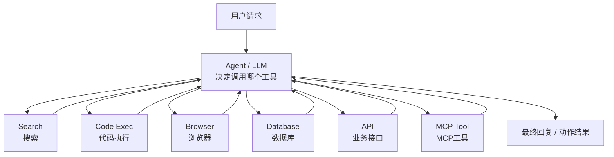

适合场景：

- 查询数据库
- 调用业务接口
- 文件处理
- 代码执行
- 联网搜索
- MCP 工具调用
- 企业系统集成

优点：

- 能把 LLM 和真实业务系统连接起来
- 是 Agent 落地的基础
- 便于封装企业内部能力

缺点：

- 工具权限和安全风险高
- 工具描述质量直接影响调用效果
- 需要参数校验、结果校验、审批和审计

在启元 AI 平台中的定位：

> Tool Use / Function Calling 是平台的底座能力，应该和权限控制、工具审批、审计日志、沙箱执行结合设计。

---

## 0.3.1 Schema-driven Agent：结构化输出与约束模式

Schema-driven Agent 强调：Agent 的关键中间结果和最终输出都应尽量结构化，而不是只输出自然语言。  
这类模式常用于计划生成、工具参数、RAG 证据包、审批请求、报告输出等环节。

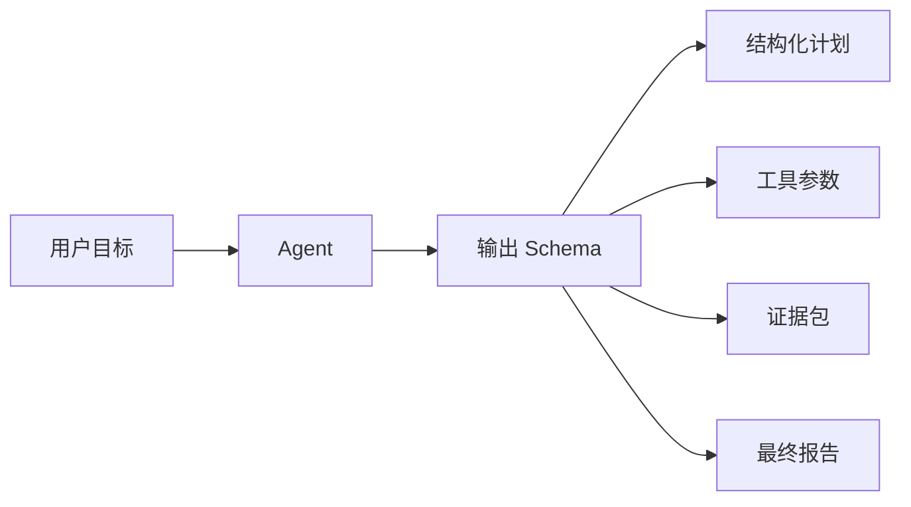

典型结构化对象包括：

| 对象 | 示例 |
|---|---|
| Plan Schema | steps、dependencies、required_tools、risk_level |
| Tool Call Schema | tool_name、arguments、reason、risk_level |
| Evidence Schema | source、content、score、citation、gap |
| Approval Schema | action、impact、requires_approval、approver |
| Final Output Schema | conclusion、evidence、suggestions、confidence |

适合场景：

- 工具调用参数生成
- 自主任务规划
- RAG 检索证据汇总
- 审批请求生成
- 审查报告、分析报告、整改建议输出

优点：

- 便于程序解析
- 便于权限和规则校验
- 便于审计和回放
- 降低模型随意输出带来的不稳定性

缺点：

- Schema 设计需要抽象能力
- 过强约束可能降低模型灵活性
- 不同业务需要不同输出结构

在启元 AI 平台中的定位：

> Schema-driven Agent 应作为工具调用、规划、审批、证据包和最终输出的基础约束方式。Agent 可以自主决策，但关键动作必须结构化，便于平台做权限、审批、审计和结果校验。

## 0.4 Reflexion / Self-Critique：自我反思与修正

Reflexion / Self-Critique 是让 Agent 对自己的输出进行评估和修正。  
可以由同一个 Agent 自评，也可以由独立 Evaluator / Critic Agent 评审。

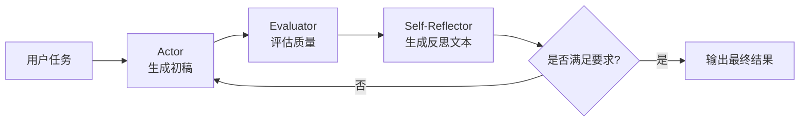

适合场景：

- 文档生成
- 代码审查
- 政策判断
- 施工方案审查
- 高质量问答
- 风险敏感场景

优点：

- 能提升结果质量
- 能减少明显错误
- 适合重要输出前的质量门禁

缺点：

- 增加 token 成本
- 增加执行时间
- 评审 Agent 也可能判断错误
- 需要明确评价标准

在启元 AI 平台中的定位：

> Reflexion 适合作为可选质量增强策略，用于重要答复、代码生成、审查类任务和需要高可靠性的业务场景。

---

## 0.5 RAG Agent：检索增强 Agent

RAG Agent 是结合知识库检索和 LLM 生成的 Agent。  
它不只依赖模型自身知识，而是先检索企业知识库、文档、数据库或向量库，再基于检索结果生成答案。

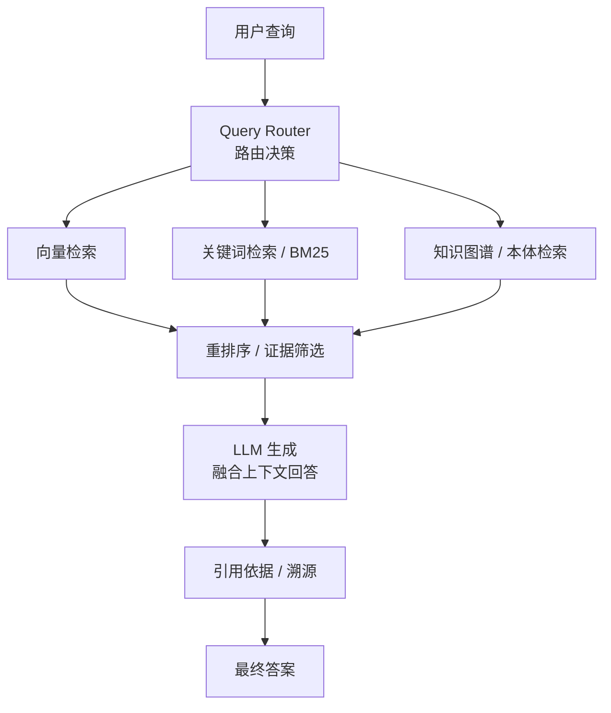

适合场景：

- 企业知识库问答
- 政策问答
- 制度问答
- 施工规范审查
- 合同 / 文档问答
- 专业知识助手

优点：

- 可基于企业私有知识回答
- 可提供引用依据
- 可降低纯模型幻觉
- 便于知识更新

缺点：

- 检索质量决定最终效果
- Chunk 切分、召回、重排序很关键
- 对复杂事实推理仍需结构化知识或规则支持
- 多轮上下文与上一轮引用需要额外管理

在启元 AI 平台中的定位：

> RAG Agent 是启元 AI 的基础核心能力之一。建议采用“向量检索 + 关键词检索 + 可选知识图谱 / 本体检索 + 引用溯源”的混合检索架构。

---

## 0.6 Multi-Agent：Orchestrator + Subagent

Orchestrator + Subagent 是多 Agent 编排的基础结构。  
一个主控编排器负责分配任务、调用子 Agent、汇总结果。

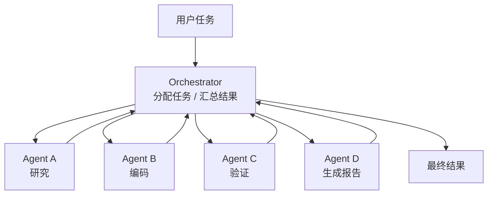

适合场景：

- 多角色协作
- 代码开发
- 报告生成
- 企业复杂任务
- 需要多个专业 Agent 协作的业务

优点：

- 分工明确
- 主控可管理
- 结果容易汇总
- 适合企业级审计和权限控制

缺点：

- Orchestrator 设计难度高
- 子 Agent 之间依赖关系需要管理
- 如果所有任务都走主控，可能产生瓶颈

在启元 AI 平台中的定位：

> Orchestrator + Subagent 是启元 AI 多 Agent 编排的核心骨架，可以进一步扩展为 Supervisor、Hierarchical、Agent-as-Tool、@Agent 协作空间等模式。


---

## 0.7 Skill-based Agent：技能驱动模式

Skill-based Agent 是通用 Agent 平台的重要抽象。  
它不是把 Agent 固定成某个流程，而是把一类可复用能力封装成 Skill，由 Agent 根据目标选择、组合和执行。

```text
Skill = Instructions + Tools + Knowledge + Policy + Output Schema + Runtime Strategy
```

例如：

- 自主 RAG Skill
- 文档解析 Skill
- 合同风险识别 Skill
- 施工方案审查 Skill
- 设备故障分析 Skill
- 报告生成 Skill
- 代码修改 Skill
- 工具调用审批 Skill

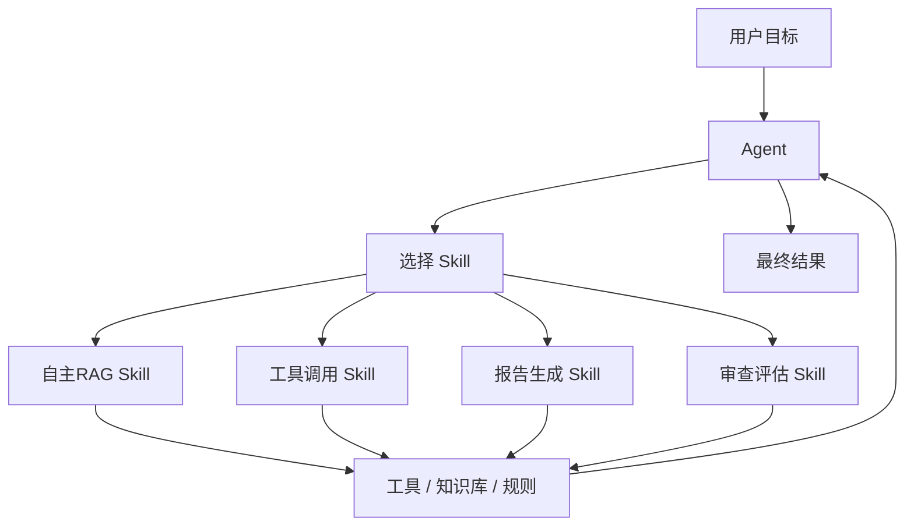

Skill 建议包含以下内容：

| 配置项 | 说明 |
|---|---|
| instructions | 该 Skill 的任务方法、角色要求和执行原则 |
| tools | Skill 可以使用的工具列表 |
| knowledge_bases | Skill 可访问的知识库或本体范围 |
| planning_rules | Skill 级规划规则，例如必须先检索再判断 |
| tool_policy | 工具调用权限、审批策略、风险等级 |
| output_schema | Skill 的结构化输出格式 |
| stop_conditions | Skill 的停止条件 |
| runtime_policy | 最大轮次、最大工具调用、是否允许子 Agent |

适合场景：

- 平台内置能力复用
- 行业 Agent 模板
- 客户级 Agent 配置
- 复杂任务按能力组合执行
- 类 Claude Code / OpenClaw 的技能扩展机制

优点：

- 平台通用性强
- 业务能力可复用
- 便于权限、审计和版本管理
- 适合 Agent 市场 / Skill 市场

缺点：

- Skill 标准需要平台统一设计
- Skill 之间的依赖、冲突和权限需要治理
- 过多 Skill 可能增加路由和选择难度

在启元 AI 平台中的定位：

> Skill 应该作为平台一级对象。Agent 不是直接绑定固定流程，而是根据目标选择合适 Skill，并在 Skill 的工具、知识库、规划规则、审批策略和停止条件约束下自主执行。

## 1. 多 Agent 交互模式总览

前面几类属于单 Agent 内部执行模式。本章开始进入多 Agent 交互模式。  
多 Agent 交互不只是“多个角色聊天”，更准确地说，它是一组可组合的交互设计模式。

| 模式 | 核心思想 | 典型框架 | 适合场景 |
|---|---|---|---|
| Sequential 顺序流水线 | Agent A → Agent B → Agent C，按固定顺序处理 | CrewAI、AG2、LangGraph、Google ADK、Microsoft Agent Framework | 文档处理、报告生成、固定流程 |
| Parallel / Concurrent 并行协作 | 多个 Agent 同时处理独立子任务，再汇总结果 | Google ADK、Microsoft Agent Framework、LangGraph | 多文档分析、多知识库检索、多专家评估 |
| Loop Agent 循环执行 | Agent 持续执行“动作-观察-评估”，直到满足停止条件 | Google ADK、LangGraph、OpenAI Agents SDK、自研 Runtime | 自主RAG、工具调用、代码开发、长任务 |
| Supervisor / Manager 主管调度 | 一个主 Agent 负责分派任务给专家 Agent | LangGraph、CrewAI、OpenAI Agents SDK、Microsoft Agent Framework | 企业问答、复杂任务分解、结果汇总 |
| Hierarchical 分层组织 | 多级主管：总控 → 小组主管 → 专家 Agent | LangGraph、CrewAI | 大型复杂任务、企业级 Agent 团队 |
| Group Chat 群聊协作 | 多个 Agent 在同一个对话空间中轮流发言 | AG2 / AutoGen | 头脑风暴、代码审查、方案讨论 |
| Debate / Critic 辩论评审 | 一个 Agent 生成，另一个 Agent 反驳或审查 | AG2、LangGraph、自定义实现 | 方案评审、代码审查、政策判断 |
| Handoff 交接 | 当前 Agent 判断自己不适合，转交给另一个 Agent | OpenAI Agents SDK、LangGraph Swarm | 客服分流、政务事项切换、多意图对话 |
| Swarm 去中心协作 | 没有固定主管，Agent 之间可互相转交 | LangGraph Swarm、AG2 | 灵活协作、低延迟、多专家自由流转 |
| Agent-as-Tool | 主 Agent 把其他 Agent 当工具调用 | OpenAI Agents SDK、LangGraph | 主控强、专家弱，最终答案由主 Agent 输出 |
| Router 路由模式 | 先判断任务类型，再选择对应 Agent | LangGraph、OpenAI Agents SDK、自研平台 | 多业务入口、政策问答、智能客服 |
| Planner-Executor 规划执行 | 规划 Agent 负责拆任务，执行 Agent 负责落地 | LangGraph、AutoGen、OpenAI Agents SDK | 编程、自动化办公、复杂流程执行 |
| Reflection 自反思模式 | Agent 生成后，再由自己或另一个 Agent 检查修正 | LangGraph、AG2、自定义 | 提高答案质量、减少幻觉 |
| Judge / Evaluator 裁判评估 | 根据评分标准判断结果是否通过、是否继续、是否停止 | LangGraph、Microsoft Agent Framework、Google ADK、自研平台 | 质量门禁、停止判断、自动验收 |
| Human-in-the-loop 人工介入 | Agent 遇到关键节点请求人工确认 | AG2、CrewAI、LangGraph、OpenAI SDK | 审批、发邮件、执行脚本、政务提交 |
| Blackboard 黑板模式 | 多个 Agent 读写共享状态 / 任务板 | LangGraph、自研平台 | 长流程、多轮协作、复杂状态管理 |
| Reducer / Aggregator 汇总归约 | 多个 Agent 的结果被统一去重、合并、冲突识别和总结 | LangGraph、Microsoft Agent Framework、自研平台 | 并行分析、群聊总结、多专家会审 |
| Event-driven 事件驱动 | 事件触发某个 Agent 或流程节点 | LangGraph、自研平台、AG2 Core | 企业工作流、异步任务、消息驱动系统 |
| Team / Crew 编队模式 | 预定义一组角色、任务、目标，作为一个团队运行 | CrewAI、AG2、LangGraph | 市场分析、投研、项目协作、内容生产 |
| Skill-based 技能驱动 | Agent 通过可复用 Skill 组合工具、知识库、规则和输出模板 | OpenClaw、Google ADK、DeepAgents、自研平台 | 通用 Agent 平台、行业能力复用 |
| User Proxy / Human Proxy 人类代理 | 由代理组件承接用户审批、补充信息和人工反馈 | AG2 / AutoGen、OpenAI Agents SDK、自研平台 | 审批、人工确认、人机协作 |
| Watcher / Safety Guard 安全观察者 | 独立观察 Agent 行为，拦截越权、危险动作和异常循环 | OpenClaw / ClawKeeper 思路、自研平台 | 企业安全、工具治理、长期自主 Agent |
| Long-running Agent 长周期 Agent | Agent 持续运行，响应事件、定时任务或长期目标 | OpenClaw、自研平台 | 监控预警、长期助手、事件订阅 |
| Agent Workspace 协作空间 | 人和 Agent 都作为成员，通过 @、消息、任务协作 | 自研平台 + LangGraph / AG2 / SDK 组合 | 企业级项目协作、边聊边办、多 Agent 工作空间 |
| Autonomous Agent 自主 Agent | 自主计划、调用工具或子 Agent、评估并重规划 | LangGraph、自研平台、OpenAI Agents SDK、AG2 | 复杂任务执行、代码开发、知识库构建、方案审查 |

---

## 2. 多 Agent 交互模式地图

```mermaid
flowchart TD
    A[用户请求] --> B{任务分发方式}

    B --> C[固定流程型]
    B --> D[中心调度型]
    B --> E[去中心协作型]
    B --> F[状态/事件驱动型]
    B --> W[协作空间型]

    C --> C1[Sequential 顺序流水线]
    C --> C2[Planner-Executor 规划-执行]
    C --> C3[Reflection 生成-反思-修正]
    C --> C4[Loop Agent 循环执行]

    D --> D1[Router 路由模式]
    D --> D2[Supervisor / Manager 主管调度]
    D --> D3[Hierarchical 分层组织]
    D --> D4[Agent-as-Tool 专家作为工具]
    D --> D5[Parallel / Concurrent 并行协作]
    D --> D6[Reducer / Aggregator 汇总归约]

    E --> E1[Group Chat 群聊协作]
    E --> E2[Debate / Critic 辩论评审]
    E --> E3[Handoff 交接]
    E --> E4[Swarm 去中心转交]

    F --> F1[Blackboard 共享状态]
    F --> F2[Event-driven 事件驱动]
    F --> F3[Human-in-the-loop 人工介入]
    F --> F4[Judge / Evaluator 裁判评估]
    F --> F5[Watcher / Safety Guard 安全观察]
    F --> F6[User Proxy 人类代理]

    W --> W1["人 @ Agent"]
    W --> W2["Agent @ Agent"]
    W --> W3["@所有 Agent"]
    W --> W4[共享上下文]
    W --> W5[任务派发与转派]
    W --> W6[Skill-based 能力组合]
    W --> W7[Long-running 长周期运行]
```

---

## 3. 关键模式详解

### 3.1 Sequential 顺序流水线

顺序流水线是最简单、最稳定的多 Agent 交互方式。  
它按照固定顺序依次执行，每个 Agent 处理自己的环节。

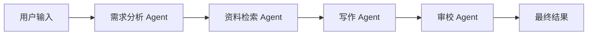

适合场景：

- 报告生成
- 政策问答
- 文档处理
- 施工方案初审
- 固定 SOP 流程

优点：

- 简单
- 稳定
- 好调试
- 容易做日志追踪

缺点：

- 灵活性一般
- 用户中途切换意图时不好处理
- 不适合复杂协作型任务

---

### 3.1.1 Parallel / Concurrent 多 Agent 并行模式

Parallel / Concurrent 模式用于把多个相互独立或弱依赖的子任务同时分发给多个 Agent 执行，再由主控 Agent 或 Reducer 汇总结果。

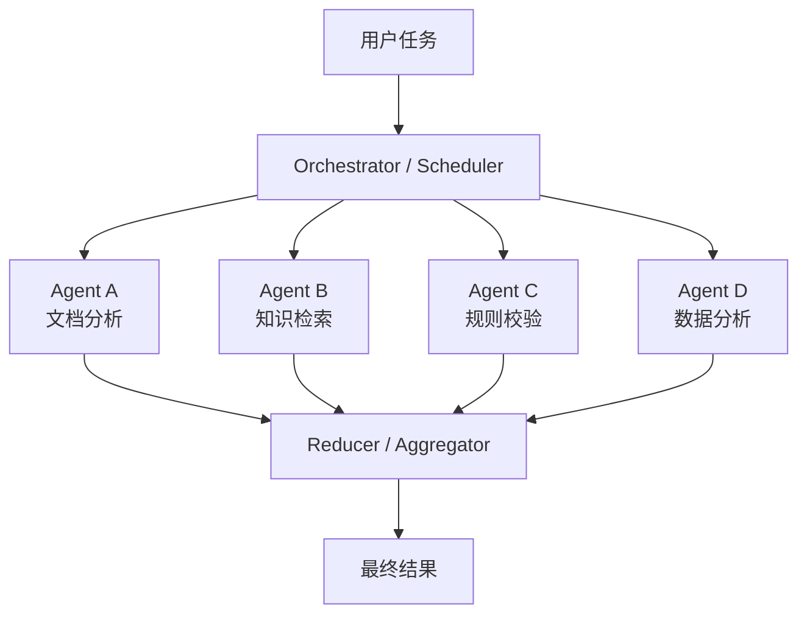

适合场景：

- 多个文档并行分析
- 多个知识库并行检索
- 多个关键词并行 RAG 查询
- 多个专家 Agent 分别评估同一个方案
- 多个子模块代码并行审查

优点：

- 提升长任务处理效率
- 适合多来源、多角度、多专家分析
- 与 @所有 Agent、Supervisor、Reducer 模式天然配套

缺点：

- Token 和工具成本更高
- 子 Agent 结果可能重复或冲突
- 需要并发上限、结果归约和冲突处理

在启元 AI 平台中的定位：

> Parallel / Concurrent 应作为多 Agent 高级调度能力。平台需要支持 max_parallel_agents、max_parallel_tasks、任务依赖关系、结果合并策略和异常隔离策略，避免 Agent 无限并行扩散。

### 3.2 Supervisor / Manager 主管调度模式

一个主控 Agent 负责理解任务、分派任务、收集结果、汇总回复。

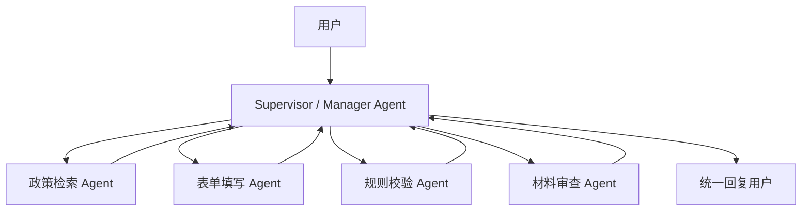

适合场景：

- 企业知识库问答
- 政务边聊边办
- 复杂任务分解
- 多工具调用
- 多 Agent 结果汇总

优点：

- 主控清晰
- 适合权限、审计、日志管理
- 适合企业级平台

缺点：

- Supervisor 容易成为瓶颈
- 所有任务都经过主控，可能增加延迟和成本
- 主控提示词和状态设计要求较高

---

### 3.3 Hierarchical 分层组织模式

分层组织是 Supervisor 模式的扩展。  
它不是一个主管管理所有 Agent，而是形成多级管理结构。

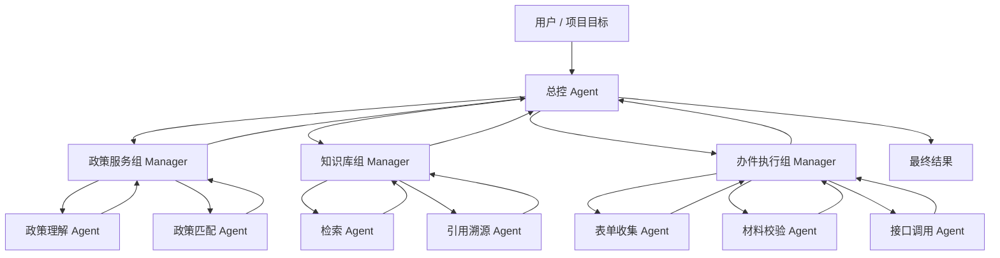

适合场景：

- 企业级 Agent 团队
- 大型项目空间
- 复杂业务流程
- 多部门协作
- 研发 Agent 平台

优点：

- 可扩展性强
- 接近真实组织结构
- 适合平台级能力设计

缺点：

- 状态管理复杂
- 调度链路长
- 需要任务追踪、权限控制和审计体系支撑

---

### 3.4 Group Chat 群聊协作模式

多个 Agent 在同一个对话空间中讨论，由群聊管理器控制发言顺序或收敛结论。

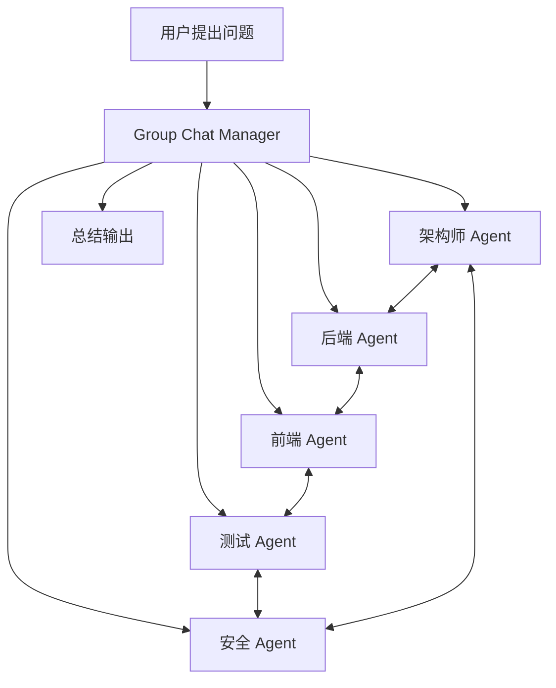

适合场景：

- 架构讨论
- 代码审查
- 方案评审
- 头脑风暴
- 多角色分析

优点：

- 多角度
- 类似真实团队讨论
- 容易模拟角色协作

缺点：

- 容易发散
- 成本高
- 不适合强流程业务
- 需要 Moderator 控场

---

### 3.5 Debate / Critic 辩论评审模式

一个 Agent 负责生成，另一个 Agent 负责审查、反驳、补充或纠错。

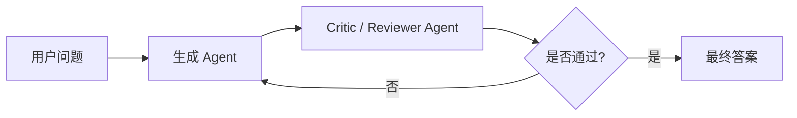

适合场景：

- 代码审查
- 政策合规判断
- 施工方案审查
- 重要文档生成
- 风险分析

优点：

- 提高答案质量
- 降低明显错误
- 适合高风险场景

缺点：

- 增加成本
- 增加响应时间
- Reviewer 本身也可能出错

---

### 3.5.1 Judge / Evaluator 裁判评估模式

Judge / Evaluator 模式强调用独立评估逻辑判断结果是否满足标准。  
它和 Critic 不完全一样：Critic 更偏指出问题和反驳，Evaluator 更偏按规则打分、验收、判断是否继续执行。

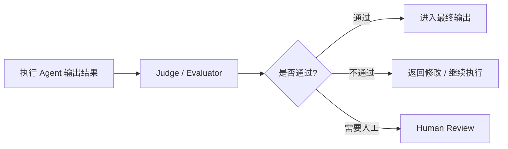

适合场景：

- Agent Loop 的停止判断
- RAG 证据是否充分判断
- 报告质量验收
- 代码测试结果评估
- 高风险业务输出前的质量门禁

优点：

- 能把“是否完成”从主 Agent 中拆出来
- 适合做质量门禁和自动验收
- 便于审计和可解释

缺点：

- 评估标准需要明确
- Evaluator 也可能误判
- 会增加模型调用成本和延迟

在启元 AI 平台中的定位：

> Judge / Evaluator 应作为自主 Agent 的关键节点，用于判断是否继续循环、是否触发人工确认、是否输出最终结论。对于重要场景，Evaluator 不应只靠大模型判断，还应结合规则、测试结果、引用证据和工具返回状态。

### 3.6 Handoff 交接模式

当前 Agent 判断任务不属于自己处理范围，于是把任务转交给另一个 Agent。

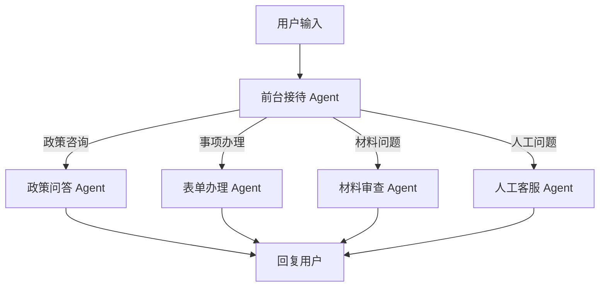

适合场景：

- 智能客服
- 政务事项切换
- 用户意图切换
- 多业务入口
- 边聊边办

对启元 AI 平台尤其重要。  
因为用户在同一个会话里可能一会儿咨询政策，一会儿填写表单，一会儿上传材料，一会儿又问另一个事项。

这种场景通常需要：

```text
Router + Handoff + State Manager
```

---

### 3.7 Swarm 去中心协作模式

Swarm 更像自由转交，没有固定中央主管。  
Agent 可以根据自己的判断把任务转给另一个 Agent。

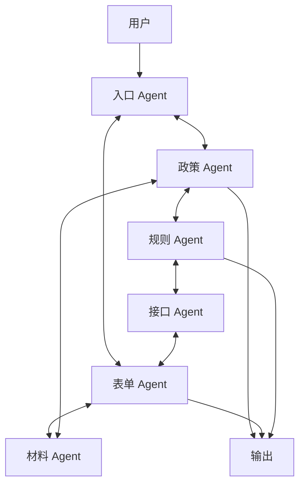

适合场景：

- 灵活问答
- 多专家咨询
- 复杂开放问题
- 动态任务流转

优点：

- 灵活
- 中心瓶颈少
- 适合探索式协作

缺点：

- 企业级管控困难
- 权限、审计、边界更难控制
- 容易产生不可预测路径

---

### 3.8 Agent-as-Tool 模式

主 Agent 不把控制权交出去，而是把其他 Agent 当成工具调用。

```mermaid
flowchart TD
    U[用户] --> M[主 Agent]

    M --> T1[调用: 检索 Agent 工具]
    M --> T2[调用: 校验 Agent 工具]
    M --> T3[调用: 写作 Agent 工具]

    T1 --> M
    T2 --> M
    T3 --> M

    M --> R[主 Agent 组织最终答案]
```

适合场景：

- 主控 Agent 需要保持最终决策权
- 专家 Agent 只提供局部能力
- 企业平台需要统一审计和权限控制

例如：

- 主 Agent 调用政策检索 Agent
- 主 Agent 调用条件判断 Agent
- 主 Agent 调用表单字段收集 Agent
- 主 Agent 调用材料校验 Agent

最终仍由主 Agent 组织回复。

---

### 3.9 Reducer / Aggregator 汇总归约模式

Reducer / Aggregator 用于处理多个 Agent 的输出，完成去重、合并、冲突识别和最终总结。  
它通常出现在 Parallel、Group Chat、@所有 Agent、Debate、Supervisor 等模式之后。

```mermaid
flowchart TD
    A[Agent A 输出] --> R[Reducer / Aggregator]
    B[Agent B 输出] --> R
    C[Agent C 输出] --> R
    D[Agent D 输出] --> R

    R --> X[去重]
    X --> Y[冲突识别]
    Y --> Z[证据合并]
    Z --> F[最终总结]
```

适合场景：

- @所有 Agent 后的统一总结
- 多专家并行评审后的结论归纳
- 多知识库检索结果合并
- 多个子 Agent 输出报告片段后的最终成稿

优点：

- 能减少重复和发散
- 能识别多 Agent 之间的分歧
- 能把多个局部结论整理成一个可交付结果

缺点：

- 汇总器如果设计不好，可能丢失关键少数意见
- 对证据、来源和冲突标记要求较高
- 多 Agent 输出格式最好结构化

在启元 AI 平台中的定位：

> Reducer / Aggregator 是并行 Agent 与协作空间的必要组件。平台应要求子 Agent 输出结构化结果，并由 Reducer 汇总为统一结论、分歧说明、证据清单和后续建议。

---

### 3.10 User Proxy / Human Proxy 人类代理模式

User Proxy / Human Proxy 用于把人类用户的审批、补充信息、反馈意见和接管操作转成 Agent Runtime 可处理的结构化事件。

```mermaid
sequenceDiagram
    participant A as Agent
    participant P as Human Proxy
    participant U as 用户

    A->>P: 需要审批高风险工具调用
    P->>U: 展示动作、参数、影响范围
    U->>P: 批准 / 拒绝 / 修改参数
    P->>A: 返回结构化审批结果
    A->>A: 恢复执行
```

适合场景：

- 工具调用审批
- 发邮件、发消息、提交表单前确认
- 用户补充资料
- 人工接管 Agent 任务
- 高风险动作二次确认

优点：

- 把 Human-in-the-loop 工程化
- 便于审计和恢复执行
- 便于统一处理用户输入、审批和拒绝

缺点：

- 需要设计审批对象、恢复点和状态机
- 用户响应不及时会导致任务挂起
- 需要前端交互配合

在启元 AI 平台中的定位：

> User Proxy / Human Proxy 是企业级审批流程的重要组件。Agent 不应直接等待自然语言反馈，而应通过 Human Proxy 生成结构化审批请求，并在用户处理后恢复执行。

---

### 3.11 Watcher / Safety Guard 安全观察者模式

Watcher / Safety Guard 是独立于任务执行 Agent 的安全观察者。  
它不负责完成业务任务，而是持续监控 Agent 的计划、工具调用、数据访问、输出内容和执行循环，一旦发现风险就拦截、降级或要求人工确认。

```mermaid
flowchart TD
    A[Agent 执行过程] --> W[Watcher / Safety Guard]
    A --> T[Tool Gateway]
    W --> C{是否存在风险?}
    C -- 否 --> T
    C -- 是 --> B[拦截 / 降级 / 人工确认]
    B --> H[Human Review]
```

适合场景：

- 长周期自主 Agent
- 高风险工具调用
- 敏感数据访问
- 外部消息发送
- 代码执行和文件操作
- Skills / 插件市场治理

优点：

- 安全职责和业务执行解耦
- 可以统一处理越权、敏感数据、危险工具和异常循环
- 适合企业审计与合规要求

缺点：

- 需要定义风险规则和拦截策略
- 可能带来误拦截
- 需要与 Tool Gateway、审批系统、审计日志打通

在启元 AI 平台中的定位：

> Watcher / Safety Guard 应作为企业级自主 Agent 的安全边界。它和 Guardrails、Tool Gateway、Human-in-the-loop 配合，负责监控危险动作、权限越界、异常循环和敏感数据外发。

---

### 3.12 Long-running Agent 长周期自主 Agent 模式

Long-running Agent 指可以跨会话、跨时间持续运行的 Agent。  
它通常由事件、定时任务、外部消息或用户目标触发，不是一次对话结束后就完全终止。

```mermaid
flowchart TD
    E[事件 / 定时任务 / 用户目标] --> A[Long-running Agent]
    A --> S[状态与记忆]
    A --> T[工具 / RAG / 子Agent]
    T --> A
    A --> W[Watcher / Safety Guard]
    A --> H[必要时请求人工确认]
    A --> R[阶段性结果 / 通知 / 任务完成]
```

适合场景：

- 设备异常监控与预警
- 项目进度持续跟踪
- 知识库定期巡检
- 长任务代码开发
- 事件订阅型企业助手

优点：

- 能处理跨时间的长期目标
- 能响应事件和状态变化
- 适合企业自动化和监控预警

缺点：

- 安全风险高
- 状态、成本、权限和失败恢复更复杂
- 必须有 Watcher、审批、审计、暂停和人工接管

在启元 AI 平台中的定位：

> Long-running Agent 可以作为后期高级能力，默认应受严格限制。平台应优先支持一次性任务内的自主执行，待权限、审批、Watcher、状态恢复和成本控制成熟后，再开放长期运行能力。

## 4. 你提到的 @Agent 协作空间模式

你说的能力包括：

- Agent 可以 @Agent
- 人可以 @某个 Agent
- 人可以 @所有 Agent
- Agent 可以请求另一个 Agent 帮忙
- Agent 可以转交任务
- 多个 Agent 和人类成员在同一个空间中协作

这不是普通的 Group Chat，而应该单独抽象成：

> 多 Agent 协作空间模式  
> Agent Workspace / Multi-Agent Chatroom / Mention-based Orchestration / Agent Message Bus

---

## 5. 协作空间模式的整体结构

```mermaid
flowchart TD
    U[用户] --> C[协作空间 / 群聊会话]

    C --> M[消息路由器 Message Router]
    C --> S[共享状态 State Store]
    C --> K[共享上下文 Context / Blackboard]

    M --> A1[政策 Agent]
    M --> A2[表单 Agent]
    M --> A3[材料 Agent]
    M --> A4[审核 Agent]
    M --> A5[知识库 Agent]

    A1 --> M
    A2 --> M
    A3 --> M
    A4 --> M
    A5 --> M

    U -->|"@政策Agent"| M
    U -->|"@所有Agent"| M
    A1 -->|"@材料Agent"| M
    A2 -->|"@审核Agent"| M

    M --> C
```

这个模式的核心不是“谁是主管”，而是：

> 人和 Agent 都在一个协作空间里，通过消息、@、事件、任务、共享上下文进行协作。

---

## 6. 普通 Group Chat 与 @Agent 协作空间的区别

| 能力 | 普通 Group Chat | @Agent 协作空间 |
|---|---|---|
| 人 @ Agent | 部分支持 | 必须支持 |
| Agent @ Agent | 不一定支持 | 必须支持 |
| @所有 Agent | 不一定支持 | 必须支持 |
| 消息路由 | 简单轮流发言 | 按 mention / role / intent 路由 |
| 共享状态 | 较弱 | 很重要 |
| 权限控制 | 较弱 | 必须有 |
| 企业协作 | 一般 | 很适合 |
| 审计追踪 | 一般 | 必须有 |
| 任务沉淀 | 不一定有 | 应该支持 |
| 上下文隔离 | 不一定有 | 必须支持 |

所以你的平台不应该只叫“群聊”，而应该叫：

> 多 Agent 协作空间  
> 或  
> 企业级 Agent Workspace

---

## 7. 人 @Agent

用户直接指定某个 Agent 处理问题。

示例：

```text
@政策Agent 帮我判断这个企业能不能申报这个政策。
```

流程：

```mermaid
flowchart LR
    用户消息 --> Mention解析器
    Mention解析器 --> 政策Agent
    政策Agent --> 回复用户
```

这个场景比较简单，核心是：

1. 解析 @ 对象
2. 校验用户是否有权限调用该 Agent
3. 将消息和必要上下文发送给目标 Agent
4. Agent 回复进入当前协作空间
5. 记录审计日志

---

## 8. 人 @所有 Agent

用户希望多个 Agent 从不同角度同时分析。

示例：

```text
@所有Agent 你们分别从政策、材料、风险角度分析一下。
```

流程：

```mermaid
flowchart TD
    用户消息 --> Broadcast[广播路由器]

    Broadcast --> A[政策 Agent]
    Broadcast --> B[材料 Agent]
    Broadcast --> C[风险 Agent]
    Broadcast --> D[审核 Agent]

    A --> Summary[汇总器 / Moderator]
    B --> Summary
    C --> Summary
    D --> Summary

    Summary --> 用户
```

这里不建议让所有 Agent 直接乱回。  
更推荐增加一个：

> Moderator Agent / 汇总器 / 群聊主持人

它负责：

- 控制哪些 Agent 需要回应
- 限制每个 Agent 的输出长度
- 合并重复观点
- 标记分歧
- 给出最终总结

---

## 9. Agent @Agent

Agent 可以主动请求另一个 Agent 协助。

示例：

```text
表单 Agent：@材料Agent 用户上传的营业执照是否符合要求？
```

流程：

```mermaid
sequenceDiagram
    participant User as 用户
    participant Form as 表单Agent
    participant Material as 材料Agent
    participant Audit as 审核Agent

    User->>Form: 我要办理这个事项
    Form->>User: 请上传营业执照
    User->>Form: 上传材料
    Form->>Material: @材料Agent 请检查营业执照
    Material->>Form: 材料清晰，有效期正常
    Form->>Audit: @审核Agent 请做最终校验
    Audit->>Form: 校验通过
    Form->>User: 材料和表单已通过初审
```

这类能力非常适合：

- 政务边聊边办
- 材料校验
- 表单收集
- 审批流
- 施工方案智能审查
- 代码开发中的审查 / 测试 / 安全 Agent 协作

---

## 10. 协作空间模式的核心组件

```mermaid
flowchart TD
    A[协作空间 Workspace / Team / Project] --> B[成员管理]
    A --> C[Agent 成员管理]
    A --> D[消息系统]
    A --> E[消息路由器]
    A --> F[共享上下文]
    A --> G[任务系统]
    A --> H[权限与审计]

    B --> B1[用户成员]
    B --> B2[角色权限]

    C --> C1[Agent 实例]
    C --> C2[Agent 能力描述]
    C --> C3[Agent 在线状态]

    D --> D1[普通消息]
    D --> D2["@消息"]
    D --> D3[系统事件]
    D --> D4[任务消息]

    E --> E1["@指定Agent"]
    E --> E2["@所有Agent"]
    E --> E3[按能力自动路由]
    E --> E4[按意图自动路由]

    F --> F1[会话上下文]
    F --> F2[项目上下文]
    F --> F3[任务上下文]
    F --> F4[共享记忆]

    G --> G1[创建任务]
    G --> G2[领取任务]
    G --> G3[转派任务]
    G --> G4[完成任务]

    H --> H1["谁能@谁"]
    H --> H2[谁能调用工具]
    H --> H3[谁能看上下文]
    H --> H4[操作审计]
```

---

## 11. 协作空间中的消息类型

建议把消息分成几类，而不是所有消息都当成普通聊天。

| 消息类型 | 说明 | 示例 |
|---|---|---|
| 普通消息 | 用户或 Agent 的普通发言 | “这个政策有什么条件？” |
| Mention 消息 | @某个人或某个 Agent | “@政策Agent 判断一下” |
| Broadcast 消息 | @所有 Agent 或 @某组 Agent | “@所有Agent 分析一下风险” |
| Task 消息 | 从聊天中沉淀出的任务 | “请材料Agent检查营业执照” |
| Event 消息 | 系统事件触发 | “用户上传了文件” |
| Tool Result 消息 | 工具执行结果 | “接口返回：校验通过” |
| Review 消息 | 审批或人工确认 | “是否确认提交？” |
| System 消息 | 系统提示或状态变更 | “表单已进入材料校验阶段” |

---

## 12. 协作空间中的路由规则

消息路由器 Message Router 是关键。

建议支持以下路由方式：

| 路由方式 | 说明 |
|---|---|
| 显式 @ 路由 | 用户明确 @ 某个 Agent，就直接路由给该 Agent |
| @所有 Agent 路由 | 广播给当前空间内符合条件的 Agent |
| 按角色路由 | 例如 @审核组、@材料组 |
| 按能力路由 | 根据 Agent 能力描述自动选择合适 Agent |
| 按意图路由 | 根据用户输入识别政策咨询、表单填写、材料校验等意图 |
| 按状态路由 | 根据当前事项办理进度决定该谁处理 |
| 按权限路由 | 用户没有权限调用的 Agent 不参与 |
| 按订阅路由 | Agent 订阅某类事件，例如“文件上传事件” |

---

## 13. Agent 成员模型建议

Agent 在企业协作空间里不只是“工具”，而是一个数字成员。

建议 Agent 成员至少包含这些字段：

```json
{
  "agentId": "policy_agent",
  "name": "政策 Agent",
  "type": "agent",
  "role": "政策咨询",
  "capabilities": [
    "政策检索",
    "申报条件判断",
    "政策依据引用"
  ],
  "tools": [
    "knowledge_search",
    "policy_db_query"
  ],
  "visibility": "team",
  "canBeMentioned": true,
  "canMentionOthers": true,
  "canUseTools": true,
  "requiresApprovalForActions": [
    "submit_form",
    "send_email",
    "call_external_api"
  ]
}
```

---

## 14. 协作空间、团队、项目的关系

可以按下面方式设计：

```mermaid
flowchart TD
    P[项目 Project / 空间 Workspace] --> T[团队 Team]
    T --> C[协作会话 Channel / Chatroom]

    C --> U1[用户成员]
    C --> U2[业务人员]
    C --> U3[技术人员]

    C --> A1[政策 Agent]
    C --> A2[知识库 Agent]
    C --> A3[表单 Agent]
    C --> A4[材料 Agent]
    C --> A5[审核 Agent]

    C --> M[消息路由器]
    C --> S[共享状态]
    C --> K[共享知识上下文]
    C --> L[审计日志]
```

也就是说：

> Agent 不是孤立运行的，而是作为数字成员加入项目、团队或会话。

---

## 15. 与现有框架的对应关系

| 你的能力 | 最接近的框架概念 |
|---|---|
| 人 @ Agent | Group Chat / Handoff / Router |
| 人 @所有 Agent | Group Chat / Broadcast / Swarm |
| Agent @ Agent | Agent-to-Agent Messaging / Swarm / Blackboard |
| Agent 请求另一个 Agent 帮忙 | Handoff / Agent-as-Tool / Task Delegation |
| 多个 Agent 在空间里协作 | Group Chat + Blackboard + Event Bus |
| 共享项目上下文 | Blackboard / Shared State |
| 任务派发 | CrewAI Task / LangGraph Node / 自研 Task |
| 企业协作空间 | 现有框架支持不完整，建议平台层自研 |

关键结论：

> 框架一般只解决 Agent 怎么运行，不一定解决企业协作空间、@消息、权限、审计、成员关系。

所以 @Agent 协作能力应该放在启元 AI 的平台层，而不是完全依赖某一个框架。

---

## 16. 框架能力对照

| 框架 | 最擅长的多 Agent 模式 | 特点 | 对启元 AI 的参考价值 |
|---|---|---|---|
| LangGraph | Supervisor、Router、Handoff、State Machine、Hierarchical、Swarm、Parallel | 有状态、可控、可恢复 | 很适合做第一版底层编排引擎或参考其状态图思想 |
| Google ADK | Sequential、Parallel、Loop、Delegation、Shared State | 企业级 Agent Workflow、多 Agent 模式清晰 | 适合参考顺序、并行、循环、委派和共享状态设计 |
| Microsoft Agent Framework | Sequential、Concurrent、Handoff、Group Chat、Magentic、Checkpoint | 企业级状态、遥测、并发和编排能力强 | 适合参考企业级多 Agent 编排、状态恢复和遥测设计 |
| CrewAI | Sequential、Hierarchical、Crew / Team、Flow | 角色 + 任务 + 流程表达清晰 | 适合参考“团队 / 角色 / 任务”的产品表达 |
| OpenAI Agents SDK | Handoff、Agent-as-Tool、Guardrails、Tool Calling、Structured Output | 工程化、轻量、和 OpenAI 模型结合紧 | 适合参考 Handoff、Agent-as-Tool、Guardrails、结构化输出 |
| OpenClaw | Autonomous Agent、Skills、Workspace、Multi-agent Routing、Watcher | 自主性强，接近 Claude Code / SuperAgent | 适合参考 Skills、Workspace、长期自主 Agent 和安全观察者 |
| AG2 / AutoGen | Group Chat、Nested Chat、Sequential、Swarm、Human-in-loop、User Proxy | 多 Agent 对话协作强 | 适合参考群聊、Agent 互相对话、嵌套对话和人类代理 |
| Dify 类平台 | Workflow、Router、Tool Calling | 更偏应用编排 | 适合参考拖拽式编排体验 |
| Semantic Kernel | Planner、Plugin、Agent Group Chat | 微软生态，插件化强 | 适合参考插件、技能、企业集成 |
| Haystack Agents | Pipeline + Tool Agent | 偏 RAG 和检索增强 | 适合知识库流程参考 |
| LlamaIndex Agents | Router、Tool Agent、Query Pipeline | 偏知识库、数据查询、RAG Agent | 适合 RAG Agent 参考 |


### 16.1 框架模式覆盖矩阵

下表从“Agent 模式”角度对主流框架进行对照。  
需要注意的是，表中的“支持”并不代表可以直接满足企业级平台要求。启元 AI 仍需要在平台层自研 Skill、Memory、Tool Gateway、Policy、Approval、Trace、Workspace 等核心抽象。

| Agent 模式 | Microsoft Agent Framework | Google ADK | OpenAI Agents SDK | CrewAI | AG2 / AutoGen | OpenClaw | 启元 AI 建议 |
|---|---|---|---|---|---|---|---|
| Single Agent Loop | 可做 | ✅Loop Agent | LLM-driven orchestration | 可做 | 可做 | ✅强 | 一期支持 |
| Sequential 顺序执行 | ✅内置 Sequential | ✅Sequential Agent | Code orchestration 可做 | ✅Sequential Process | ✅支持 | 可做 | 一期支持 |
| Parallel / Concurrent 并行 | ✅内置 Concurrent | ✅Parallel Agent | 需代码编排 | 可做 | 可做 | 可做 | 一期/二期支持 |
| Handoff / Delegation | ✅内置 Handoff | ✅Delegation | ✅核心能力 | Hierarchical 可模拟 | ✅支持 | ✅Multi-agent routing | 一期/二期支持 |
| Supervisor / Manager | ✅Magentic / Manager | Orchestrator 可做 | 需编排 | ✅Hierarchical Process | ✅Group Manager 类模式 | 可做 | 一期支持 |
| Group Chat | ✅内置 Group Chat | 可构建 | 需编排 | 可模拟 | ✅核心能力 | 可做 | 二期支持 |
| Debate / Critic | 可构建 | 可构建 | 需编排 | 可构建 | 常见模式 | 可做 | 二期支持 |
| Swarm 去中心协作 | 可构建 | 可构建 | Handoff 可模拟 | 不突出 | ✅支持 | Routing 可做 | 三期支持 |
| Agent-as-Tool | 可做 | 可做 | ✅核心思路之一 | 可做 | 可做 | 可做 | 一期支持 |
| Skill-based Agent | 插件 / workflow 可模拟 | 可参考 | tools + instructions 可模拟 | 角色 + 工具可模拟 | 可做 | ✅核心能力 | 一期核心 |
| RAG Agent | 需集成 | 需集成 | 需集成 | Knowledge 支持 | 需集成 | 可集成 | 一期支持 |
| Structured Output | 可做 | 可做 | ✅核心能力 | Guardrail 可做 | 可做 | 可做 | 一期支持 |
| Human-in-the-loop | ✅支持 | ✅支持 | ✅Human review / guardrails | ✅支持 | ✅支持 | ✅需治理 | 一期支持 |
| User Proxy / Human Proxy | 可构建 | 可构建 | Human review 可构建 | 可构建 | ✅经典能力 | 可构建 | 一期/二期支持 |
| Blackboard / Shared State | Workflow state | Shared State | 需自研 | Memory / Knowledge | 可构建 | Workspace / session | 一期支持 |
| Event-driven | 可构建 | 可构建 | 需自研 | Flow 可做 | Core 可做 | 可做 | 二期支持 |
| Reducer / Aggregator | 可构建 | 可构建 | 需编排 | 可构建 | 可构建 | 可构建 | 一期/二期支持 |
| Judge / Evaluator | 可构建 | 可构建 | Guardrails 可做 | Guardrails 可做 | Critic 可做 | Watcher 可扩展 | 一期支持 |
| Watcher / Safety Guard | 需自研 | 需自研 | Guardrails 部分覆盖 | Guardrails 部分覆盖 | 需自研 | ✅重要参考 | 二期支持 |
| Long-running Agent | 可构建 | 可构建 | 需编排 | 可做 | 可做 | ✅核心方向 | 三期谨慎支持 |
| Workspace / @Agent 协作空间 | 需平台自研 | 需平台自研 | 需平台自研 | 部分可模拟 | Group Chat 可参考 | ✅重要参考 | 启元 AI 特色能力 |

结论：

> 单个框架只能覆盖部分模式。启元 AI 更适合在平台层抽象自己的 Agent Runtime、Skill、Tool、Memory、Policy、Approval、Trace、Workspace，然后参考不同框架的优势能力进行实现。
---

## 17. 启元 AI 平台建议优先支持的模式

### 17.1 一期核心模式

一期不要一开始做全量多 Agent。  
建议先支持最适合企业平台的几类。

```mermaid
flowchart TD
    A[一期核心模式] --> B[Router 路由]
    A --> C[Supervisor 主控]
    A --> D[Agent-as-Tool]
    A --> E[Sequential 顺序流程]
    A --> F[Loop Agent 受控循环]
    A --> G[Human-in-the-loop 人工确认]
    A --> H[Skill-based 技能驱动]
    A --> I[基础 @Agent 协作]
```

一期重点：

1. Router：判断用户意图
2. Supervisor：统一调度
3. Agent-as-Tool：专家能力插件化
4. Sequential：固定业务流程
5. Loop Agent：支持受控自主循环和停止条件
6. Skill-based：支持将工具、知识库、规则、输出模板封装成技能
7. Human-in-the-loop：关键动作人工确认
8. 基础 @Agent：人可以 @ 指定 Agent

这套已经能覆盖大部分企业智能体需求。

---

### 17.2 二期增强模式

```mermaid
flowchart TD
    A[二期增强模式] --> B[Handoff 交接]
    A --> C[Reflection 自反思]
    A --> D[Critic 审查]
    A --> E[Judge / Evaluator 评估]
    A --> F[Blackboard 共享状态]
    A --> G[Hierarchical 分层团队]
    A --> H[Parallel / Concurrent 并行Agent]
    A --> I[Reducer / Aggregator 汇总]
    A --> J[Watcher / Safety Guard]
    A --> K["Agent @ Agent"]
    A --> L["@所有 Agent + 汇总器"]
```

二期重点：

- Agent 可以 @Agent
- 用户可以 @所有 Agent
- 多 Agent 结果由 Moderator 汇总
- 支持共享状态和任务沉淀
- 支持更复杂的交接和审查流程

---

### 17.3 三期高级模式

```mermaid
flowchart TD
    A[三期高级模式] --> B[Group Chat 群聊]
    A --> C[Swarm 去中心协作]
    A --> D[Nested Chat 嵌套对话]
    A --> E[Event-driven 异步事件驱动]
    A --> F[复杂 Agent 订阅机制]
    A --> G[Long-running 长周期 Agent]
    A --> H[跨空间 / 跨项目 Agent 协作]
```

三期重点：

- 更自由的 Agent 讨论
- 事件驱动
- Agent 订阅消息
- 更复杂的异步协作
- 跨项目、跨团队协作

---

## 18. 启元 AI 平台推荐核心架构

```mermaid
flowchart TD
    U[用户消息] --> I[Intent Router 意图路由器]

    I --> O[Orchestrator 编排器 / Supervisor]

    O --> A1[Agent 实例]
    O --> A2[Agent 实例]
    O --> A3[Agent 实例]

    A1 --> T1[工具 / MCP / API]
    A2 --> T2[知识库 / RAG]
    A3 --> T3[表单 / 工作流 / 业务系统]

    O --> S[State Store 状态管理]
    O --> M[Memory 记忆]
    O --> G[Guardrails 安全与权限]
    O --> H[Human Review 人工审批]

    S --> O
    M --> O
    G --> O
    H --> O

    O --> R[最终响应 / 动作执行]
```

平台底层可以抽象为：

> Agent 交互模式 = 路由 + 编排 + 状态 + 工具 + 权限 + 审计

不要直接绑定某一个框架。  
更推荐在平台层抽象自己的 Agent 运行模型，然后底层可选择接入 LangGraph、OpenAI Agents SDK、AG2、CrewAI 或自研执行器。

---

## 19. 企业级 @Agent 协作空间架构

```mermaid
flowchart LR
    A[Group Chat 群聊] --> X[多 Agent 协作空间]
    B[Handoff 交接] --> X
    C[Blackboard 共享状态] --> X
    D[Event Bus 消息事件] --> X
    E[Human-in-the-loop 人工参与] --> X
    F[Permission 权限审计] --> X
    G[Task 任务系统] --> X
    H[Memory 记忆系统] --> X
```

你的核心卖点可以总结为：

> 人和 Agent 在同一个企业协作空间中共同工作，支持人 @Agent、Agent @Agent、@所有 Agent、任务转派、上下文共享、权限控制和审计追踪。

---

## 20. 适合写进产品文档的一段话

平台支持将人类用户与多个 Agent 共同组织到同一个协作空间中。Agent 作为数字成员参与对话、任务处理和工具调用。用户可以通过 `@Agent` 指定某个智能体处理问题，也可以通过 `@所有Agent` 发起多智能体并行分析。Agent 之间也可以通过 `@Agent` 方式请求协作、转交任务或进行交叉审核。

该模式融合了 Group Chat、Handoff、Blackboard、Event-driven、Human-in-the-loop、权限控制和审计追踪等多种机制，更适合企业级项目协作、政务边聊边办、施工方案智能审查、知识库问答和复杂业务办理场景。


---

## 20.1 启元 AI 推荐落地组合

结合上面的基础模式和多 Agent 模式，启元 AI 平台可以按下面方式组合：

```mermaid
flowchart TD
    U[用户输入] --> R[Router<br/>识别意图 / 选择模式]

    R --> A1[普通问答 Agent<br/>ReAct]
    R --> A2[复杂任务 Agent<br/>Plan-and-Execute]
    R --> A3[知识库 Agent<br/>RAG Agent]
    R --> A4[工具型 Agent<br/>Function Calling]
    R --> A5["协作空间<br/>@Agent / 多Agent"]
    R --> A6[技能型 Agent<br/>Skill-based]

    A1 --> T[工具 / API / MCP]
    A2 --> T
    A3 --> KB[知识库 / 向量库 / 全文检索 / 知识图谱]
    A4 --> T
    A6 --> SK[Skill<br/>工具 / 知识库 / 规则 / 输出模板]

    A5 --> O[Orchestrator / Supervisor]
    O --> S1[Subagent A]
    O --> S2[Subagent B]
    O --> S3[Subagent C]

    O --> ST[State Store<br/>会话状态 / 任务状态]
    O --> G[Guardrails<br/>权限 / 审批 / 安全]
    O --> J[Judge / Evaluator<br/>质量评估 / 停止判断]
    O --> W[Watcher<br/>安全观察]
    O --> L[Audit Log<br/>审计追踪]

    ST --> O
    G --> O
    J --> O
    W --> O
    L --> O
    SK --> OUT[最终输出]

    A1 --> OUT
    A2 --> OUT
    A3 --> OUT
    A4 --> OUT
    O --> OUT
```

推荐分层理解：

| 层级 | 主要模式 | 说明 |
|---|---|---|
| Agent 执行层 | ReAct、Loop Agent、Plan-and-Execute、Tool Calling、RAG Agent、Reflexion、Schema-driven Agent | 单个 Agent 怎么完成任务 |
| 多 Agent 编排层 | Orchestrator、Supervisor、Agent-as-Tool、Handoff、Parallel / Concurrent、Reducer / Aggregator | 多个 Agent 怎么分工协作 |
| 协作空间层 | 人 @Agent、Agent @Agent、@所有 Agent、Moderator、User Proxy | 人和 Agent 怎么在同一个空间里协同 |
| 企业治理层 | State Store、Guardrails、Human-in-the-loop、Judge / Evaluator、Watcher、Audit | 权限、安全、审批、状态、评估、审计 |
| 平台产品层 | 项目、团队、模板、Agent 实例、Skill、工具市场、知识库 | 面向用户的产品能力 |

一句话总结：

> ReAct、Loop Agent、Plan-and-Execute、Tool Calling、RAG Agent 是 Agent 的“执行内核”；Supervisor、Handoff、Agent-as-Tool、Parallel、Reducer 是多 Agent 的“编排方式”；Skill-based Agent 是平台能力复用方式；@Agent 协作空间是启元 AI 平台区别于普通工作流平台的“企业协作形态”。


---

## 20.2 自主 Agent 模式：自主计划、工具执行与子 Agent 调用

自主 Agent 不是单一模式，而是多个 Agent 设计模式的组合。  
它的核心是：

> Agent 能够基于用户目标自主制定计划，按步骤调用工具、检索知识库或调用子 Agent 执行任务，并根据执行结果进行评估、重规划和修正，直到完成目标或触发人工确认。

也就是说，自主 Agent 通常由以下模式组合而成：

```text
Plan-and-Execute
+ Tool Use / Function Calling
+ RAG Agent
+ Orchestrator + Subagent
+ Reflexion / Self-Critique
+ State Store
+ Human-in-the-loop
+ Guardrails
+ Audit Log
```

---

### 20.2.1 自主 Agent 的核心流程

```mermaid
flowchart TD
    U[用户给出目标] --> A[Autonomous Agent<br/>自主 Agent]

    A --> G[目标理解<br/>Goal Understanding]
    G --> P[自主计划<br/>Plan]
    P --> Q[任务队列<br/>Task Queue]

    Q --> D{选择执行方式}

    D --> T[调用工具<br/>Tool / Function Calling]
    D --> RAG[检索知识库<br/>RAG Agent]
    D --> SA[调用子 Agent<br/>Subagent / Agent-as-Tool]
    D --> WF[执行工作流<br/>Workflow Executor]
    D --> H[请求人工确认<br/>Human-in-the-loop]

    T --> O[观察结果<br/>Observation]
    RAG --> O
    SA --> O
    WF --> O
    H --> O

    O --> E[评估结果<br/>Evaluate]
    E --> C{目标是否完成?}

    C -- 否 --> RP[重新规划<br/>Re-Plan]
    RP --> Q

    C -- 是 --> F[最终交付<br/>Final Delivery]
```

这个流程里，Agent 不只是“回答问题”，而是在一个受控边界内持续推进任务。

---

### 20.2.2 自主 Agent 与已有模式的对应关系

| 自主 Agent 能力 | 对应设计模式 |
|---|---|
| 自主理解用户目标 | Router / Intent Recognition |
| 自主拆解任务 | Plan-and-Execute |
| 自主选择下一步 | ReAct / Planner |
| 自主调用工具 | Tool Use / Function Calling |
| 自主检索知识库 | RAG Agent |
| 自主调用子 Agent | Orchestrator + Subagent / Agent-as-Tool |
| 自主转交任务 | Handoff |
| 自主评估结果 | Reflexion / Self-Critique |
| 自主修正计划 | Re-Planner |
| 需要人确认时暂停 | Human-in-the-loop |
| 维护长期任务状态 | State Store / Blackboard |
| 多 Agent 协同 | @Agent 协作空间 / Supervisor |
| 控制执行边界 | Guardrails / Permission / Audit |

---

### 20.2.3 自主 Agent 的三种强度

#### 1. 低自主：工具型 Agent

低自主 Agent 主要是根据用户问题选择工具，并返回结果。  
它适合简单查询和短链路工具调用。

```mermaid
flowchart LR
    U[用户问题] --> A[Agent]
    A --> T[选择工具]
    T --> R[返回结果]
```

典型组合：

```text
ReAct + Tool Calling + RAG
```

适合场景：

- 查询企业信息
- 检索政策依据
- 查询办件进度
- 调用一个业务接口
- 简单文件处理

---

#### 2. 中自主：计划执行型 Agent

中自主 Agent 能把复杂目标拆成多个步骤，并按步骤执行。  
这是企业级应用中最常用、也最容易落地的一类自主 Agent。

```mermaid
flowchart TD
    U[用户目标] --> P[Planner<br/>拆解任务]
    P --> E1[执行步骤1]
    E1 --> E2[执行步骤2]
    E2 --> E3[执行步骤3]
    E3 --> V[评估是否完成]
    V --> R[最终结果]
```

典型组合：

```text
Plan-and-Execute
+ Tool Calling
+ Re-Planner
+ State Store
+ Human-in-the-loop
```

适合场景：

- 分析某个政策是否可申报
- 审查施工方案是否违反规范
- 根据需求文档生成初版代码
- 自动整理知识库文档
- 自动生成分析报告

---

#### 3. 高自主：多 Agent 自主协作

高自主 Agent 不仅能自己规划，还能调用多个子 Agent 协作完成任务。  
主 Agent 负责规划、分派、汇总、评估和重规划，子 Agent 负责专业任务执行。

```mermaid
flowchart TD
    U[用户目标] --> O[Autonomous Orchestrator<br/>自主编排 Agent]

    O --> P[自主规划]
    P --> D{分派任务}

    D --> A1[研究 Agent]
    D --> A2[编码 Agent]
    D --> A3[测试 Agent]
    D --> A4[审查 Agent]

    A1 --> O
    A2 --> O
    A3 --> O
    A4 --> O

    O --> E[评估 / 反思 / 重规划]
    E --> R[最终交付]
```

典型组合：

```text
Orchestrator + Subagent
+ Agent-as-Tool
+ Supervisor
+ Reflexion
+ Human-in-the-loop
+ State Store
+ Guardrails
```

适合场景：

- 自主完成代码功能
- 自主生成政策分析报告
- 自主审查施工方案并输出整改建议
- 自主完成知识库构建任务
- 自主组织多个 Agent 完成复杂企业任务

---

### 20.2.4 启元 AI 中的自主 Agent 架构建议

```mermaid
flowchart TD
    U[用户目标] --> A[自主 Agent]

    A --> M[目标理解 / 意图识别]
    M --> P[任务规划器 Planner]
    P --> Q[任务队列 Task Queue]

    Q --> D{任务类型}

    D --> T[工具执行器<br/>Tool Executor]
    D --> R[知识检索器<br/>RAG Retriever]
    D --> S[子 Agent 调用器<br/>Subagent Caller]
    D --> W[工作流执行器<br/>Workflow Executor]
    D --> H[人工确认<br/>Human Approval]

    T --> O[执行结果]
    R --> O
    S --> O
    W --> O
    H --> O

    O --> E[结果评估器 Evaluator]
    E --> C{是否达成目标?}

    C -- 否 --> RP[重规划 Re-Planner]
    RP --> Q

    C -- 是 --> F[最终交付]

    A --> ST[State Store<br/>任务状态 / 上下文]
    A --> LG[Audit Log<br/>审计日志]
    A --> GD[Guardrails<br/>权限 / 安全策略]
```

建议不要把自主 Agent 做成一个硬编码流程，而是做成一种 **Agent 运行模式**。

每个 Agent 可以选择不同运行模式：

| 运行模式 | 说明 |
|---|---|
| Chat Mode | 普通对话 |
| ReAct Mode | 边思考边调用工具 |
| Plan-and-Execute Mode | 先规划再执行 |
| RAG Mode | 检索增强问答 |
| Workflow Mode | 按固定流程执行 |
| Autonomous Mode | 自主规划、自主执行、自主修正 |
| Multi-Agent Mode | 调用子 Agent 或与其他 Agent 协作 |

其中，Autonomous Mode 内部可以组合：

```text
Planner
+ Executor
+ Tool Caller
+ Subagent Caller
+ RAG Retriever
+ Evaluator
+ Re-Planner
+ State Manager
+ Approval Gate
```

---

### 20.2.5 自主 Agent 适用场景

| 场景 | 是否适合自主 Agent | 原因 |
|---|---|---|
| 代码开发 | 很适合 | 可规划、可执行、可测试、可修正 |
| 报告生成 | 适合 | 可拆解资料收集、分析、撰写、审校 |
| 知识库构建 | 适合 | 可拆分文档解析、切分、入库、质检 |
| 施工方案审查 | 适合 | 可按规范逐项检查，但需要规则和证据 |
| 政策申报判断 | 适合 | 可收集条件、检索政策、判断匹配 |
| 表单办理 | 部分适合 | 需要强状态和人工确认 |
| 涉及提交、删除、付款、发邮件 | 谨慎 | 必须 Human-in-the-loop |
| 高风险政务审批 | 谨慎 | Agent 只能辅助，不能完全自主决策 |

---

### 20.2.6 企业级自主 Agent 的安全边界

企业级平台中的自主 Agent 应该是：

> 有限自主，而不是完全放飞。

至少要有以下控制项：

| 控制项 | 说明 |
|---|---|
| 最大步骤数 | 防止无限循环 |
| 最大 token / 成本 | 防止消耗失控 |
| 最大执行时间 | 防止长时间卡住 |
| 工具白名单 | 只允许调用授权工具 |
| 危险动作审批 | 提交、删除、发邮件、调用外部接口需要确认 |
| 状态快照 | 每一步保存状态，方便恢复 |
| 审计日志 | 记录 Agent 为什么这么做、调用了什么、结果是什么 |
| 失败回滚 | 工具执行失败要能恢复 |
| 人工接管 | 关键节点可切换人工处理 |
| 结果评估 | 输出前必须检查质量和依据 |
| 权限隔离 | 按用户、团队、项目、租户隔离工具和数据 |

---

### 20.2.7 对启元 AI 的产品定位补充

自主 Agent 可以作为启元 AI 的高级 Agent 运行模式。

产品表达可以这样写：

> 启元 AI 支持受控自主 Agent。Agent 可以基于用户目标自动制定计划，按步骤调用工具、检索知识库、执行工作流或调用子 Agent 协作完成任务，并在执行过程中持续观察结果、评估质量、重规划和修正。对于提交、删除、外部接口调用、发邮件等高风险动作，平台通过权限控制、人工确认和审计日志保证执行安全。

一句话总结：

```text
ReAct
= 单步或短链路自主行动

Plan-and-Execute
= 复杂任务的自主规划

Tool Calling
= 自主执行外部能力

RAG Agent
= 自主获取知识依据

Orchestrator + Subagent
= 自主调用其他 Agent

Reflexion
= 自主评估和修正

State Store
= 自主任务持续运行的记忆和状态

Human-in-the-loop
= 企业级安全边界
```


---

## 21. 最终结论

Agent 设计模式可以先分为两大类：

1. **单 Agent 执行模式**：ReAct、Plan-and-Execute、Tool Use / Function Calling、Reflexion、RAG Agent。
2. **自主 Agent 模式**：在单 Agent 执行模式基础上，进一步具备自主计划、工具调用、子 Agent 调用、结果评估和重规划能力。
3. **多 Agent 交互模式**：Supervisor、Handoff、Group Chat、Swarm、Agent-as-Tool、@Agent 协作空间等。

其中，多 Agent 交互模式可以进一步分为五大类：

```mermaid
mindmap
  root((多 Agent 交互模式))
    固定流程型
      Sequential 顺序执行
      Loop Agent 循环执行
      Planner-Executor
      Reflection
    中心调度型
      Router
      Supervisor
      Hierarchical
      Agent-as-Tool
      Parallel/Concurrent 并行
      Reducer/Aggregator 汇总
    协作对话型
      Group Chat
      Debate/Critic
      Handoff
      Swarm
      Nested Chat
    协作空间型
      人 @ Agent
      Agent @ Agent
      @所有 Agent
      Agent 订阅消息
      共享上下文
      任务派发
    企业工程型
      Blackboard
      Event-driven
      Human-in-the-loop
      User Proxy
      Judge/Evaluator
      Watcher/Safety Guard
      Skill-based
      Long-running Agent
      Guardrails
      Audit/Trace
```

对启元 AI 平台最有价值的组合不是单纯 Group Chat，而是：

```text
ReAct / Plan-and-Execute
+ Tool Use / Function Calling
+ RAG Agent
+ Skill-based Agent
+ Router
+ Supervisor
+ Agent-as-Tool
+ Parallel / Concurrent
+ Reducer / Aggregator
+ Judge / Evaluator
+ State Store
+ Handoff
+ User Proxy / Human Proxy
+ Watcher / Safety Guard
+ Human-in-the-loop
+ @Agent 协作空间
+ 权限与审计
```

其中，`@Agent 协作空间` 应该作为平台的重要核心能力，而不是简单附属于 Group Chat。

建议产品定位可以表达为：

> 启元 AI 平台不仅支持单个智能体和工作流编排，还支持企业级多 Agent 协作空间。人类成员与 Agent 成员可以在同一个项目、团队或会话中通过 @、任务、事件和共享上下文协同工作，从而实现可控、可审计、可扩展的企业级智能体协作。
