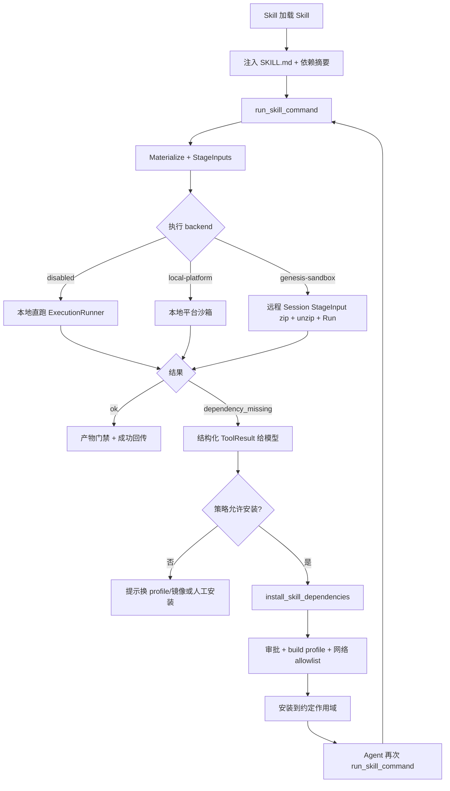

# Skill 三模式执行与依赖闭环设计

> 状态：最终方案（Codex / Kode-CLI 对照后，经 review-fix-rereview 收敛）  
> 日期：2026-07-10  
> 关联：`docs/Skills设计.md`、`docs/沙箱API对接与Profile选择规则.md`、`docs/执行工作空间与Sandbox文件路径契约.md`、`docs/superpowers/specs/2026-07-09-skill-script-execution-design.md`、`docs/Anthropic-Office-Skills完整能力迁移设计.md`  
> 参考源码：`D:\workspace\go\go-project\codex`、`D:\workspace\go\go-project\Kode-CLI`  
> 实现状态：**Gate A/B 已落地；Gate C 基线（optional 降级、Enterprise 可配 sandbox、preflight/opt-in、镜像包清单文档）已落地。** 远程联调与镜像构建仍属 sandbox 仓/运维（见 §1.4）。

---

## 1. 从第一性原理

### 1.1 用户要解决的根问题

1. **同一套 Skill 脚本**，在三种执行后端上语义一致、可正确执行：
   - 无沙箱（本地直跑）
   - 本地平台沙箱（bwrap / Seatbelt / Windows constrained）
   - 远程沙箱容器（genesis-sandbox API）
2. **依赖是可恢复失败**：脚本缺包时，Agent 必须能看见结构化错误、在策略允许下安装、装完再跑同一脚本——类似 Codex 的「失败回传 + 模型申请网络/提权后重试」，但 Genesis 要把契约写死，避免「错误被吞、工具被收窄、装不了」的断点。

### 1.2 非目标

- 不在脚本内静默 `subprocess pip/npm install`（绕过审批与审计）。
- 不默认对所有 Skill 做隐藏自动装包重试（供应链与权限风险）。
- 不把 `Skill()` 工具变成脚本执行器；脚本仍走 `run_skill_command`。
- 不把「镜像预装」与「对话期安装」混成一条无边界路径。

### 1.3 硬不变量

| ID | 不变量 |
| --- | --- |
| I1 | Agent / Skill 只依赖逻辑目录：`INPUT_DIR` / `OUTPUT_DIR` / `WORK_DIR` / `TMPDIR` / `SKILL_DIR` |
| I2 | 脚本入口统一为 `run_skill_command`（ResourceID），三模式只换 backend 映射 |
| I3 | 运行期默认无网络；安装依赖必须显式进入 **install 通道**（审批 + 审计 + 允许的 profile） |
| I4 | 工具失败时，**结构化 stdout/stderr 必须到达模型**（禁止只回 `exit_code=1`） |
| I5 | 安装不得扩大 Profile 永久授权；`allowed-tools` 只收窄，不自动扩权 |
| I6 | `SandboxRequire` 不满足则失败；`SandboxOptional` 降级必须有 warning/trace/audit |

### 1.4 现状 vs 目标（避免把设计当成已实现）

| 能力 | 今日代码 | 本方案目标 |
| --- | --- | --- |
| 无沙箱跑 Skill 脚本 | CLI/Enterprise 可用 | 保持 |
| 本地平台沙箱跑 Skill | CLI 已接线；Enterprise 可配 | 三产品可测通过 |
| 远程 API 跑 Skill | CLI 有路径；Skill 脚本 zip staging + job 内解压已测；Enterprise 可按配置注入 SessionClient | 三模式齐 + sandbox E2E 联调 |
| 失败 JSON 到模型 | ReAct 保留 Output JSON（Gate A） | I4 |
| 缺依赖结构化字段 | `failure_kind` / `missing` / `suggested_install`（Gate A） | §6.2–6.3 |
| 对话期安装通道 | `install_skill_dependencies`（Gate B，workspace） | §6.5；session/user 后续 |
| Agent 装完再跑 | Meta 工具 + SKILL 硬规则；默认无平台自动二次 Run；opt-in auto_retry | 显式再调为主 |
| `dependencies.runtime` | 已解析（Gate B） | §5.2 |
| optional 降级 | Skill 与 run_command 对齐 warning（Gate C） | I6 |
| office-basic 预装清单 | 文档已列（Gate C）；镜像构建在 sandbox 仓 | §5.3 |

---

## 2. 参考实现结论（Codex / Kode-CLI）

### 2.1 Codex（`codex-rs`）

| 机制 | 事实 |
| --- | --- |
| Skill 脚本执行 | 走普通 `shell_command`，不是独立 Skill 执行器 |
| 自动安装 | **仅 MCP 依赖**（`mcp_skill_dependencies.rs`）；**无** Python/npm 运行时自动安装状态机 |
| 缺包处理 | 脚本 `ImportError` → stderr 提示 `uv pip install ...` → exit≠0 → `RespondToModel` 把完整输出回传模型 |
| 再执行 | **模型驱动**：permissions prompt 要求依赖下载失败时用 `additional_permissions.network` 或 `require_escalated` 重跑，不要先闲聊 |
| 预装 | 系统 Skill 文件 materialize 到 `$CODEX_HOME/skills/.system`；**不**预装 openai/pillow 等第三方包 |
| 关键启示 | 「友好报错 + 完整回传 + prompt 契约 + 显式网络/提权」比「隐藏 auto-pip-retry」更可观测、更安全 |

关键路径（摘要；完整必读清单见 **§14**）：`core/src/mcp_skill_dependencies.rs`、`core/src/tools/mod.rs`（`format_exec_output_for_model`）、`prompts/templates/permissions/approval_policy/on_request.md`、`skills/.../imagegen/scripts/image_gen.py`。

### 2.2 Kode-CLI

| 机制 | 事实 |
| --- | --- |
| Skill 工具 | 只注入 `SKILL.md` + `Base directory`，**不执行脚本** |
| 脚本执行 | 主 CLI 靠 Bash；SDK 有 `execute_script`（无 install/retry） |
| 缺包处理 | stderr 原样回传；**无** `ModuleNotFoundError` 解析器与自动安装状态机 |
| 再执行 | **LLM ReAct 多轮**自行 `pip/npm install` 再跑 |
| 沙箱失败 | prompt 指导用 `dangerouslyDisableSandbox` 重试（与装包失败分离） |
| 关键启示 | 错误透传与工具分离清晰；自动 bootstrap 需 Genesis 自研，不能假设 Kode 已有 |

### 2.3 对照后的产品选择

Codex / Kode **都没有**「平台级 pip/npm 自动装完再跑」状态机。  
Genesis 采用 **分层闭环**（比两者更明确，但不违背其安全边界）：

```text
优先：Profile / 镜像预装（运行期零网络）
其次：对话期「结构化缺依赖 → 显式 install 通道 → Agent 再调 run_skill_command」
禁止：脚本内静默装包；禁止吞掉 stdout 的失败回传
```

这与既有 `docs/沙箱API对接与Profile选择规则.md` §7「运行期默认无网络；对话期安装须用户授权并审计」一致，并把「授权后怎么装、怎么再跑」补成可实现协议。

---

## 3. 目标架构总览



---

## 4. 三模式执行（统一契约）

### 4.1 统一入口

```text
run_skill_command(skill, script ResourceID, args[], inputs[])
  → SkillScriptService
  → Materialize(scripts + _office_common)
  → Stage inputs → INPUT_DIR
  → 选择 SandboxProfile / RuntimeProfile
  → Backend.Run
  → Collect OUTPUT_DIR + 门禁
  → RunResult（含结构化失败字段）
```

产品只注入 backend 依赖，不改脚本契约：

| 产品 | 无沙箱 | 本地平台沙箱 | 远程 API |
| --- | --- | --- | --- |
| CLI | 已具备 | 代码已接，补 Skill E2E | 代码已接，脚本包 zip staging 已测，补 sandbox E2E |
| Enterprise | 已接（headless 审批过渡） | 待注入 SandboxRunner | 待注入 SessionClient + WorkspaceRef + 租户 credential |

### 4.2 Backend 选择规则

| 条件 | Backend |
| --- | --- |
| `Provider=genesis-sandbox` 且 Mode∈{optional,required} | 远程 Session（`runRemote`） |
| `Provider=local-platform` 或 Mode 升到平台沙箱 | `localexec.SandboxRunner` |
| Mode=disabled 或无 sandbox runner | 本地直跑 |

**降级策略（对齐 I6）**：

| Mode | 不可用时 |
| --- | --- |
| optional | 可降级本地直跑，**必须** warning + audit；Skill 与 `run_command` 行为一致 |
| required | fail closed，不得静默降级 |

### 4.3 路径映射（逻辑一致、物理分化）

| 逻辑 | 本地 / 本地平台沙箱 | 远程 genesis-sandbox |
| --- | --- | --- |
| `WORK_DIR` | `.genesis/runs/<id>/work` | `/workspace` |
| `INPUT_DIR` | `.genesis/runs/<id>/input` | `/workspace/input` |
| `OUTPUT_DIR` | `.genesis/runs/<id>/output` | `/workspace/output` |
| `TMPDIR` | `.genesis/runs/<id>/tmp` | `/workspace/tmp` |
| `SKILL_DIR` | `WORK_DIR/skills/<pkg>` | `/workspace/tmp/skills/<pkg>` |
| `PYTHONPATH` / `NODE_PATH` | `PYTHONPATH` 指向 `SKILL_DIR/scripts`；`NODE_PATH` 指向工作区/祖先 `node_modules` | `PYTHONPATH=/workspace/tmp/skills/<pkg>/scripts`；`NODE_PATH` 必须包含 `/opt/genesis-sandbox/image/node_modules`，并可包含 `/workspace/node_modules` 等 session 落点 |

远程 StageInput 命名：

- Skill 脚本：`skill-scripts-<pkg>.zip` → `/workspace/input/skill-scripts-<pkg>.zip`，job 内解压到 `/workspace/tmp/skills/<pkg>/scripts`
- 用户输入：`<basename>` → `/workspace/input/<basename>`

### 4.4 三模式验收

| 用例 | 无沙箱 | 本地平台 | 远程 |
| --- | --- | --- | --- |
| `inspect_pptx.py` | 必过 | 必过 | 必过 |
| `office/unpack.py` 嵌套路径 | 必过 | 必过 | 必过（联调重点） |
| optional 沙箱挂掉 | 降级+warning | 同左 | 与 run_command 策略一致 |
| required 沙箱挂掉 | N/A | fail closed | fail closed |

---

## 5. 依赖模型（声明分层）

### 5.1 三层依赖（不要混在一个袋子里）

| 层 | 内容 | 谁消费 | 何时处理 |
| --- | --- | --- | --- |
| **A. 工具依赖** | `type: tool/command/mcp` | `Skill()` 加载前校验 / 审批 | 加载时 |
| **B. 运行时包依赖** | `runtime.python` / `runtime.node` / `runtime.system` | preflight + installer | 构建期优先；对话期可恢复 |
| **C. 环境/镜像依赖** | LibreOffice、Poppler、浏览器 | Sandbox Profile / 镜像 | 构建镜像或本机预装 |

### 5.2 Frontmatter 扩展（目标 schema）

在现有 `dependencies.tools` 之上增加 `runtime`（向后兼容：无 `runtime` 时行为与今日相同）：

```yaml
dependencies:
  tools:
    - type: tool
      value: run_skill_command
    - type: command
      value: node
  runtime:
    python:
      - name: pillow
        import: PIL
    node:
      - name: pptxgenjs
        require: pptxgenjs
    system:
      - name: libreoffice
        command: soffice
    # 可选：一次性安装命令模板（仍须走 install 通道，不可脚本内执行）
    install_hints:
      - "npm install pptxgenjs"
      - "pip install pillow"
```

### 5.3 预装优先策略

| Skill 类型 | 默认 |
| --- | --- |
| 内置 Office（`office-basic` / `office-ocr`） | 镜像/本机 profile **必须**预装声明的 runtime；远程运行期优先使用镜像预装，不依赖对话期安装 |
| 用户/项目 Skill | 注册/安装期可用 `skill-build-polyglot` 构建 venv/node_modules 缓存 |
| 第三方 Marketplace | **禁止**默认对话期装包；须注册期构建或管理员授权策略 |

---

## 6. 「执行报错 → 安装 → 再执行」协议（核心）

> 本节是本方案的重点。目标：把 Codex「模型驱动重试」变成 Genesis 可测试、可审计的契约，同时保留审批边界。

### 6.1 设计原则

1. **平台不隐藏重试**：默认不自动「装完再跑」；由 Agent 在看到结构化结果后再次调用工具（可观测）。  
2. **平台保证信息完整**：缺依赖时 ToolResult 必须带 `failure_kind` / `missing` / `suggested_install`。  
3. **安装走专用通道**：`install_skill_dependencies`（或受限的 install 类 `run_command`），使用 `skill-build-polyglot` + 网络 allowlist。  
4. **可选 opt-in 自动重试**：产品配置 `skills.auto_retry_after_install=true` 时，Service 可在同一次用户回合内执行「install → 再 run」一次（仍写审计）；默认 `false`（对齐 Codex 安全偏好）。

### 6.2 失败分类（`failure_kind`）

| failure_kind | 含义 | Agent 下一步 |
| --- | --- | --- |
| `dependency_missing` | 缺 python/node/system 包或命令 | 走 install 通道或换 profile |
| `sandbox_violation` | 沙箱拒绝写/网/exec | 申请权限升级或换 Mode（非装包） |
| `artifact_invalid` | 产物门禁失败 | 修脚本/禁止假 write_file |
| `script_error` | 业务逻辑错误 | 改参数/改代码 |
| `timeout` | 超时 | 调 timeout 或拆分 |
| `approval_denied` | 审批拒绝 | 向用户说明 |

### 6.3 结构化 ToolResult（必须到达模型）

`run_skill_command` 在 `ok=false` 时仍返回 JSON 正文；ReAct **不得**丢弃 stdout。

```json
{
  "ok": false,
  "skill": "office-ppt",
  "script": "office-ppt/scripts/create_pptx.js",
  "exit_code": 1,
  "failure_kind": "dependency_missing",
  "missing": [
    { "manager": "npm", "name": "pptxgenjs", "require": "pptxgenjs" }
  ],
  "suggested_install": {
    "tool": "install_skill_dependencies",
    "args": {
      "skill": "office-ppt",
      "packages": [{ "manager": "npm", "name": "pptxgenjs" }]
    },
    "shell_fallback": "npm install pptxgenjs"
  },
  "stdout": "...",
  "stderr": "...",
  "retryable": true,
  "suggested_action": "install_then_retry"
}
```

脚本侧约定（与 `create_pptx.js` 对齐，推广到 Python）：

```json
{ "ok": false, "errors": ["..."], "hint": "dependency_missing", "dependency": "pptxgenjs" }
```

`SkillScriptService` 解析 `hint`/`dependency` 或常见 stderr（`ModuleNotFoundError`、`Cannot find module`），填充 `failure_kind` 与 `missing[]`。

### 6.4 错误回传修复（P0，阻塞闭环）

当前断点：`react_loop.runToolCall` 在 `toolErr != nil` 时只返回 error，上层变成「工具执行失败: …」，**丢掉 JSON**。

**目标行为**：

```text
Execute 返回 (resultJSON, err)
  → Tool Message content = resultJSON（若非空）
  → 另附 error 摘要（可选）
  → 模型始终能看到 failure_kind / suggested_install
```

验收：人为卸掉 `pptxgenjs` 后跑 `create_pptx.js`，模型上下文中出现 `dependency_missing` 与 `suggested_install`。

### 6.5 安装通道：`install_skill_dependencies`

#### 职责

在**约定作用域**安装 Skill 声明或 Agent 指定的 runtime 包，不执行业务脚本。

#### 输入

```json
{
  "skill": "office-ppt",
  "packages": [
    { "manager": "npm", "name": "pptxgenjs" },
    { "manager": "pip", "name": "pillow" }
  ],
  "scope": "workspace"
}
```

`scope`：

| 值 | 含义 | 适用 |
| --- | --- | --- |
| `workspace` | 项目/`WORK_DIR` 下 `node_modules` 或 `.venv` | CLI 本地默认 |
| `user` | 用户级缓存（如 `~/.genesis/skill-deps/<hash>`） | 跨项目复用 |
| `session` | 本次 run 工作空间内临时 | 远程沙箱 job 内 |
| `image` | 不允许对话期写入；返回「需重建 profile/镜像」 | Enterprise 生产默认 |

#### 执行约束

| 项 | 规则 |
| --- | --- |
| Profile | `skill-build-polyglot`（或等价 build profile） |
| 网络 | allowlist（PyPI/npm registry 等），默认拒绝任意 URL |
| 审批 | `ActionCommandExec` + metadata `skill_dep_install=true`；建议 scopes：`once`/`session` |
| 命令白名单 | 仅允许 `npm install <pkg>`、`pip/uv pip install <pkg>`、`pnpm add` 等模板；禁止任意 shell |
| 审计 | 记录 skill、packages、scope、backend、exit_code、耗时 |
| 包白名单 | **默认仅允许** Skill `dependencies.runtime` 已声明的包名；Agent 临时追加包需更高风险审批或拒绝 |
| 与业务脚本隔离 | 安装成功 ≠ 业务成功；必须由 Agent（或 opt-in 自动重试）再调 `run_skill_command` |

#### 三模式 × 安装作用域（必须写清，否则远程装了本地看不见）

| Backend | 推荐 scope | 安装落点 | 业务脚本如何看见 |
| --- | --- | --- | --- |
| 无沙箱本地 | `workspace` | 项目 `node_modules` / `.venv`，或 `WORK_DIR` 下约定目录 | `NODE_PATH`/`VIRTUAL_ENV`/`PATH` 注入与 `run_skill_command` 一致 |
| 本地平台沙箱 | `workspace` 或 `session` | 同上，且须在沙箱可写 roots 内 | 同左；网络须 build profile 放开 allowlist |
| 远程 genesis-sandbox | 当前 Gate B：镜像/profile 预装；目标 Gate C：`session` | 当前 `run_skill_command` 每次打开独立 session 并结束后关闭，`workspace` 安装不会可靠传给后续 Office/Skill 运行 session | 当前必须通过 `/opt/genesis-sandbox/image/node_modules` 等预装路径暴露；session scope 完成后才允许“安装后同 session 重跑” |
| Enterprise 生产 | `image` | 对话期安装返回明确错误：`failure_kind=install_forbidden_use_image` | 运维重建 `office-basic` 等 profile |

**禁止**：在宿主机装包却期望远程容器内生效（跨 backend 串味）。

#### 与 `run_command` 的关系

- **推荐**：专用工具，避免 office Skill 收窄掉 `run_command` 后无法安装。  
- **过渡**：若未上专用工具，office Skill 的 `allowed-tools` 可临时包含 `run_command`，但 SKILL.md 必须写明「仅允许 install 类命令；业务脚本仍用 `run_skill_command`」。  
- **禁止**：用 `run_command` 直接 `python scripts/...` 绕过 materialize/门禁。

### 6.6 再执行（Agent 协议）

写入系统/Skill 硬规则（对齐 Codex permissions prompt，改成 Genesis 工具名）：

```text
1. 若 run_skill_command 返回 failure_kind=dependency_missing 且 retryable=true：
   - 调用 install_skill_dependencies（或策略允许的等价安装命令）
   - 安装成功后，用相同 skill/script/args/inputs 再调用一次 run_skill_command
   - 不要在未安装成功时用同一参数死循环
2. 若 failure_kind=sandbox_violation：申请权限/换 sandbox mode，不要当成缺包
3. 若 suggested_action 缺失或 retryable=false：向用户说明，不要臆造安装命令
```

**默认不在平台内自动二次 Run**；由 Agent 显式二次调用，便于 Trace 看到两段工具调用。

### 6.7 可选：同回合自动重试（opt-in）

配置：`skills.auto_retry_after_install: false`（默认）。

当为 `true` 且同时满足：

- `failure_kind=dependency_missing`
- 安装审批已通过（或 policy allow）
- 本 skill+script 本回合尚未自动重试过（最多 1 次）

则 `SkillScriptService` 可内部：`Install → Run`，并在结果 metadata 标记 `auto_retried=true`。  
Enterprise 生产建议保持默认 `false`，由治理策略显式打开。

### 6.8 时序（标准路径）

本地/本地平台 `workspace` scope：

```text
Agent: run_skill_command(create_pptx.js)
  → ok=false, failure_kind=dependency_missing, missing=[pptxgenjs]
Agent: install_skill_dependencies(skill=office-ppt, packages=[pptxgenjs])
  → 审批（session）→ npm install 到本地 workspace 可见路径
  → ok=true, scope=workspace, path=.../node_modules
Agent: run_skill_command(create_pptx.js)  # 相同参数
  → ok=true, artifacts=[demo.pptx]
```

远程 `genesis-sandbox` 当前 Gate B：

```text
Agent: run_skill_command(create_pptx.js)
  → 优先通过 office-basic 镜像预装依赖 + NODE_PATH 运行
若仍返回 dependency_missing：
  → 不要重复 workspace 安装；应修复/重建 runtime profile，或等 Gate C 的 session scope 安装闭环落地
```

### 6.9 Preflight（可选加速，不替代报错契约）

在 `Run` 前对声明了 `runtime` 的脚本做轻量探测：

- Node：`node -e "require('pptxgenjs')"`
- Python：`python -c "import PIL"`
- System：`LookPath("soffice")`

失败则**直接**返回 `dependency_missing`（不必先跑业务脚本）。  
探测失败与执行失败使用同一 ToolResult schema。

---

## 7. Skill 工具收窄与安装能力的关系

### 7.1 问题

`office-ppt` 等 Skill 的 `allowed-tools` 收窄后若去掉 `run_command`，Agent 在缺包时**无安装工具**——这是当前闭环断裂点之一。

### 7.2 规则

| 规则 | 说明 |
| --- | --- |
| Meta 工具始终可见 | `Skill` / `list_skill_resources` / `read_skill_resource` / `run_skill_command` / **`install_skill_dependencies`** |
| 业务 Skill 可不列 `run_command` | 安装走专用工具，避免滥用 shell |
| SKILL.md 硬约束改写 | 「业务脚本必须用 run_skill_command；缺依赖时用 install_skill_dependencies，禁止用 write_file 假交付」 |

---

## 8. 与现有文档的关系（收敛冲突）

| 文档原表述 | 本方案解释 |
| --- | --- |
| 「对话中不应临时 pip/npm install」 | **默认禁止**；仅当 `install_skill_dependencies` 获批且走 build profile 时允许，并审计 |
| 「依赖构建用 skill-build-polyglot」 | 对话期安装与注册期构建**共用**该 profile，操作类型 `build_dependencies` |
| 「运行期只执行已声明脚本」 | 不变；安装不是运行期业务脚本，是独立操作 |
| Office 迁移「镜像预装」 | 仍是第一优先级；本方案补的是预装不足时的可恢复路径 |

实施时须同步改写 `docs/沙箱API对接与Profile选择规则.md` §7 措辞为：「运行期默认禁止临时装包；经 `install_skill_dependencies` 授权的构建通道除外」。

`docs/Skills设计.md` 中 `dependencies` 说明应扩展为：加载前校验（tools）+ 运行时包声明（runtime）+ 安装通道消费。

---

## 9. 实施分期

### Phase A — 打通信息与三模式基线（P0）

1. 修复 ReAct / `run_skill_command`：**失败时保留 JSON ToolResult**  
2. `RunResult` 增加 `failure_kind` / `missing` / `suggested_action`；解析脚本 `hint`  
3. CLI：Skill 远程 optional 降级与 `run_command` 对齐；补脚本包 zip staging + 解压执行测试  
4. Enterprise：可配置注入平台沙箱 / SessionClient（不再写死仅 disabled）  
5. 更新 office-ppt SKILL：缺依赖指引指向结构化字段（即使尚未有专用 install 工具，也先保证模型看得见）

### Phase B — 安装通道（P1）

1. 实现 `install_skill_dependencies` + `skill-build-polyglot` 执行路径  
2. frontmatter `dependencies.runtime` 解析与 preflight  
3. Meta 工具强制并入 `narrowToolNames`  
4. 审批策略：install 默认 ask；session 授权缓存  
5. 三模式安装作用域矩阵（workspace / session / user）落地测试

### Phase C — 产品化与预装（P2）

1. `office-basic` 镜像声明并验证 pptxgenjs/Pillow/soffice  
2. 用户/项目 Skill 注册期 build + lock  
3. opt-in `auto_retry_after_install`  
4. 更新 `docs/Skills设计.md` / `docs/Office能力与Skills设计.md` 实现状态表

---

## 10. 验收标准（DoD）

### 10.1 三模式

- [x] 同一 `office-ppt/scripts/inspect_pptx.py` 在三种 backend 返回语义一致的 JSON（本地/单测；远程服务端联调仍属 sandbox 仓）
- [x] 远程 `office/unpack.py` 经脚本包 zip staging + job 内解压执行的客户端契约已测；真实 sandbox E2E 仍属联调项
- [x] required 失败不静默降级；optional 降级有 warning + metadata（与 run_command 对齐；独立 audit sink 事件仍可加强）

### 10.2 依赖闭环

- [x] 缺 `pptxgenjs` 时模型上下文出现 `failure_kind=dependency_missing`（Gate A）
- [ ] 经审批安装后，第二次 `run_skill_command` 成功产出合法 `.pptx`（门禁通过）— 人工 E2E
- [x] 安装命令走审批；未审批不能装（Gate B 单测）
- [x] office Skill 收窄后仍能调用 `install_skill_dependencies`（Gate B）
- [x] 默认配置下平台**不会**在无 Agent 二次调用时偷偷重跑业务脚本（除非 opt-in）

---

## 11. 风险与残余

| 风险 | 缓解 |
| --- | --- |
| 对话期装包供应链风险 | 包名白名单 / lock / 仅允许声明列表内的 package；第三方 Skill 默认禁止 |
| 远程沙箱无持久 node_modules | `scope=session` 每 job 装；或镜像预装 |
| Windows 本地平台沙箱能力不足 | required 时 fail closed；文档标明平台差异 |
| 模型忽略 suggested_action | system 硬规则 + 单测用假模型断言工具调用序（集成层） |
| 与「禁止运行期 install」文案冲突 | 以本文 §8 为准，同步改沙箱文档措辞为「默认禁止，授权通道例外」 |

---

## 12. 决策摘要（最终）

1. **三模式**：统一 `run_skill_command` + Execution Workspace；产品注入 backend；降级策略显式。  
2. **依赖**：预装优先；声明分 tools / runtime / system 三层。  
3. **报错→安装→再执行**：  
   - 平台保证结构化失败回传（修 ReAct 断点）  
   - 安装走 `install_skill_dependencies`（build profile + 审批 + 审计）  
   - 再执行由 Agent 显式二次调用（默认）；opt-in 才允许同回合自动重试一次  
4. **不照搬** Codex/Kode 的「纯靠模型碰运气」；**不发明**隐藏 auto-pip 黑盒；在两者之间做成 **可审计的显式闭环**。

---

## 13. 下一步编码入口（供实施计划引用）

**编码前必须先完成 §14 参考源码精读**，再改 Genesis 落点；禁止只凭本文摘要直接开写。

| 项 | 落点 |
| --- | --- |
| 失败回传 | `internal/runtime/strategy/react/react_loop.go` |
| 结构化失败 | `internal/capabilities/skill/script/service/service.go` + `script/contract` |
| 安装工具 | `internal/capabilities/skill/tool/install_skill_dependencies/`（新建） |
| Build profile | `execution/model` 已有枚举 → Runner/Sandbox 真正消费 |
| Enterprise 三模式 | `products/enterprise/bootstrap` + `shared/skillstack` |
| 契约测试 | `script/service` smoke + 远程 mock StageInput zip |

---

## 14. 编码前必读：参考源码清单

> 根目录：  
> - Codex：`D:\workspace\go\go-project\codex`  
> - Kode-CLI：`D:\workspace\go\go-project\Kode-CLI`  
>  
> **原则**：先读参考实现理解机制与边界，再映射到 Genesis；**借鉴契约与错误回传，不照搬「纯靠模型碰运气」或隐藏 auto-pip**。

### 14.1 开发工作流（强制）

```text
1. 按 Phase 选任务（A/B/C）
2. 打开本节对应「必读文件」通读（至少浏览关键函数）
3. 对照「Genesis 落点」确认目录边界符合 docs/项目目录与边界说明.md
4. 写测试 / 改代码
5. 用 §10 DoD 自检
```

### 14.2 Phase A（失败回传 + 三模式基线）— 必读

| 优先级 | 参考文件（绝对路径） | 读什么 | Genesis 落点 |
| --- | --- | --- | --- |
| P0 | `D:\workspace\go\go-project\codex\codex-rs\core\src\tools\mod.rs` | `format_exec_output_for_model`：exit code + stdout/stderr 如何拼给模型 | `react_loop.go` 失败时保留 ToolResult JSON |
| P0 | `D:\workspace\go\go-project\codex\codex-rs\core\src\tools\events.rs` | 非零 exit → `RespondToModel(content)`（内容仍完整） | 同上；禁止只回 `工具执行失败: exit_code` |
| P0 | `D:\workspace\go\go-project\codex\codex-rs\skills\src\assets\samples\imagegen\scripts\image_gen.py` | `_dependency_hint` / `ImportError` → 明确安装命令 + exit 1 | 脚本 `hint=dependency_missing`；Service 解析填充 `failure_kind` |
| P0 | `D:\workspace\go\go-project\codex\codex-rs\skills\src\assets\samples\imagegen\scripts\remove_chroma_key.py` | Pillow 缺失同类模式 | Python 脚本侧约定 |
| P0 | `D:\workspace\go\go-project\codex\codex-rs\prompts\templates\permissions\approval_policy\on_request.md` | 依赖下载失败 → 直接申请 escalation/网络，不要先闲聊 | system/Skill 硬规则：`install_then_retry` |
| P0 | `D:\workspace\go\go-project\codex\codex-rs\prompts\templates\permissions\approval_policy\on_request_rule_request_permission.md` | `with_additional_permissions` 优先于盲目提权 | 安装走 build profile + 网络 allowlist，而非默认 disable sandbox |
| P1 | `D:\workspace\go\go-project\Kode-CLI\packages\tools\src\tools\system\BashTool\BashTool.tsx` | `renderResultForAssistant`：stdout+stderr 原样拼接 | ToolResult 透传 |
| P1 | `D:\workspace\go\go-project\Kode-CLI\packages\tools\src\tools\system\BashTool\executeForeground.tsx` | 非零 exit 写入 stderr 的方式 | `RunResult.Stderr` / `ExitCode` |
| P1 | `D:\workspace\go\go-project\Kode-CLI\packages\tools\src\tools\system\BashTool\prompt.ts` | **沙箱失败**与**其他失败**分离；指导 `dangerouslyDisableSandbox` | `failure_kind=sandbox_violation` vs `dependency_missing` 分流 |
| P1 | `D:\workspace\go\go-project\Kode-CLI\kode-agent-sdk\src\tools\scripts.ts` | `execute_script` 失败结构 `{ok,error,data:{stdout,stderr}}`（无 install） | `script/contract.RunResult` 字段对齐 |
| P1 | `D:\workspace\go\go-project\Kode-CLI\packages\tools\src\tools\interaction\SkillTool\SkillTool.tsx` | Skill 只注入、不执行脚本 | 保持 `Skill` ≠ `run_skill_command` |
| P1 | `D:\workspace\go\go-project\Kode-CLI\apps\cli\src\services\customCommands\discovery.ts` | `Base directory for this skill` 注入 | 已有 `SKILL_DIR`；勿退回宿主机 embed 路径 |

**本仓库先读（改之前）**：

- `internal/runtime/strategy/react/react_loop.go`（`runToolCall` / `executeOneToolCall`）
- `internal/capabilities/skill/script/service/service.go`
- `internal/capabilities/skill/script/contract/runner.go`
- `internal/capabilities/skill/tool/run_skill_command/tool.go`
- `products/cli/bootstrap/container.go`（sandbox / SessionClient 接线）
- `docs/执行工作空间与Sandbox文件路径契约.md`

### 14.3 Phase B（安装通道）— 必读

| 优先级 | 参考文件（绝对路径） | 读什么 | Genesis 落点 |
| --- | --- | --- | --- |
| P0 | `D:\workspace\go\go-project\codex\codex-rs\core\src\mcp_skill_dependencies.rs` | **唯一** runtime 自动安装：收集缺失 → 用户确认 → 持久化 → refresh；会话去重 | `install_skill_dependencies` 的审批/去重/审计形态（装的是包不是 MCP） |
| P0 | `D:\workspace\go\go-project\codex\codex-rs\core\src\session\turn.rs` | turn 入口何时调用依赖安装 | 不在业务脚本里装；装完再跑脚本 |
| P0 | `D:\workspace\go\go-project\codex\codex-rs\core-skills\src\loader.rs` | `resolve_dependencies`：tools 元数据（mcp/cli） | `dependencies.tools` + 扩展 `runtime` |
| P0 | `D:\workspace\go\go-project\codex\codex-rs\protocol\src\protocol.rs` | `SkillDependencies` / `SkillToolDependency` 协议字段 | `internal/capabilities/skill/model` |
| P0 | `D:\workspace\go\go-project\codex\codex-rs\features\src\lib.rs` | `SkillMcpDependencyInstall`；已移除的 `SkillEnvVarDependencyPrompt` | 对话期装包用独立 feature/config，默认谨慎 |
| P1 | `D:\workspace\go\go-project\codex\codex-rs\core\src\tools\handlers\request_permissions.rs` | 显式申请 network 等权限 | 安装通道的网络审批，而非默认开网 |
| P1 | `D:\workspace\go\go-project\codex\codex-rs\core\src\tools\network_approval.rs` | 出站网络审批 | sandbox/build profile 网络 allowlist |
| P1 | `D:\workspace\go\go-project\codex\codex-rs\skills\src\assets\samples\imagegen\SKILL.md` | 文档如何写依赖安装步骤 | office-ppt `SKILL.md` / references |
| P1 | `D:\workspace\go\go-project\codex\codex-rs\skills\src\assets\samples\imagegen\references\codex-network.md` | 网络与审批配置说明 | CLI/沙箱文档 |
| P1 | `D:\workspace\go\go-project\Kode-CLI\packages\core\src\permissions\policies\bash.ts` | `SAFE_COMMANDS`；`npm install` 不在白名单 → ask | install 默认 ask + 命令模板白名单 |
| P1 | `D:\workspace\go\go-project\Kode-CLI\packages\core\src\permissions\bash\engine.ts` | Bash 权限决策 | approval / policy 接线 |
| P1 | `D:\workspace\go\go-project\Kode-CLI\packages\core\src\utils\ripgrep.ts` | `ensureRipgrepReady` 多源 resolve + Fix 文案（**工具级 ensure，非 Skill 装包**） | preflight 失败时的人类可读 Fix / `suggested_install` |
| P2 | `D:\workspace\go\go-project\Kode-CLI\kode-agent-sdk\src\core\agent.ts` | 工具错误 recommendations（通用，无 pip 模板） | 可借鉴结构，勿照搬空泛建议 |
| P2 | `D:\workspace\go\go-project\Kode-CLI\packages\core\src\agent\builtin.ts` | Explore 等只读 agent **禁止** npm install | 只读/Plan 模式禁用 install 工具 |

**本仓库先读**：

- `internal/capabilities/skill/tool/skill/tool.go`（`checkDependencies`）
- `internal/capabilities/skill/model/model.go`（`Dependencies`）
- `internal/capabilities/skill/parser/markdown.go`
- `internal/capabilities/execution/tool/run_command/`（审批与 Dangerous 分类）
- `internal/capabilities/execution/model/model.go`（`SandboxOperationBuildDependencies`、`skill-build-polyglot`）
- `docs/沙箱API对接与Profile选择规则.md` §5 / §7
- `docs/统一配置权限与审批治理设计.md`（若改审批元数据）

### 14.4 Phase C（预装 / materialize）— 必读

| 优先级 | 参考文件（绝对路径） | 读什么 | Genesis 落点 |
| --- | --- | --- | --- |
| P0 | `D:\workspace\go\go-project\codex\codex-rs\skills\src\lib.rs` | `install_system_skills` + fingerprint 跳过重复写入 | embed materialize / 系统 Skill 落盘 |
| P1 | `D:\workspace\go\go-project\codex\codex-rs\core-skills\src\service.rs` | 启动时调用 system skills 安装 | CLI/Enterprise bootstrap |
| P1 | `D:\workspace\go\go-project\codex\.devcontainer\Dockerfile.secure` | 镜像预装的是**工具链**不是 per-skill pip 包 | `office-basic` 镜像职责边界 |
| P2 | `D:\workspace\go\go-project\codex\sdk\python\_runtime_setup.py` | SDK 自举 pip（与 Skill 依赖无关，防误用） | **不要**把 Skill 依赖装成 SDK 自举 |
| P2 | `D:\workspace\go\go-project\Kode-CLI\apps\cli\src\services\skillMarketplace\plugins\install.ts` | Plugin/Skill **文件**安装，非 runtime 包 | marketplace install ≠ `install_skill_dependencies` |

**本仓库先读**：

- `internal/capabilities/skill/script/materialize/`
- `internal/capabilities/skill/adapter/embedded/`
- `shared/skillstack/`
- genesis-sandbox 侧 profile/requirements（独立仓库，按沙箱文档对接）

### 14.5 明确「不要抄」的部分

| 参考行为 | 原因 | Genesis 做法 |
| --- | --- | --- |
| 解析 `ModuleNotFoundError` 后平台静默 `pip install` 再跑 | Codex/Kode 都未做；供应链与审批不可推断 | 结构化报错 + 显式 install 工具 + Agent 再调 |
| Skill 脚本走任意 Bash 拼路径 | 破坏 ResourceID / materialize / 门禁 | 只允许 `run_skill_command` |
| 用 `dangerouslyDisableSandbox` 当装包默认手段 | 权限过大 | build profile + 网络 allowlist |
| 把 MCP 自动安装逻辑原样当 pip 安装 | 对象不同（配置 vs 包生态） | 只借鉴「确认 → 持久化/落盘 → 刷新 → 去重」流程形态 |

### 14.6 精读检查清单（开 PR / 开工前勾选）

Phase A：

- [ ] 已读 Codex `format_exec_output_for_model` + `events.rs` 非零 exit 回传
- [ ] 已读 imagegen `image_gen.py` 依赖提示模式
- [ ] 已读 Kode Bash `renderResultForAssistant` / sandbox 失败分流 prompt
- [ ] 已定位 Genesis `react_loop` 丢 stdout 断点

Phase B：

- [ ] 已读 Codex `mcp_skill_dependencies.rs` 全流程
- [ ] 已读 Codex permissions / network 相关 prompt 与 handler
- [ ] 已读 Kode bash 权限白名单与 ask 路径
- [ ] 已确认 Genesis install 命令模板白名单与 `dependencies.runtime` 包白名单

Phase C：

- [ ] 已读 Codex `install_system_skills` fingerprint
- [ ] 已区分「Skill 文件预装」与「第三方包预装」

---

## 附录 A：review-fix-rereview 记录

### Cycle 1 — 第一性原理与对照

- 确认 Codex/Kode **均无**平台级 pip/npm 自动重试；Genesis 采用「结构化回传 + 显式 install + Agent 再跑」。
- 确认当前最大工程断点是 ReAct 丢 stdout，而非「缺一个安装脚本」 alone。

### Cycle 2 — 可行动修订（已写入正文）

| 发现 | 处理 |
| --- | --- |
| 文档易被读成「已实现」 | 增加 §1.4 现状 vs 目标 |
| 远程装包与本地串味未定义 | 增加「三模式 × 安装作用域」表 |
| 任意包名安装供应链风险 | 增加包白名单：默认仅 `dependencies.runtime` 声明包 |
| 与 Skills/沙箱文档字段不一致 | §8 要求同步改写 `dependencies` 与 §7 措辞 |

### Cycle 3 — 参考源码可追溯性（本文修订）

| 发现 | 处理 |
| --- | --- |
| 编码入口未强制「先读参考再写」 | 新增 **§14 编码前必读**（绝对路径 + 读什么 + Genesis 落点 + 不要抄） |
| Phase 与参考文件未绑定 | §14.2–14.4 按 Phase A/B/C 分列；§14.6 开工勾选清单 |

### 残余（接受，不阻塞方案定稿）

- genesis-sandbox 镜像内具体包列表属 sandbox 仓库，本方案只定契约。
- Windows 本地平台沙箱能力上限属平台实现风险，required 时 fail closed。
- 模型是否遵守 `suggested_action` 需 Phase B 用集成测试约束，无法单靠文档保证。


