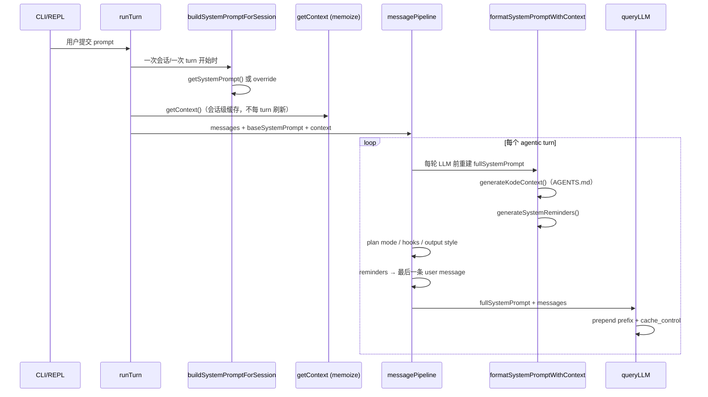

续篇：把 Kode-CLI 的架构映射到你们 `genesis-agent` 现状，并给出可落地的演进建议。

---

## 7. 生命周期与时序（Kode 的关键设计细节）

上一篇讲了「有哪些层」，这里补「**何时组装**」——这对你们设计 `PromptComposer` 很重要。



**三个时间点要分开：**

| 时机 | Kode 做什么 | 是否缓存 |
|---|---|---|
| 进程/会话启动 | `refreshKodeContext()` 预取 AGENTS.md；`getSessionStartAdditionalContext()` 跑 SessionStart hook | session 级 |
| 每次用户提交 | `buildSystemPromptForSession()`（override/append/jsonSchema） | 通常不变 |
| 每个 agentic turn | `formatSystemPromptWithContext()` + plan/hook/output style + reminder 注入 user | reminder 动态；context memoize 不变 |

**genesis-agent 当前差异：** `react_loop.go` 只在 **Run 开始时** 调一次 `BuildSystem()`，之后主循环不再重建 system prompt，也没有「reminder 注入 user message」通道。

```166:170:internal/runtime/strategy/react/react_loop.go
	systemPrompt, err := e.prompt.BuildSystem(ctx, prompt.BuildRequest{Agent: agent, Run: rc.Run})
	if err != nil {
		return err
	}
	rc.Messages = append(rc.Messages, domain.NewSystemMessage(systemPrompt))
```

这是你们与 Kode 最大的架构差距之一。

---

## 8. genesis-agent 现状 vs Kode 对照表

| 能力域 | Kode-CLI | genesis-agent 现状 | 差距 |
|---|---|---|---|
| 基座 prompt | `constants/prompts.ts` 大模板 + 条件段落 | `Agent.SystemPrompt` 或默认一句 | 缺分层基座（身份/工具策略/安全/语气） |
| 构建接口 | 多层函数链 | `prompt.Builder` + `ContextInjector` | 接口方向对，但缺 per-turn 层 |
| 项目指令 | AGENTS.md 栈 + `kodeContext` | 有 `AGENTS.md` 文档约定，**未接入 builder** | 需 `ProjectInstructionsInjector` |
| 环境上下文 | git/目录/README `<context>` 标签 | 仅当前时间 | 需 `EnvContextInjector` |
| 工具知识 | `tool.prompt()` → schema description | Skill 规则在 injector；catalog 在 Tool DescriptionFunc | 方向一致，可继续强化 |
| 动态 reminder | `<system-reminder>` → **user message** | `failure_kind` 写在 system 行为规则 | 应拆到 per-turn user 前缀 |
| 子 Agent | `getAgentPrompt()` + `agentConfig.systemPrompt` | `domain.Agent.SystemPrompt` | 缺子 agent 公共基座 + 工具过滤 |
| Hook 注入 | SessionStart / UserPromptSubmit → system | Hook 设计文档有，prompt 未接 | 需 `HookPromptDrain` |
| 覆盖优先级 | built-in < … < policy | config + agent 字段 | 需显式 merge 链 |
| Prompt caching | Anthropic `cache_control` + prefix 分割 | 未见 | Phase 2 可做 |
| Output Style | 独立 prompt 块 + `keepCodingInstructions` | 无 | 可用 Agent Profile / 产品配置替代 |

你们已有雏形：

```10:40:internal/runtime/prompt/interface.go
type BuildRequest struct {
	Agent   *domain.Agent
	Run     *domain.Run
	UserID  string
	TurnID  string
	Context map[string]string
}

type ContextInjector interface {
	Inject(ctx context.Context, req BuildRequest) (Fragment, error)
}

type Builder interface {
	BuildSystem(ctx context.Context, req BuildRequest) (string, error)
}
```

CLI 产品已在 bootstrap 注入 Skill 硬规则（与 Kode「工具策略在 system、catalog 在 tool description」一致）。

---

## 9. 建议的 `PromptComposer` 演进（借鉴 Kode，贴合 Go）

不必照搬 Kode 的 TS 大字符串，建议保留你们 `ContextInjector` 插件化，但**拆成 4 个阶段**：

### 阶段 A — `BasePromptProvider`（稳定、可测试）

职责等同 Kode 的 `getSystemPrompt()`。

```go
// 建议新增：internal/runtime/prompt/base.go
type BasePromptProvider interface {
    Blocks(ctx context.Context, req BuildRequest) ([]string, error)
}
```

块建议固定顺序：
1. `identity` — 产品身份
2. `security` — 恶意代码/安全拒绝
3. `tool_policy` — 工具使用总则（Skill 网关边界、并行调用等）
4. `task_management` — 若启用 Task/Todo
5. `tone` — 可由 Agent Profile 关闭
6. `agent_specific` — `req.Agent.SystemPrompt`

来源：代码常量 + `products/<product>/bootstrap` 注入，**不要**把 AGENTS.md 放这里。

### 阶段 B — `SessionContextProvider`（会话级 memoize）

等同 Kode `getContext()` + `generateKodeContext()`。

```go
type SessionContextProvider interface {
    Snapshot(ctx context.Context, req BuildRequest) (SessionContext, error)
}

type SessionContext struct {
    ProjectDocs string            // AGENTS.md 栈（高优先级，进 system 固定段）
    Fragments   []Fragment       // gitStatus, directoryStructure, readme...
}
```

建议 injector：
- `ProjectInstructionsInjector` — 移植 Kode `projectInstructions.ts` 逻辑（git root→cwd、override 优先、字节预算）
- `GitStatusInjector`
- `DirectorySnapshotInjector`
- `ReadmeInjector`

**去重规则（学 Kode）：** `ProjectDocs` 只进 `# 项目上下文` 段，不再出现在 `<context name="codeStyle">` 里（Kode 的 `getCodeStyle()` 重复读 AGENTS 是反面教材）。

### 阶段 C — `TurnPromptEnhancer`（每 turn 调用）

等同 Kode `message-pipeline` 252–319 行。

```go
type TurnEnhanceRequest struct {
    BuildRequest
    Iteration int
    Messages  []domain.Message
}

type TurnPromptEnhancer interface {
    EnhanceSystem(ctx context.Context, base string, snap SessionContext, req TurnEnhanceRequest) (string, error)
    EnhanceUserPrefix(ctx context.Context, req TurnEnhanceRequest) (string, error) // <system-reminder>
}
```

增强器插件：
- `PlanModeEnhancer` — 等同 `getPlanModeSystemPromptAdditions`
- `HookEnhancer` — 等同 `drainHookSystemPromptAdditions`
- `OutputStyleEnhancer` — 产品级风格块
- `ReminderEnhancer` — task/todo/file/security，输出到 **user 前缀**而非 system

**react_loop 改造点：** 主循环每次 LLM 前调 `EnhanceSystem`；每次 user/tool_result 回合前调 `EnhanceUserPrefix` 并 prepend 到最后 user message。

### 阶段 D — `TransportAdapter`（LLM 层）

等同 Kode `splitSysPromptPrefix` + `cache_control`。

```go
type SystemMessageAdapter interface {
    ToProviderBlocks(system string, profile ModelProfile) []ProviderTextBlock
}
```

与业务 prompt 解耦，只在 adapter 层做 prefix 分割和 caching。

---

## 10. 覆盖与合并优先级（建议 genesis-agent 采用）

直接借鉴 Kode `mergeAgents()` 的「后者覆盖前者」：

```
builtin_base < product_base < tenant_policy < project < user < run_flag < agent.system_prompt
```

对应配置来源建议：

| 层级 | 配置位置 | 映射 Kode |
|---|---|---|
| product | `products/*/bootstrap` 注入 BasePromptProvider | built-in |
| project | `AGENTS.md` / `AGENTS.override.md` | projectInstructions |
| project agents | `.genesis/agents/*.md`（未来） | `.kode/agents` |
| user | `~/.genesis/settings` | `~/.kode` |
| run | CLI `--system-prompt` / `--append-system-prompt` | rootAction flags |
| agent | `domain.Agent.SystemPrompt` | agentConfig.systemPrompt |

**子 Agent 公式（与 Kode TaskTool 一致）：**

```
SubAgentSystem = BaseAgentPrompt() + agent.SystemPrompt + SessionContext.ProjectDocs
```

子 agent **仍走** TurnEnhancer，但可跳过 OutputStyle（Kode 仅 `agentId === 'main'` 注入）。

---

## 11. Reminder 体系建议（高价值、实现成本适中）

Kode 把 reminder 分成两类，建议 genesis-agent 照搬：

| 类型 | 注入位置 | 示例 |
|---|---|---|
| Instruction | system（TurnEnhancer） | plan mode、hook additional context |
| Reminder | user message 前缀 `<system-reminder>` | 文件已修改、task 空、重复失败 guard |

你们现在把 `failure_kind=repeated_failure` 写在 system 行为规则里是有效的，但更贴近 Kode 的做法是：

- **稳定规则** → system（阶段 A）
- **本轮/本事件提醒** → user 前缀（阶段 C `EnhanceUserPrefix`）

这样 system 可缓存、reminder 可每 turn 变化，且模型更容易把 reminder 当「系统附加信息」而非「用户说的话」。

可参考 Kode：
- `packages/core/src/services/systemReminder/service.ts` — 限流、去重 key、事件驱动
- `packages/core/src/engine/message-pipeline.ts:295-319` — 注入 user message

---

## 12. 实施路线图（按性价比排序）

**Phase 1（1–2 周，对齐 Kode 核心）**
1. `ProjectInstructionsInjector` — 读 AGENTS.md 栈
2. `EnvContextInjector` — cwd、git、平台、日期
3. 拆分 `DefaultBuilder`：基座常量块 + injectors
4. `react_loop` 支持 per-turn `EnhanceUserPrefix`（先接 failure/reminder）

**Phase 2**
5. `TurnPromptEnhancer` 框架 + Hook drain
6. 子 Agent `BaseAgentPrompt` + 工具过滤
7. Run 级 `--append-system-prompt` CLI 参数

**Phase 3**
8. Output Style / Agent Profile
9. Anthropic prompt caching（TransportAdapter）
10. compat prompt profile（多模型网关）

---

## 13. 可直接复用的 Kode 文件（按优先级）

若你们要「抄作业」，建议按这个顺序读/移植：

1. `packages/core/src/utils/projectInstructions.ts` — AGENTS 发现算法
2. `packages/core/src/services/systemPrompt.ts` — 双通道注入 + 去重
3. `packages/core/src/engine/message-pipeline.ts` — per-turn 组装时序
4. `packages/core/src/services/systemReminder/` — reminder 子系统
5. `packages/core/src/constants/prompts.ts` — 基座段落拆分参考（不必照搬文案）
6. `packages/tools/src/tools/ai/TaskTool/call.ts` — 子 agent 拼接
7. `packages/core/src/agent/loader.ts` — 配置合并优先级

---

**一句话总结续篇：** Kode 的核心不是「一个大 prompt 文件」，而是 **会话快照（memoize）+ 每 turn 增强（system/user 双通道）+ 工具知识外置（tool description）** 三板斧。你们 `internal/runtime/prompt` 的 `ContextInjector` 插件模型已经走对路，下一步关键是把 `react_loop` 从「Run 级一次 BuildSystem」升级为「Turn 级 EnhanceSystem + EnhanceUserPrefix」，并补上 AGENTS.md 栈注入。

若要我在 Agent 模式下直接起草 `internal/runtime/prompt/` 的接口拆分和 `ProjectInstructionsInjector` 实现草案，可以说一下优先做 CLI 还是 Enterprise 产品路径。