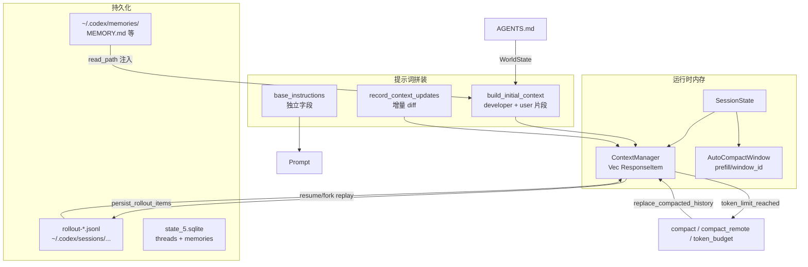

# Codex 会话/上下文/记忆/压缩机制 — 源码调研报告

> 仓库根目录：`D:\workspace\go\go-project\codex`  
> 核心实现语言：**Rust**（`codex-rs/`）

---

## 架构总览



---

## 1. 会话/对话历史（Rollout）如何存储与组织

### 1.1 内存模型（活跃会话）

| 组件 | 路径 | 职责 |
|------|------|------|
| `ContextManager` | `D:\workspace\go\go-project\codex\codex-rs\core\src\context_manager\history.rs` | 对话 transcript：`items: Vec<ResponseItem>`，**最旧在前、最新在后** |
| `SessionState` | `D:\workspace\go\go-project\codex\codex-rs\core\src\state\session.rs` | 持有 `history: ContextManager`、token 信息、auto-compact window 等 |
| `Session` | `D:\workspace\go\go-project\codex\codex-rs\core\src\session\mod.rs` | 对外 API：`record_conversation_items`、`replace_compacted_history`、`clone_history` 等 |

`ContextManager` 关键字段：

```36:57:D:\workspace\go\go-project\codex\codex-rs\core\src\context_manager\history.rs
/// Transcript of thread history
#[derive(Debug, Clone, Default)]
pub(crate) struct ContextManager {
    /// The oldest items are at the beginning of the vector.
    items: Vec<ResponseItem>,
    /// Bumped whenever history is rewritten, such as compaction or rollback.
    history_version: u64,
    token_info: Option<TokenUsageInfo>,
    reference_context_item: Option<TurnContextItem>,
    world_state_baseline: Option<WorldStateSnapshot>,
}
```

### 1.2 持久化：JSONL Rollout

| 文件/模块 | 绝对路径 |
|-----------|----------|
| Rollout 写入器 | `D:\workspace\go\go-project\codex\codex-rs\rollout\src\recorder.rs` |
| Rollout 策略/过滤 | `D:\workspace\go\go-project\codex\codex-rs\rollout\src\policy.rs` |
| 压缩读取 | `D:\workspace\go\go-project\codex\codex-rs\rollout\src\compression.rs` |
| 列表/搜索 | `D:\workspace\go\go-project\codex\codex-rs\rollout\src\list.rs`, `search.rs` |
| 会话索引 | `D:\workspace\go\go-project\codex\codex-rs\rollout\src\session_index.rs` |
| State DB 桥接 | `D:\workspace\go\go-project\codex\codex-rs\rollout\src\state_db.rs` |
| 协议定义 | `D:\workspace\go\go-project\codex\codex-rs\protocol\src\protocol.rs` |

**磁盘路径约定：**

- 会话目录：`{codex_home}/sessions/{YYYY}/{MM}/{DD}/`
- 文件名：`rollout-{RFC3339-timestamp}-{thread_uuid}.jsonl`
- 常量：`SESSIONS_SUBDIR = "sessions"`（`rollout\src\lib.rs`）
- 典型完整路径示例：`C:\Users\<user>\.codex\sessions\2025\01\03\rollout-2025-01-03T12-00-00-<uuid>.jsonl`

**RolloutItem 枚举**（JSONL 每行一个）：

```3153:3168:D:\workspace\go\go-project\codex\codex-rs\protocol\src\protocol.rs
pub enum RolloutItem {
    SessionMeta(SessionMetaLine),
    ResponseItem(ResponseItem),
    InterAgentCommunication(InterAgentCommunication),
    InterAgentCommunicationMetadata { trigger_turn: bool },
    Compacted(CompactedItem),
    TurnContext(TurnContextItem),
    WorldState(WorldStateItem),
    EventMsg(EventMsg),
}
```

- `SessionMeta`：会话级元数据（thread_id、base_instructions、cwd、context_window 等）
- `ResponseItem`：模型可见消息/工具调用/输出
- `Compacted`：压缩摘要 + `replacement_history`
- `TurnContext`：每轮上下文快照（用于 resume diff）
- `WorldState`：AGENTS.md 等 world-state 基线
- `EventMsg`：UI/遥测事件（含 `TokenCount`）

### 1.3 恢复/Replay

| 模块 | 路径 |
|------|------|
| Rollout 重建 | `D:\workspace\go\go-project\codex\codex-rs\core\src\session\rollout_reconstruction.rs` |
| Rollout trace reducer | `D:\workspace\go\go-project\codex\codex-rs\rollout-trace\src\reducer\` |
| Thread Store 抽象 | `D:\workspace\go\go-project\codex\codex-rs\thread-store\` |

Resume 时：`InitialHistory::Resumed` → `apply_rollout_reconstruction()` 从 rollout 重建 `ContextManager`。

### 1.4 SQLite 元数据索引

| 路径 | 内容 |
|------|------|
| `D:\workspace\go\go-project\codex\codex-rs\state\src\lib.rs` | `STATE_DB_FILENAME = "state_5.sqlite"` |
| `D:\workspace\go\go-project\codex\codex-rs\state\src\runtime.rs` | `state_db_path(codex_home)` → `{codex_home}/state_5.sqlite` |
| `D:\workspace\go\go-project\codex\codex-rs\state\migrations\0001_threads.sql` | `threads` 表（rollout_path、tokens_used 等） |
| `D:\workspace\go\go-project\codex\codex-rs\state\migrations\0006_memories.sql` | `stage1_outputs`、`jobs`（记忆流水线） |

---

## 2. 上下文窗口管理

### 2.1 Token 计数（两套体系）

#### A. 服务端权威计数（主路径）

- 每次模型响应后更新 `TokenUsageInfo`（`protocol.rs`）
- 活跃用量 = `last_token_usage.total_tokens` + 本地追加项（工具输出、reasoning 等）

```328:346:D:\workspace\go\go-project\codex\codex-rs\core\src\context_manager\history.rs
pub(crate) fn get_total_token_usage(&self, server_reasoning_included: bool) -> i64 {
    let last_tokens = self.token_info.as_ref()
        .map(|info| info.last_token_usage.total_tokens).unwrap_or(0);
    let items_after_last_model_generated_tokens = ...
    if server_reasoning_included {
        last_tokens.saturating_add(items_after_last_model_generated_tokens)
    } else {
        last_tokens.saturating_add(self.get_non_last_reasoning_items_tokens())
            .saturating_add(items_after_last_model_generated_tokens)
    }
}
```

入口：`Session::get_total_token_usage()` → `D:\workspace\go\go-project\codex\codex-rs\core\src\session\mod.rs`

#### B. 本地估算（压缩后重算、兜底）

- **不用 tiktoken**，用字节启发式：`approx_token_count = len / 4`
- 实现：`D:\workspace\go\go-project\codex\codex-rs\utils\string\src\truncate.rs`

```71:78:D:\workspace\go\go-project\codex\codex-rs\utils\string\src\truncate.rs
pub fn approx_token_count(text: &str) -> usize {
    let len = text.len();
    len.saturating_add(APPROX_BYTES_PER_TOKEN.saturating_sub(1)) / APPROX_BYTES_PER_TOKEN
}
```

- 封装：`D:\workspace\go\go-project\codex\codex-rs\utils\output-truncation\src\lib.rs`
- 估算函数：`ContextManager::estimate_token_count()`、`Session::recompute_token_usage()`

### 2.2 模型最大上下文如何配置/获取

| 层级 | 路径 | 字段/逻辑 |
|------|------|-----------|
| 模型元数据 JSON | `D:\workspace\go\go-project\codex\codex-rs\models-manager\models.json` | `context_window`, `max_context_window`, `auto_compact_token_limit`, `effective_context_window_percent` |
| 协议结构 | `D:\workspace\go\go-project\codex\codex-rs\protocol\src\openai_models.rs` | `ModelInfo` |
| 解析逻辑 | `ModelInfo::resolved_context_window()` | `context_window.or(max_context_window)` |
| 有效窗口 | `TurnContext::model_context_window()` | `resolved_context_window * effective_context_window_percent / 100`（默认 **95%**） |
| 配置覆盖 | `D:\workspace\go\go-project\codex\codex-rs\models-manager\src\model_info.rs` | `with_config_overrides()` |

```188:195:D:\workspace\go\go-project\codex\codex-rs\core\src\session\turn_context.rs
pub(crate) fn model_context_window(&self) -> Option<i64> {
    let effective_context_window_percent = self.model_info.effective_context_window_percent;
    self.model_info.resolved_context_window().map(|context_window| {
        context_window.saturating_mul(effective_context_window_percent) / 100
    })
}
```

**为输出预留**：`effective_context_window_percent` 默认 95，即约 5% 留给系统提示、工具开销和模型输出。

### 2.3 自动压缩阈值（auto_compact_token_limit）

```441:452:D:\workspace\go\go-project\codex\codex-rs\protocol\src\openai_models.rs
pub fn auto_compact_token_limit(&self) -> Option<i64> {
    let context_limit = self.resolved_context_window()
        .map(|context_window| (context_window * 9) / 10);  // 默认 90%
    let config_limit = self.auto_compact_token_limit;
    ...
}
```

用户可在 `config` 中覆盖：`model_auto_compact_token_limit`（`core\src\config\mod.rs`）。

### 2.4 上下文使用率与接近上限处理

核心状态机：`context_window_token_status()`  
→ `D:\workspace\go\go-project\codex\codex-rs\core\src\session\context_window.rs`

| 指标 | 含义 |
|------|------|
| `active_context_tokens` | 全量活跃 token |
| `auto_compact_scope_tokens` | 计入压缩预算的 token（受 scope 影响） |
| `auto_compact_scope_limit` | 压缩触发阈值 |
| `full_context_window_limit` | 有效上下文上限（95%） |
| `tokens_until_compaction` | `min(scope_remaining, full_remaining)` |
| `token_limit_reached` | scope 或 full 任一达到 |

**Scope 两种模式**（`AutoCompactTokenLimitScope`，`protocol\src\config_types.rs`）：

- `Total`：全量 active tokens 对比 limit
- `BodyAfterPrefix`：减去 `auto_compact_window.prefill_input_tokens`（前缀不计入 body 增长）

`AutoCompactWindow` 管理窗口链与 prefill 基线：  
`D:\workspace\go\go-project\codex\codex-rs\core\src\state\auto_compact_window.rs`

**接近上限时的动作**（`session\turn.rs`）：

1. `maybe_record()` 发送 token budget 提醒（`session\token_budget.rs`）
2. `token_limit_reached` 时触发 `run_auto_compact()`（mid-turn）
3. 模型返回 `ContextWindowExceeded` 时压缩循环内 `remove_first_item()` 删最旧历史
4. `Feature::TokenBudget` 时走 `compact_token_budget`（不摘要，直接换新窗口）

---

## 3. 压缩（Compaction）/ 自动摘要机制

### 3.1 触发条件

| 触发场景 | Reason | Phase | 关键函数 |
|----------|--------|-------|----------|
| Mid-turn token 超限 | `ContextLimit` | `MidTurn` | `turn.rs` → `run_auto_compact()` |
| 用户 `/compact` | `UserRequested` | `StandaloneTurn` | `compact.rs` → `run_compact_task()` |
| 模型 comp_hash 变化 | `CompHashChanged` | `PreTurn` | `maybe_run_previous_model_inline_compact()` |
| 切换到更小窗口模型 | `ModelDownshift` | `PreTurn` | 同上 |
| TokenBudget feature | N/A | 任意 | `compact_token_budget.rs` |

触发判断（mid-turn）：

```346:368:D:\workspace\go\go-project\codex\codex-rs\core\src\session\turn.rs
if needs_follow_up
    && (sess.take_new_context_window_request().await || token_limit_reached)
{
    run_auto_compact(..., InitialContextInjection::BeforeLastUserMessage(...),
        CompactionReason::ContextLimit, CompactionPhase::MidTurn).await
}
```

阈值：**不是固定百分比 UI 阈值**，而是 `active_context_tokens >= auto_compact_token_limit` 或 `>= full_context_window_limit`（见 `context_window.rs`）。

### 3.2 三种压缩实现

| 实现 | 路径 | 说明 |
|------|------|------|
| Inline（Responses API 摘要） | `D:\workspace\go\go-project\codex\codex-rs\core\src\compact.rs` | 默认；发 compaction turn 让模型写摘要 |
| Remote compaction | `D:\workspace\go\go-project\codex\codex-rs\core\src\compact_remote.rs`, `compact_remote_v2.rs` | 服务端压缩 API |
| Token budget compaction | `D:\workspace\go\go-project\codex\codex-rs\core\src\compact_token_budget.rs` | 跳过摘要，`start_new_context_window()` 重装初始上下文 |

### 3.3 摘要提示词模板

| 文件 | 绝对路径 | 常量 |
|------|----------|------|
| 压缩指令 | `D:\workspace\go\go-project\codex\codex-rs\prompts\templates\compact\prompt.md` | `SUMMARIZATION_PROMPT` |
| 摘要前缀 | `D:\workspace\go\go-project\codex\codex-rs\prompts\templates\compact\summary_prefix.md` | `SUMMARY_PREFIX` |
| Rust 绑定 | `D:\workspace\go\go-project\codex\codex-rs\prompts\src\compact.rs` | `include_str!` |
| 用户可覆盖 | `config.compact_prompt` 或 `experimental_compact_prompt_file` | `core\src\config\mod.rs` |

`prompt.md` 核心内容（CONTEXT CHECKPOINT COMPACTION handoff summary）。

`summary_prefix.md` 开头：

> "Another language model started to solve this problem and produced a summary..."

### 3.4 压缩流程与历史回填

主流程（`compact.rs` → `run_compact_task_inner_impl`）：

1. 发送 compaction user message（默认 `SUMMARIZATION_PROMPT`）
2. 用当前 history + base_instructions 调模型
3. 取最后 assistant 输出作为 `summary_suffix`
4. 组装 `summary_text = "{SUMMARY_PREFIX}\n{summary_suffix}"`
5. `collect_user_messages()` 收集非摘要 user 消息
6. `build_compacted_history()`：
   - 从最新往回保留 user 消息，总预算 **20,000 tokens**（`COMPACT_USER_MESSAGE_MAX_TOKENS`）
   - 末尾追加 summary 作为 **user role** 消息
7. 按 `InitialContextInjection` 决定是否插入 `build_initial_context` 片段
8. `replace_compacted_history()` 替换内存历史并持久化 `RolloutItem::Compacted`

回填结构示例逻辑：

```585:658:D:\workspace\go\go-project\codex\codex-rs\core\src\compact.rs
// new_history = [可选 initial_context] + [保留的 user 消息...] + [summary user 消息]
history.push(ResponseItem::Message { role: "user", content: summary_text, ... });
```

持久化：`replace_compacted_history()` → `D:\workspace\go\go-project\codex\codex-rs\core\src\session\mod.rs`（写 `Compacted` + `WorldState` + `TurnContext` rollout 行）。

压缩后 token 重算：`recompute_token_usage()` 用本地估算填充 `last_token_usage.total_tokens`。

### 3.5 Hooks

| 路径 |
|------|
| `D:\workspace\go\go-project\codex\codex-rs\hooks\src\events\compact.rs` |
| `D:\workspace\go\go-project\codex\codex-rs\hooks\schema\generated\pre-compact.*.schema.json` |
| `D:\workspace\go\go-project\codex\codex-rs\hooks\schema\generated\post-compact.*.schema.json` |

---

## 4. 跨会话记忆 / 持久记忆

Codex 有 **两套独立机制**：AGENTS.md（项目级）+ Memories（跨 rollout 经验库）。

### 4.1 AGENTS.md（项目文档记忆）

| 模块 | 绝对路径 |
|------|----------|
| 发现与加载 | `D:\workspace\go\go-project\codex\codex-rs\core\src\agents_md.rs` |
| Manager | `D:\workspace\go\go-project\codex\codex-rs\core\src\agents_md_manager.rs` |
| WorldState 段 | `D:\workspace\go\go-project\codex\codex-rs\core\src\context\world_state\agents_md.rs` |
| 注入渲染 | `D:\workspace\go\go-project\codex\codex-rs\core\src\context\user_instructions.rs` |
| 文档 | `D:\workspace\go\go-project\codex\docs\agents_md.md` |

**如何形成：**

- 从 project root（`.git` 等 marker）到 cwd，逐级查找 `AGENTS.override.md` → `AGENTS.md` → fallback 文件名
- 拼接预算：`project_doc_max_bytes`（默认 AGENTS_MD_MAX_BYTES）
- 多环境时按 environment 标签分组

**如何注入：**

- 作为 `WorldState` 的 `agents_md` section
- 渲染为 **user role** 消息，包裹在 `# AGENTS.md instructions` / `</INSTRUCTIONS>` 标记内
- 增量 diff：变更时发 replacement/removal notice

```18:28:D:\workspace\go\go-project\codex\codex-rs\core\src\context\user_instructions.rs
fn type_markers() -> (&'static str, &'static str) {
    ("# AGENTS.md instructions", "</INSTRUCTIONS>")
}
```

### 4.2 Memories（跨 rollout 经验记忆）

| 类别 | 绝对路径 |
|------|----------|
| 总览文档 | `D:\workspace\go\go-project\codex\codex-rs\memories\README.md` |
| Phase1 写入 | `D:\workspace\go\go-project\codex\codex-rs\memories\write\src\phase1.rs` |
| Phase2 合并 | `D:\workspace\go\go-project\codex\codex-rs\memories\write\src\phase2.rs` |
| 启动编排 | `D:\workspace\go\go-project\codex\codex-rs\memories\write\src\start.rs`, `runtime.rs` |
| 读路径扩展 | `D:\workspace\go\go-project\codex\codex-rs\ext\memories\src\extension.rs` |
| 读路径提示词 | `D:\workspace\go\go-project\codex\codex-rs\ext\memories\templates\memories\read_path.md` |
| Phase1 系统提示 | `D:\workspace\go\go-project\codex\codex-rs\memories\write\templates\memories\stage_one_system.md` |
| Phase2 合并提示 | `D:\workspace\go\go-project\codex\codex-rs\memories\write\templates\memories\consolidation.md` |
| 引用解析 | `D:\workspace\go\go-project\codex\codex-rs\memories\read\src\citations.rs` |
| State 模型 | `D:\workspace\go\go-project\codex\codex-rs\state\src\runtime\memories.rs` |
| 配置 | `D:\workspace\go\go-project\codex\codex-rs\config\src\types.rs` (`MemoriesConfig`) |

**存储位置：**

- 文件系统：`{codex_home}/memories/`（`MEMORY.md`、`memory_summary.md`、`rollout_summaries/`、`skills/`、`extensions/ad_hoc/notes/`）
- SQLite：`stage1_outputs` 表（per-thread raw_memory + rollout_summary）
- Git 基线：`~/.codex/memories/.git`（Phase2 workspace diff）

**如何形成：**

- 根会话启动后异步触发（非 ephemeral、非 sub-agent、feature 开启）
- Phase1：从 state DB 认领近期 rollout → 模型抽取 → 写入 `stage1_outputs`
- Phase2：合并 top-N → 更新文件 → 可选启动 consolidation sub-agent

**如何注入会话：**

- `MemoriesExtension::contribute_thread_context()` 读取 `memory_summary.md`
- 渲染 `read_path.md` 模板 → 作为 **developer policy** 片段注入 `build_initial_context`
- 可选 dedicated tools：`memory_search` / `memory_read` 等（`ext\memories\src\tools\`）
- 模型回复可带 `<oai-mem-citation>` 块，core 解析并记录 usage（`stream_events_utils.rs`）

---

## 5. 提示词分层拼装

### 5.1 最终发给模型的 `Prompt` 结构

```17:36:D:\workspace\go\go-project\codex\codex-rs\core\src\client_common.rs
pub struct Prompt {
    pub input: Vec<ResponseItem>,           // 历史 + 上下文片段
    pub(crate) tools: Vec<ToolSpec>,
    pub base_instructions: BaseInstructions, // 独立系统指令，不在 history items 里
    pub output_schema: Option<Value>,
}
```

### 5.2 分层来源与拼装入口

主函数：`Session::build_initial_context_with_world_state_and_mcp()`  
→ `D:\workspace\go\go-project\codex\codex-rs\core\src\session\mod.rs`（约 3142 行起）

| 层级 | 来源 | Role | 相关文件 |
|------|------|------|----------|
| **Base instructions** | `ModelInfo.get_model_instructions(personality)`，会话创建时快照到 `SessionConfiguration.base_instructions` | API `instructions` 字段 | `models.json`, `openai_models.rs`, `session\session.rs` |
| **Developer instructions** | `config.developer_instructions` | developer message | `session\mod.rs` |
| **Permissions** | sandbox/approval profile | developer | `context\permissions_instructions.rs`（经 `context_manager\updates.rs`） |
| **Collaboration mode** | plan/review 等模式 | developer | `context\collaboration_mode_instructions.rs` |
| **Realtime** | 语音/实时状态 | developer | `realtime_context.rs`, `updates.rs` |
| **Personality** | 人格变体（friendly/pragmatic） | developer | `context\personality_spec_instructions.rs` |
| **Apps/MCP connectors** | 已启用 connector | developer | `context\apps_instructions.rs` |
| **Skills** | 可用 skill 列表 | developer | `core-skills\src\render.rs` |
| **Plugins** | 已加载插件 | developer | `ext\skills\`, `session\mod.rs` |
| **Extensions** | `ContextContributor` 插件 | developer/user | `ext\extension-api\`, 各 ext |
| **Token budget** | window id + MCP notes | developer | `context\token_budget_context.rs` |
| **Memories** | memory_summary | developer | `ext\memories\` |
| **AGENTS.md** | 项目文档 | **user**（带标记） | `agents_md.rs`, `world_state\agents_md.rs` |
| **Environment** | cwd/shell 等 | user/developer | `context\world_state\environment.rs` |
| **Model switch** | 换模型提示 | developer | `context\model_switch_instructions.rs` |

默认 base instructions 模板（开源 CLI 版）：  
`D:\workspace\go\go-project\codex\codex-rs\protocol\src\prompts\base_instructions\default.md`

云端模型内置版：嵌在 `models-manager\models.json` 的 `base_instructions` / `model_messages.instructions_template`。

### 5.3 增量 vs 全量注入

| 模式 | 函数 | 路径 |
|------|------|------|
| 首 turn / 无 baseline | 全量 `build_initial_context` | `session\mod.rs` |
| 稳态 turn | `record_context_updates_and_set_reference_context_item()` diff | `session\mod.rs` |
| Diff 构建 | `context_manager\updates.rs` | 对比 `reference_context_item` |
| WorldState diff | `WorldState::render_history_diff()` | `context\world_state\mod.rs` |

压缩后：`InitialContextInjection::DoNotInject` 时清空 `reference_context_item`，下一 regular turn **强制全量 reinject**。

---

## 6. Token 估算库与模型上下文元数据

### 6.1 Token 估算

| 项目 | 结论 |
|------|------|
| **库** | **无 tiktoken**；自研启发式 `bytes/4` |
| 实现 | `D:\workspace\go\go-project\codex\codex-rs\utils\string\src\truncate.rs` |
| 对外 crate | `codex-utils-output-truncation` |
| 用途 | 工具输出截断、本地 token 估算、压缩后重算 |
| 服务端计数 | API 返回的 `TokenUsage`（`input_tokens`/`output_tokens`/`total_tokens`） |

### 6.2 模型上下文元数据配置

| 文件 | 字段 |
|------|------|
| `D:\workspace\go\go-project\codex\codex-rs\models-manager\models.json` | `context_window`, `max_context_window`, `auto_compact_token_limit`, `effective_context_window_percent`, `truncation_policy`, `slug` |
| `D:\workspace\go\go-project\codex\codex-rs\protocol\src\openai_models.rs` | `ModelInfo` 结构 + `resolved_context_window()` / `auto_compact_token_limit()` |
| `D:\workspace\go\go-project\codex\codex-rs\models-manager\src\config.rs` | 用户覆盖：`model_context_window`, `model_auto_compact_token_limit`, `tool_output_token_limit` |
| `D:\workspace\go\go-project\codex\codex-rs\models-manager\src\model_info.rs` | `with_config_overrides()`, fallback `model_info_from_slug()` |
| `D:\workspace\go\go-project\codex\codex-rs\core\config.schema.json` | 用户 config schema |

示例（gpt-5.5）：`context_window: 272000`, `max_context_window: 272000`, `auto_compact_token_limit: null`（运行时按 90% 推导 ≈ 244,800）。

---

## 完整相关源码文件索引（按子系统）

### 会话 / 历史 / Rollout
- `D:\workspace\go\go-project\codex\codex-rs\core\src\context_manager\history.rs`
- `D:\workspace\go\go-project\codex\codex-rs\core\src\context_manager\history_tests.rs`
- `D:\workspace\go\go-project\codex\codex-rs\core\src\context_manager\updates.rs`
- `D:\workspace\go\go-project\codex\codex-rs\core\src\context_manager\normalize.rs`
- `D:\workspace\go\go-project\codex\codex-rs\core\src\state\session.rs`
- `D:\workspace\go\go-project\codex\codex-rs\core\src\state\auto_compact_window.rs`
- `D:\workspace\go\go-project\codex\codex-rs\core\src\session\mod.rs`
- `D:\workspace\go\go-project\codex\codex-rs\core\src\session\session.rs`
- `D:\workspace\go\go-project\codex\codex-rs\core\src\session\turn.rs`
- `D:\workspace\go\go-project\codex\codex-rs\core\src\session\turn_context.rs`
- `D:\workspace\go\go-project\codex\codex-rs\core\src\session\context_window.rs`
- `D:\workspace\go\go-project\codex\codex-rs\core\src\session\token_budget.rs`
- `D:\workspace\go\go-project\codex\codex-rs\core\src\session\rollout_reconstruction.rs`
- `D:\workspace\go\go-project\codex\codex-rs\core\src\session\world_state.rs`
- `D:\workspace\go\go-project\codex\codex-rs\rollout\src\recorder.rs`
- `D:\workspace\go\go-project\codex\codex-rs\rollout\src\policy.rs`
- `D:\workspace\go\go-project\codex\codex-rs\rollout\src\lib.rs`
- `D:\workspace\go\go-project\codex\codex-rs\thread-store\src\lib.rs`
- `D:\workspace\go\go-project\codex\codex-rs\rollout-trace\src\reducer\compaction.rs`

### 压缩
- `D:\workspace\go\go-project\codex\codex-rs\core\src\compact.rs`
- `D:\workspace\go\go-project\codex\codex-rs\core\src\compact_remote.rs`
- `D:\workspace\go\go-project\codex\codex-rs\core\src\compact_remote_v2.rs`
- `D:\workspace\go\go-project\codex\codex-rs\core\src\compact_token_budget.rs`
- `D:\workspace\go\go-project\codex\codex-rs\prompts\templates\compact\prompt.md`
- `D:\workspace\go\go-project\codex\codex-rs\prompts\templates\compact\summary_prefix.md`
- `D:\workspace\go\go-project\codex\codex-rs\prompts\src\compact.rs`
- `D:\workspace\go\go-project\codex\codex-rs\protocol\src\compacted_item.rs`

### 记忆 / AGENTS.md
- `D:\workspace\go\go-project\codex\codex-rs\core\src\agents_md.rs`
- `D:\workspace\go\go-project\codex\codex-rs\core\src\context\world_state\agents_md.rs`
- `D:\workspace\go\go-project\codex\codex-rs\memories\README.md`
- `D:\workspace\go\go-project\codex\codex-rs\memories\write\src\*.rs`
- `D:\workspace\go\go-project\codex\codex-rs\memories\read\src\*.rs`
- `D:\workspace\go\go-project\codex\codex-rs\ext\memories\src\*.rs`
- `D:\workspace\go\go-project\codex\codex-rs\state\src\runtime\memories.rs`

### 提示词 / 模型元数据 / Token
- `D:\workspace\go\go-project\codex\codex-rs\core\src\client_common.rs`
- `D:\workspace\go\go-project\codex\codex-rs\protocol\src\prompts\base_instructions\default.md`
- `D:\workspace\go\go-project\codex\codex-rs\models-manager\models.json`
- `D:\workspace\go\go-project\codex\codex-rs\protocol\src\openai_models.rs`
- `D:\workspace\go\go-project\codex\codex-rs\protocol\src\protocol.rs`（TokenUsageInfo, RolloutItem）
- `D:\workspace\go\go-project\codex\codex-rs\utils\string\src\truncate.rs`
- `D:\workspace\go\go-project\codex\codex-rs\utils\output-truncation\src\lib.rs`
- `D:\workspace\go\go-project\codex\codex-rs\core\src\context\token_budget_context.rs`
- `D:\workspace\go\go-project\codex\codex-rs\core\src\config\mod.rs`

### 测试（行为契约参考）
- `D:\workspace\go\go-project\codex\codex-rs\core\tests\suite\compact.rs`
- `D:\workspace\go\go-project\codex\codex-rs\core\tests\suite\compact_remote.rs`
- `D:\workspace\go\go-project\codex\codex-rs\core\tests\suite\token_budget.rs`
- `D:\workspace\go\go-project\codex\codex-rs\core\tests\suite\rollout_budget.rs`

---

## 对 genesis-agent 设计的可借鉴要点

1. **双层存储**：内存 `Vec<items>` + 追加式 JSONL rollout；元数据进 SQLite，历史本体可重放。
2. **base_instructions 与 history 分离**：系统指令不混进 message list，便于压缩只动 body。
3. **压缩 = 替换历史 + rollout 记录**：`CompactedItem.replacement_history` 保证 resume 一致。
4. **阈值双轨**：90% 触发压缩预算 + 95% 有效窗口上限；可选 `BodyAfterPrefix` 只计 body 增长。
5. **上下文 diff 机制**：`reference_context_item` + `WorldState` patch，避免每 turn 全量重注入。
6. **记忆分层**：AGENTS.md（项目内、随 cwd） vs Memories（跨会话、异步提炼、读时注入 summary）。
7. **Token 估算务实**：服务端计数为主，本地 `bytes/4` 仅作估算/截断，不依赖 tiktoken。

如需我基于这份调研为 genesis-agent 草拟一份「会话管理与记忆管理」对齐设计草案，可切换到 Agent 模式继续。