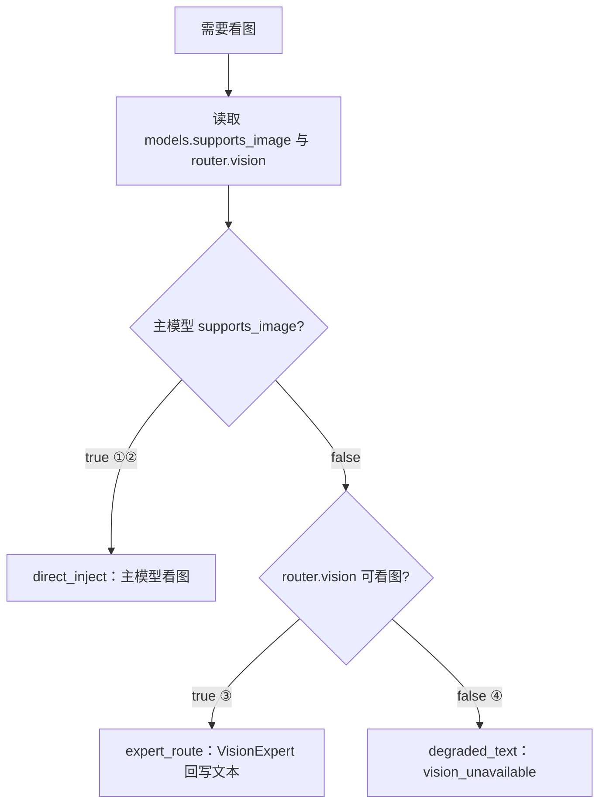

# 多模态输入与视觉能力设计

> 状态：**已实现（内核 + CLI）** — 2026-07-19；推迟项见文末「实现状态」  
> 实现计划：[`superpowers/plans/2026-07-19-multimodal-and-turn-input.md`](./superpowers/plans/2026-07-19-multimodal-and-turn-input.md)  
> 范围：消息多模态（用户图+工具图）、模型视觉能力鉴定、统一装配流水线、`view_image`、office-ppt 等视觉 QA  
> 相关：[`用户Turn输入与附件契约设计.md`](./用户Turn输入与附件契约设计.md)（产品面采集与文本点名）、[`参考项目工具清单与文件系统覆盖分析.md`](./参考项目工具清单与文件系统覆盖分析.md)、[`统一执行工作空间、文件权限与产物规范.md`](./统一执行工作空间、文件权限与产物规范.md)、[`2026-07-17-produced-resource-artifact-delivery-architecture.md`](./superpowers/specs/2026-07-17-produced-resource-artifact-delivery-architecture.md)、Skill/Tool 边界设计

---

## 1. 问题与目标

### 1.1 现状缺口

1. `read_file` 对 jpg/png 等二进制**省略 content**，模型拿不到像素。
2. `domain.Message` / eino 适配当前只有纯文本 `Content`，**无多模态 Parts**。
3. 远程 Skill cwd 中的预览图与宿主 `read_file` **命名空间隔离**；中间态故意不 Delivery 到项目根。
4. `QAPolicy=visual-qa/v1` 名实不符：匹配 SKILL QA 章节的 `run_skill_command` **命令成功**即记 `passed`（含 `markitdown`），**不验证是否看过图与通过逻辑断言**。
5. （已解决）`supports_image` + `router.vision` 已接入；四种配置组合见 §2.0。历史缺口曾是：路由位未接入、无显式 `supports_image`。
6. （已解决）用户上传图与 `view_image` 统一走 `ContentPart`；细节见本文与 Turn 输入契约文档。

### 1.2 设计目标

- **统一两类输入**：用户上传图片与工具产生的图片统一走 `ContentPart` 流水线。
- **配置优先**鉴定视觉能力；运行时只做校验与硬门控降级，不做猜测探测。
- **工具面固定**：`view_image` 放在 `internal/capabilities/media`，为纯粹看图/取图原语；Skill 只负责出图与检查清单；子 Agent 仅作编排增强。
- **收束形态 B 唯一主路径**：工具保持原语，由 Runtime 统一走 `router.vision`，禁止在工具内部隐式裸调 LLM 或保留模糊双路径。
- **强化视觉 QA 判据**：无论形态 A 还是 B，视觉 QA passed 必须具备结构化 checklist 校验回执与断言。
- 视觉 QA 与 ProducedResource / leased session-file 对齐，不把 Skill cwd 全量 sync 回宿主。

### 1.3 非目标

- 不在 Engine 硬编码 LibreOffice / Poppler。
- 不把视觉能力做成 Skill 名当 Tool（禁止 `Skill(visual-qa)` 替代看图）。
- 不把 QA 缩略图自动 Delivery 到用户项目根。
- 不做「根据模型名字符串猜测是否支持视觉」的唯一真相源。
- 不在数据库中直接持久化原始 `image_bytes` 或大 base64 字符串。

---

## 2. 三种能力形态与四种配置组合

在一次 Run 内，对**主 Agent 使用的 chat/tool_call 模型**与可选的 **vision 路由模型**求值，得到 `EffectiveVisionMode`。

### 2.0 四种配置组合（必读）

| # | 主模型 `supports_image` | `router.vision` | EffectiveVisionMode | 说明 |
|---|-------------------------|-----------------|---------------------|------|
| **①** | `true` | 已配置且可看图 | **`direct_inject`（A）** | 主模型直接看图；**本 Run 主路径不用** vision 别名（可留给 Task 二次审计） |
| **②** | `true` | 未配置 / 空 | **`direct_inject`（A）** | 同上，仅主模型看图 |
| **③** | `false` | 已配置且该别名 `supports_image=true` | **`expert_route`（B）** | `view_image` → VisionExpert(视觉模型) → **只回写文本**给主模型 |
| **④** | `false` | 未配置，或指向的别名不可看图 | **`degraded_text`（C）** | `vision_unavailable`；QA 记 `degraded`，禁止伪 visual passed |

配置真相源：

- **是否多模态模型**：只看 `llm.models.<alias>.supports_image`（未写默认 `false`），**禁止**按模型名字符串猜测。
- **`models` 池**：可同时存在多个 `supports_image=true` 的别名（专用 VL、多模态大模型均可）。
- **`router.vision`**：形态 B 的**单一路由槽**（与 `coding`/`planning` 同模式），值为 models 中的一个别名；该别名必须 `supports_image=true`。
  - **可以**指向多模态大模型（如 `gpt4o`、`qwen-vl-max`），不要求必须是「只能看图」的小模型。
  - **当前一次 Run 只启用一个** vision 路由目标；换模型 = 改配置指向另一个别名，不是并行多专家。

```yaml
# 形态 A 示例：主模型自己能看图
llm:
  models:
    default:
      supports_image: true
  router:
    default: default
    vision: ""                    # 可空；即使填了也不改变主路径

# 形态 B 示例：主用文本模型，vision 指向多模态大模型
llm:
  models:
    default:
      supports_image: false
    gpt4o:
      supports_image: true        # 多模态大模型
    qwen-vl:
      supports_image: true        # 池里可同时有多个；本 Run 只用 router 指向的那个
  router:
    default: default
    vision: gpt4o                 # 也可写成 vision: qwen-vl

# 形态 C 示例：都不能看图（当前仓库默认）
llm:
  models:
    default:
      supports_image: false
  router:
    vision: ""
```

形态摘要表（与上表对应）：

| 形态 | 条件 | EffectiveVisionMode | 行为摘要 |
|------|------|---------------------|----------|
| **A. 主模型多模态** | ① 或 ② | `direct_inject` | 图注入主 Loop；主模型直接看图决策 |
| **B. 主模型无视觉，有视觉模型** | ③ | `expert_route` | 不向主模型注入图；Runtime `VisionExpert` 用 vision 模型分析，**只回写文本结论** |
| **C. 主模型无视觉，也无视觉模型** | ④ | `degraded_text` | 禁止注入图；`vision_unavailable` + QA degraded |



### 2.1 形态 A：主模型多模态（默认体验）

- 对齐 Kode（`Read`→image block）与 Codex（`view_image`→`InputImage`）。
- 主 Loop **直接**接收多模态 tool result，可边看边改产物。
- `Task` 子 Agent「新鲜眼睛」为**可选二次评审编排**，不是唯一读图原语。
- 即使同时配置了 `router.vision`，**主看图仍走主模型**（组合 ①）；vision 别名不自动接管。

### 2.2 形态 B：收束为单一 Runtime/VisionExpert 路由路径

**严禁保留“产品可二选一”的双路径设计债**。

1. **`view_image` 职责保持纯粹**：它只是资源获取与校验原语（介质：`candidate_id` / path）。
2. **形态 B 运行逻辑**：
   - 当 `view_image` 被调用且全局属于 `expert_route` 时，`view_image` 不会将像素载荷返回给主 Agent。
   - `view_image` 会交由 Runtime 内置的 **`VisionExpert` 引擎组件**（带独立 Trace/Span 与 Usage 记账），使用配置的 `router.vision` 别名模型进行图片分析。
   - 工具最终返回给主 Agent 的结果为**纯文本结构化缺陷 JSON/Markdown**。
3. **不允许**在工具内直接隐式裸调外部 API，也不强制要求模型写 `Task(visual-review)`。`Task` 仅作为高隔离度二次审计的编排工具。

### 2.3 形态 C：完全无视觉能力（诚实降级）

必须诚实降级，禁止伪装「已视觉通过」：

| 策略 | 说明 | 何时用 |
|------|------|--------|
| **C1. 文本 QA only** | 仅 `markitdown` / grep 类内容检查；`visual-qa` 可记为 `skipped`/`degraded`（`vision_unavailable`）。交付侧 `qa.enforcement` 省略或 `optional` 时**不阻塞完成** | 默认（如 office-ppt） |
| **C2. 渲染证据 only** | 允许 `thumbnail.py` 成功作为「已生成预览图」的弱证据，**不得**记为 `visual-qa/v1` 的 `passed` | 需审计「渲染链路通」时 |
| **C3. 人工介入** | 审批/用户确认预览（产品 UI 展示图，模型不看） | Desktop/企业需要签字时 |
| **C4. Fail closed** | Skill `requires: [{kind: vision, enforcement: required}]` 或交付 `QAEnforcement=required`：无视觉能力则**拒绝加载技能**或 Run **不能** completed | 以图为交付/审核主体的技能 |

形态 C 下：`view_image` 返回结构化错误 `vision_unavailable`；bridge 追加 `[harness_bridge]` 禁止 Pillow/像素伪看图；system 行为规则要求如实告知用户无法视觉理解。

---

## 3. 能力如何鉴定：配置真相源与两级作用域

### 3.1 确定单一真相源：`supports_image`

在 `llm.models.<alias>` 增加与 `supports_tools` 同级的显式布尔字段（仓库默认配置见 `configs/llm.yaml`）：

```yaml
llm:
  models:
    default:
      supports_tools: true
      supports_image: false          # 未写亦视为 false；能看图的模型显式写 true
    vision-helper:
      supports_tools: false
      supports_image: true
  router:
    default: default
    vision: ""                      # 空=未配；形态 B 时可填任意 supports_image=true 的别名（含多模态大模型）
```

- **统一字段**：使用 `supports_image: bool` 作为「是否多模态/可看图」的唯一真相源；不采用并行的 `modalities` 扩展列表。
- **缺省规则**：`supports_image` 未写时默认 `false`（fail-safe）。
- **四种组合**：见 §2.0；实现求解函数 `ResolveEffectiveVisionMode(mainSupportsImage, visionAlias, visionSupportsImage)`。
- **`router.vision`**：指向 models 池中任一 `supports_image=true` 的别名即可（专用 VL 或多模态大模型）；池可多配，路由槽当前单选。
### 3.2 区分两级作用域：工具门控 vs Sanitizer 门控

必须严格区分两级的判定粒度：

1. **工具门控作用域（Run 级 / Session 级）**：
   - 根据主模型与 `router.vision` 计算得到 `EffectiveVisionMode`。
   - 决定 `view_image` 工具在主 Agent 面前的暴露状态与默认返回模式（A/B/C）。

2. **Sanitizer 门控作用域（Per-Request 级）**：
   - 必须作用于**每一次具体发送的 LLM HTTP 请求**的 `TargetModel`！
   - 无论是主模型、`router.vision` 专家模型、`summarization` 摘要模型还是子 Agent 模型，发送前一律走 `ImageSanitizer(targetModel.supports_image)`。
   - `targetModel.supports_image == false` 时，**硬性剥离**该请求中所有 `ContentPartImage` 载荷，替换为占位文本 `[image omitted: target model 'xxx' does not support image input]`。

---

## 4. 统一模型调用路径与消息数据规范

无论用户多模态输入还是工具看图，**只有一条装配流水线**：

```text
用户输入附件 / 工具 view_image 结果
  → domain.ContentPart (Text | ImageRef)
  → 解析 ImageRef (candidate_id / session-file / 本地 Backend)
  → 缩放与大小 budget 限制 (防爆上下文)
  → Per-Request ImageSanitizer (targetModel.supports_image)
  → Provider Adapter (eino / OpenAI SDK 等)
  → Chat/ToolCall
```

### 4.1 用户多模态输入与工具图的统一

- **统一 Parts 流水线**：用户通过 UI / CLI **显式附件**绑定的图片，首轮解析后封装为 `domain.ContentPart{Type: ContentPartImage, ImageRef: ...}` 追加在 Prompt Messages 中。
- 用户图与 `view_image` 图走完全相同的 `ImageSanitizer` 与并发/缩放 Budget，杜绝为用户上传开辟危险旁路。
- **产品面如何采集附件、文档如何分流、仅文本点名「描述下 111.png」如何处理**：见 [`用户Turn输入与附件契约设计.md`](./用户Turn输入与附件契约设计.md)（标识优先 §4.2、Codex/Kode §2.4、分流 §4.5、抽取时序 §7）。默认：未显式附件时**不**静默注入像素，由模型调用 `view_image`。

### 4.2 消息模型与持久化规范（`image_ref` vs `image_bytes`）

- `domain.Message` 从「单一 `Content string`」演进为持有一组 `Parts []ContentPart`。
- **持久化硬规则**：
  - 会话日志、数据库（Session/Message Store）与 Resume Snapshot 中，**严禁保存原始 `image_bytes` 或 Base64 巨型字符串**！
  - Message 持久化时仅保存 `ImageRef`（包含 `candidate_id` / `produced_resource_id` / `media_type` / `sha256`）。
  - 只有在向 LLM 组装物理 HTTP Body 请求的刹那，由 Adapter / Provider 动态打开 `ResourceReader` 调取字节。
  - **上传与对话协议**：先上传换 file id / `InputRef`，`StartRun` 与跨端 Body 只传标识——完整约定见 [`用户Turn输入与附件契约设计.md`](./用户Turn输入与附件契约设计.md) **§4.2**。

### 4.3 Compact 策略与资源 Budget

1. **Compact / Truncate 图片剥离策略**：
   - 历史对话滑动窗口与上下文压缩（Compactor）时，图片载荷仅保留最近 **1~N 轮**（默认 N=2）活跃上下文。
   - 超出窗口的早期 `ContentPartImage` 自动降级为 `ContentPartText{Text: "[historical image ref: slide-1.jpg, omitted]"}`，避免多轮看图挤爆 Token 上下文。
2. **并发与配额 Budget（`ConcurrencySafe`）**：
   - 单轮 ToolCall 处理多张图片时，限制并行读图并发数（默认 max=3），防止突发流量打爆 vision 模型 Rate Limit。
   - 单图限制：分辨率超过 `2048x2048` 时自动下采样缩放；字节数上限默认 10MB。

---

## 5. `view_image` 工具契约与能力域归属

### 5.1 目录归属
固定归属于 **`internal/capabilities/media`**（媒体检查能力），只读调取 I/O 经由 `PathResolver` / Backend（目标再收敛到 `workspace.ResourceReaderRouter` / `SessionFileReader`）。不得在 `filesystem` 与 `media` 之间摇摆。工具内**禁止**调用 LLM。

### 5.2 工具契约（Genesis）

```json
{
  "candidate_id": "produced-01J...",
  "path": "slide-1.jpg",
  "detail": "high"
}
```

规则：
1. remote Skill QA 图：必须先登记为 **leased supporting ProducedResource**，用 `candidate_id` 读取。
2. 宿主 binding 内已有文件：可用 workspace-relative `path`（经 PathResolver + 审批）。
3. 禁止模型传宿主绝对路径或远程 `/workspace/...` 物理路径（**相对 Codex 更严**，见 §7.1）。
4. `detail`：`low | high | auto | original`（默认 `auto`≈`high`）。缩放/预算在 **outbound Materializer** 统一执行（对齐 Codex「工具薄、装配厚」）。

| `detail` | 预算（对齐 Codex） | 用途 |
|----------|-------------------|------|
| `low` | max dim **512**，patches 收紧 | 缩略预览、省 token |
| `high` / `auto` | max dim **2048**，max patches **2500** | 默认 QA / 主路径 |
| `original` | max dim **6000**，max patches **10000** | 需要更高保真时（仍受 10MB 硬顶） |
5. 成功时工具返回 **ImageRef JSON 标记**（`ok` / `image_ref` / `inject_image`）；**不**在工具结果里塞 base64。形态 A 由 Runtime 把 ImageRef 写入 ToolResult `Parts`；形态 B 由 Runtime 调 VisionExpert 后改写为纯文本。

### 5.3 与 Codex 对齐的硬要求（形态 A 主路径）

在 `direct_inject`（对齐 Codex 主模型多模态）下，行为目标应等价于 Codex：

| 步骤 | Codex | Genesis 应对齐 |
|------|-------|----------------|
| 工具职责 | 沙箱内读文件 → 产出可注入的 image 载荷标记 | 读元数据 / 校验 → 产出 `ImageRef`；不调 LLM |
| 注入位置 | `function_call_output` 内 `input_image`（非另开 user message） | ToolResult Message 的 `Parts`（text 元数据 + image）；**同一 tool result** |
| 解码与缩放 | **延后**到 history/`prepare_response_items`（high: max dim 2048、max patches 2500） | **延后**到 Materializer / Adapter outbound；按 `detail` 落实缩放 |
| 无视觉模型 | 运行时拒绝：`view_image is not allowed because you do not support image inputs` | 形态 C：`vision_unavailable`；且 Sanitizer 剥离误带的 Image part |
| 并行 | `supports_parallel_tool_calls=true` | Traits `ConcurrencySafe=true`；读图并发建议 cap=3 |

形态 B（VisionExpert）是 Genesis **相对 Codex 的有意扩展**（Codex 无独立 vision 主路径）；不得把 Expert 塞进工具内部。

---

## 6. office-ppt / 视觉 QA 强化与证据闭环

### 6.1 Validator 枚举与证据分轨

废除过往“命令成功即 RecordPassed”的伪逻辑，明确定义以下三种独立 Validator 证据：

| Validator 枚举 | 获得途径 | 满足 `visual-qa/v1` passed？ | 记录位置 |
|---|---|---|---|
| `content-qa/v1` | `markitdown` / 文本 grep 类命令成功 | **否**（仅满足文本内容轨） | `QAEvidenceRecord` |
| `render-proof/v1` | `thumbnail.py` / `pdftoppm` 渲染成功 | **否**（仅证明渲染成功，记为 `render_ok`） | `QAEvidenceRecord` |
| `visual-qa/v1` | 满足硬性断言条件（见 6.2） | **是**（真视觉通过） | `QAEvidenceRecord` |

### 6.2 形态 A 与形态 B 的视觉 QAPassed 硬条件

无论是形态 A 还是形态 B，调用 `RecordPassed(visual-qa/v1)` **必须具备可校验的结构化 Checklist 回执与断言**，不能仅凭“调用过 `view_image`”：

1. **形态 A（主模型多模态）**：
   - 必须满足：`view_image` 成功调用 **+** 主模型产出包含格式化 QA Sign-off 结构的 Tool/Text 回执（如 `[VISUAL_CHECKLIST: layout=ok, contrast=ok, overflow=none]`）。
   - Harness / QA Gate 校验该断言字段完整且无 reject 标记后，方可记为 `visual-qa/v1=passed`。

2. **形态 B（视觉专家路由）**：
   - 必须满足：`VisionExpert` 专家模型返回结构化评审结果（`passed: true`，且缺陷列表为空）。

3. **形态 C（无视觉）**：
   - `QAEvidenceRecord` 写入 `status: degraded/skipped`，`failure_code: vision_unavailable`。
   - `CompletionPolicy` 根据 `on_unavailable` 策略（`degrade` 时允许完成但带 warning；`fail` 时阻断完成）做出决策。

### 6.3 leased 资源过期与重试闭环

当 `view_image` 或 QA 评估读取图片触发 `PRODUCED_RESOURCE_EXPIRED` 时：
1. 运行时捕捉该稳定错误码。
2. 若沙箱 Lease 已失效且不可续租，Bridge/Runtime 拦截并引导 Agent 重新触发一次轻量渲染命令（如 `thumbnail.py`），生成新的 leased `candidate_id` 自动替换后重试。

---

## 7. 参考项目对照（决策依据）

| 点 | Kode-CLI | Codex | Genesis 采纳 |
|----|----------|-------|--------------|
| 看图原语 | `Read` 返回 image block | 专用 `view_image` | **专用 `view_image`**（归属 `media` 能力域） |
| 主 Loop 多模态 | 是 | 是 | 形态 A（应对齐 Codex 注入语义） |
| 独立视觉模型 | 无主路径 | 无主路径 | **形态 B（有意扩展）**：Runtime VisionExpert |
| 视觉 QA 判据 | 无硬判据 | 无硬判据 | **Checklist + Validator 分轨**（有意增强） |
| 无多模态门控 | 较弱 | 硬拒 + strip | **`supports_image` + Per-Request Sanitizer** |

### 7.1 Codex `view_image` 实现要点（源码对照基准）

源码锚点（`D:\workspace\go\go-project\codex`）：

| 角色 | 路径 |
|------|------|
| Handler | `codex-rs/core/src/tools/handlers/view_image.rs` |
| Schema | `codex-rs/core/src/tools/handlers/view_image_spec.rs` |
| 缩放/校验 | `codex-rs/core/src/image_preparation.rs`、`codex-rs/utils/image` |
| 集成测试 | `codex-rs/core/tests/suite/view_image.rs` |

**Codex 行为摘要：**

1. **入参**：必填 `path`；可选 `detail`=`high|original`（仅当模型支持 original）；多环境时可选 `environment_id`。  
2. **路径**：相对路径相对 **environment cwd**；**允许绝对路径**（替换 base，不拼接）。经 **filesystem sandbox** `get_metadata` / `read_file`。  
3. **工具本身极薄**：不解码、不缩放；先包成 `data:application/octet-stream;base64,...`；真正 decode/resize 在后续 `prepare_response_items`。  
4. **成功注入**：`function_call_output.output[]` 里 **一条** `input_image`（带 `detail`）；**无** `<image name=...>` 标签；**不**另开 user message。  
5. **缩放预算（high）**：max dimension **2048**、max patches **2500**；original 放宽到 6000 / 10000。  
6. **无视觉**：工具仍可能在 plan 中出现，调用时返回明确英文错误（不支持 image inputs）。  
7. **用户 `--image` / LocalImage** vs **工具 `view_image`**：前者走 user message + 路径标签；后者走 tool output。二者共享后续 prepare 缩放。  
8. **无** `candidate_id` / leased ProducedResource / VisionExpert——Codex 不承担 office-ppt QA 产物租约语义。

### 7.2 Genesis vs Codex：一致 / 有意差异 / 缺口

| 维度 | Codex | Genesis 现状 | 判定 |
|------|-------|--------------|------|
| 专用 `view_image` 工具 | ✅ | ✅ media 域 | **一致** |
| 工具内不调 LLM | ✅ | ✅ | **一致** |
| 成功结果进「工具输出侧」多模态，非旁路 user 消息 | FCO `input_image` | ToolResult `Parts` | **语义一致**（载体不同） |
| 持久化不存 base64 | prepare 前可暂存 deferred URL；发模型前处理 | Message 只存 ImageRef | **一致（Genesis 更严）** |
| 读图并行安全 | parallel=true | ConcurrencySafe=true | **一致** |
| 无视觉时硬失败文案 | 英文固定句 | `vision_unavailable` | **一致（形态 C）** |
| 路径权威 | env cwd + **允许绝对路径** + sandbox | **禁止绝对路径**；workspace-relative + PathResolver | **有意更严**（多租户/远程安全） |
| `detail` 枚举 | `high` / `original` | `low` / `high` / `auto` / `original` | **已对齐**（另保留 low/auto） |
| 缩放落地 | prepare 路径完整 | Materializer 按 detail（含 original）缩放；失败占位 | **已对齐** |
| I/O 通道 | env FS + sandbox | path 经 Backend 读入 InlineBytes+ephemeral；`candidate_id` 经 ProducedStore+Reader | **已落地** |
| leased QA / `candidate_id` | 无 | 有（Genesis 产物体系） | **有意扩展** |
| 形态 B VisionExpert | 无 | 有 | **有意扩展** |
| 工具结果带结构化错误码 | 多为自然语言 | `not_an_image` / `PRODUCED_RESOURCE_EXPIRED` 等 | **有意增强**（Harness 可解析） |

### 7.3 对齐 Codex 的后续工作项（按优先级）

1. ~~**P0 — outbound 物化对齐 prepare**~~：**已完成**（Materializer detail 缩放 + 失败占位）。  
2. ~~**P0 — `candidate_id` 可读像素**~~：**已完成**（ProducedStore + ResourceReader + ephemeral）。  
3. ~~**P1 — I/O 收敛**~~：**已完成**（path 模式 Backend 读全量 → InlineBytes）。  
4. ~~**P1 — 并发 cap=3**~~：**已完成**（`visionio` 信号量；view_image / Materializer）。  
5. ~~**P2 — `detail` 语义文档化**~~：**已完成**（`low/high/auto/original` + Materializer 预算表）。  
6. **不对齐（保持）**：禁止绝对路径；形态 B；`candidate_id`；结构化错误码与 visual-qa Validator。

---

## 8. 落地阶段

1. **Phase 1: 配置与能力求解**
   - 补充 `LLMModelConfig.SupportsImage` 字段与解析逻辑；计算 `EffectiveVisionMode`。
2. **Phase 2: domain.Message 演进与 Sanitizer**
   - 升级 `domain.Message` 支持 `Parts`，实现 Message 持久化只留 `image_ref` 的剥离逻辑与 Per-Request `ImageSanitizer`。
3. **Phase 3: `view_image` 工具与 VisionExpert 组件**
   - 在 `internal/capabilities/media` 实现 `view_image`；在 Runtime 实现 `VisionExpert` 专家路由引擎。
4. **Phase 4: Harness / office-ppt 证据分轨与 Completion 闭环**
   - 接入 Validator 枚举（`content-qa/v1` / `render-proof/v1` / `visual-qa/v1`），补齐结构化 Checklist 校验断言与过期自动重试。

---

## 9. 验收标准

1. `supports_image=false` 的模型 HTTP 请求中**永不**残留未剥离的 image part 字节。
2. 数据库与 Message 持久化存储中**永不**包含原始 Base64 或 `image_bytes`。
3. 形态 B 下 `view_image` 只做原语，统一经由 `VisionExpert` 路由并产出纯文本分析，Trace 与 Token 记账完整。
4. 形态 A/B 的 `visual-qa/v1` passed 均有可校验的 Checklist 结构化断言回执；未看过图或无断言绝不放行 passed。
5. 用户项目根只出现正式 Deliverable（pptx），无一堆 QA jpg。

---

## 10. 实现状态（2026-07-19）

| 项 | 状态 |
|----|------|
| `supports_image` + `EffectiveVisionMode` | 已落地 |
| `Message.Parts` / `ImageRef` 持久化无 bytes | 已落地 |
| Per-Request `ImageSanitizer` + Compact N=2 | 已落地 |
| eino `UserInputMultiContent` + Materializer（detail 缩放 + 占位） | 已落地 |
| `view_image`（media）+ CLI / Desktop / Enterprise 注册 | 已落地 |
| `candidate_id` ProducedStore + ResourceReader 物化 | 已落地 |
| 读图并发 cap=3（`visionio`） | 已落地 |
| 形态 C `RecordDegraded(vision_unavailable)` | 已落地 |
| 形态 B Runtime 改写 tool result | 已落地（bootstrap 注入 `router.vision` ChatModel + Trace/TreeBudget） |
| QA 分轨：content/render ≠ visual passed | 已落地（Completion 要求 `Validator=visual-qa/v1`） |
| Checklist / Expert JSON → `RecordPassed(visual-qa/v1)` | 已落地 |
| leased 过期检测 + harness_bridge 重渲染引导 | 已落地（静默无 Agent 自动重跑 thumbnail 仍非目标） |
| 与 Codex `view_image` 对照（§7.1–7.3） | P0/P1/P2（detail 含 original）已关闭 |
| Desktop/Enterprise 最小上传交互 | 已落地（Desktop `run --attach`；Enterprise Web Live 上传） |
| `Profile.TurnInput`（document_extract / mention_resolve） | 已落地 |
