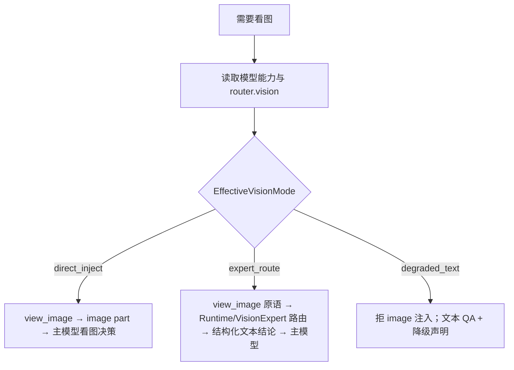

# 多模态输入与视觉能力设计

> 状态：设计规范（已吸收架构评审并收束关键决策）  
> 范围：消息多模态（用户图+工具图）、模型视觉能力鉴定、统一装配流水线、`view_image`、office-ppt 等视觉 QA  
> 相关：[`用户Turn输入与附件契约设计.md`](./用户Turn输入与附件契约设计.md)（产品面采集与文本点名）、[`参考项目工具清单与文件系统覆盖分析.md`](./参考项目工具清单与文件系统覆盖分析.md)、[`统一执行工作空间、文件权限与产物规范.md`](./统一执行工作空间、文件权限与产物规范.md)、[`2026-07-17-produced-resource-artifact-delivery-architecture.md`](./superpowers/specs/2026-07-17-produced-resource-artifact-delivery-architecture.md)、Skill/Tool 边界设计

---

## 1. 问题与目标

### 1.1 现状缺口

1. `read_file` 对 jpg/png 等二进制**省略 content**，模型拿不到像素。
2. `domain.Message` / eino 适配当前只有纯文本 `Content`，**无多模态 Parts**。
3. 远程 Skill cwd 中的预览图与宿主 `read_file` **命名空间隔离**；中间态故意不 Delivery 到项目根。
4. `QAPolicy=visual-qa/v1` 名实不符：匹配 SKILL QA 章节的 `run_skill_command` **命令成功**即记 `passed`（含 `markitdown`），**不验证是否看过图与通过逻辑断言**。
5. 配置已有 `llm.router.vision` 路由位，但**未接入**消息装配与工具门控；`LLMModelConfig` 有 `supports_tools`，**尚无**显式 `supports_image`。
6. 用户上传图片与工具看图（`view_image`）缺少统一的上下文 Parts 规范与首轮自动注入契约。

### 1.2 设计目标

- **统一两类输入**：用户上传图片与工具产生的图片统一走 `ContentPart` 流水线。
- **配置优先**鉴定视觉能力；运行时只做校验与硬门控降级，不做猜测探测。
- **工具面固定**：`view_image` 放在 `internal/capabilities/media`，为纯粹看图/取图原语；Skill 只负责出图与检查清单；子 Agent 仅作编排增强。
- **收束形态 B 唯一主路径**：工具保持原语，由 Runtime 统一走 `router.vision`，禁止在工具内部隐式裸调 LLM 或保留模糊双路径。
- **强化视觉 QA 判据**：无论形态 A 还是 B，视觉 QA passed 必须具备结构化 checklist 校验回执与断言。
- 视觉 QA 与 ProducedResource / leased session-file 对齐，不把 Skill cwd 全量 sync 回宿主。

### 1.3 非目标

- 不在 Engine 硬编码 LibreOffice / Poppler。
- 不把视觉能力做成 Skill 名当 Tool（禁止 `Skill(visual-qa)` 替代看图）。
- 不把 QA 缩略图自动 Delivery 到用户项目根。
- 不做「根据模型名字符串猜测是否支持视觉」的唯一真相源。
- 不在数据库中直接持久化原始 `image_bytes` 或大 base64 字符串。

---

## 2. 三种能力形态与唯一路径收束

在一次 Run 内，对**主 Agent 使用的 chat/tool_call 模型**与可选的 **vision 路由模型**求值，得到 `EffectiveVisionMode`：

| 形态 | 条件 | EffectiveVisionMode | 行为摘要 |
|------|------|---------------------|----------|
| **A. 主模型多模态** | 主模型 `supports_image=true` | `direct_inject` | `view_image` 把 image part 注入主 Loop；主模型直接看图决策 |
| **B. 主模型无视觉，有视觉模型** | 主模型 `supports_image=false`，且 `router.vision` 已配置且该模型 `supports_image=true` | `expert_route` | 不向主模型注入图；Runtime/Gateway 调视觉专家模型，**只把文本结论与分析**回写给主 Loop |
| **C. 主模型无视觉，也无视觉模型** | 主模型无图，且 vision 路由未配置 / 不可用 | `degraded_text` | 禁止向任何主会话注入图；视觉 QA **降级为文本/渲染证据**，并显式标记 incomplete/degraded |



### 2.1 形态 A：主模型多模态（默认体验）

- 对齐 Kode（`Read`→image block）与 Codex（`view_image`→`InputImage`）。
- 主 Loop **直接**接收多模态 tool result，可边看边改产物。
- `Task` 子 Agent「新鲜眼睛」为**可选二次评审编排**，不是唯一读图原语。

### 2.2 形态 B：收束为单一 Runtime/VisionExpert 路由路径

**严禁保留“产品可二选一”的双路径设计债**。

1. **`view_image` 职责保持纯粹**：它只是资源获取与校验原语（介质：`candidate_id` / path）。
2. **形态 B 运行逻辑**：
   - 当 `view_image` 被调用且全局属于 `expert_route` 时，`view_image` 不会将像素载荷返回给主 Agent。
   - `view_image` 会交由 Runtime 内置的 **`VisionExpert` 引擎组件**（带独立 Trace/Span 与 Usage 记账），使用配置的 `router.vision` 别名模型进行图片分析。
   - 工具最终返回给主 Agent 的结果为**纯文本结构化缺陷 JSON/Markdown**。
3. **不允许**在工具内直接隐式裸调外部 API，也不强制要求模型写 `Task(visual-review)`。`Task` 仅作为高隔离度二次审计的编排工具。

### 2.3 形态 C：完全无视觉能力（诚实降级）

必须诚实降级，禁止伪装「已视觉通过」：

| 策略 | 说明 | 何时用 |
|------|------|--------|
| **C1. 文本 QA only** | 仅 `markitdown` / grep 类内容检查；`visual-qa` 记为 `skipped` 或 `degraded`，附 reason=`vision_unavailable` | 默认 |
| **C2. 渲染证据 only** | 允许 `thumbnail.py` 成功作为「已生成预览图」的弱证据，**不得**记为 `visual-qa/v1` 的 `passed` | 需审计「渲染链路通」时 |
| **C3. 人工介入** | 审批/用户确认预览（产品 UI 展示图，模型不看） | Desktop/企业需要签字时 |
| **C4. Fail closed** | Profile/`QAPolicy` 声明 `visual_required=true` 时，无视觉能力则 Run **不能** completed | 强合规场景 |

形态 C 下：`view_image` 返回结构化错误 `vision_unavailable`；bridge 提示 Agent 改走文本 QA 或向用户说明无法自动视觉验收。

---

## 3. 能力如何鉴定：配置真相源与两级作用域

### 3.1 确定单一真相源：`supports_image`

在 `llm.models.<alias>` 增加与 `supports_tools` 同级的显式布尔字段：

```yaml
llm:
  models:
    main:
      provider: deepseek
      model: deepseek-v4-flash
      supports_tools: true
      supports_image: false          # 显式：主模型不看图
    vision-helper:
      provider: openai
      model: gpt-4.1
      supports_tools: true
      supports_image: true           # 显式：可看图
  router:
    default: main
    tool_call: main
    vision: vision-helper           # 可选；未配置则形态 C
```

- **统一字段**：使用 `supports_image: bool` 作为唯一真相源；不采用并行的 `modalities` 扩展列表，避免配置二义性与双重解析成本。
- **缺省规则**：`supports_image` 未写时默认 `false`（fail-safe）。内置能力表仅在配置文件字段缺失时提供 suggestion，日志标记 `source=builtin_hint`。

### 3.2 区分两级作用域：工具门控 vs Sanitizer 门控

必须严格区分两级的判定粒度：

1. **工具门控作用域（Run 级 / Session 级）**：
   - 根据主模型与 `router.vision` 计算得到 `EffectiveVisionMode`。
   - 决定 `view_image` 工具在主 Agent 面前的暴露状态与默认返回模式（A/B/C）。

2. **Sanitizer 门控作用域（Per-Request 级）**：
   - 必须作用于**每一次具体发送的 LLM HTTP 请求**的 `TargetModel`！
   - 无论是主模型、`router.vision` 专家模型、`summarization` 摘要模型还是子 Agent 模型，发送前一律走 `ImageSanitizer(targetModel.supports_image)`。
   - `targetModel.supports_image == false` 时，**硬性剥离**该请求中所有 `ContentPartImage` 载荷，替换为占位文本 `[image omitted: target model 'xxx' does not support image input]`。

---

## 4. 统一模型调用路径与消息数据规范

无论用户多模态输入还是工具看图，**只有一条装配流水线**：

```text
用户输入附件 / 工具 view_image 结果
  → domain.ContentPart (Text | ImageRef)
  → 解析 ImageRef (candidate_id / session-file / 本地 Backend)
  → 缩放与大小 budget 限制 (防爆上下文)
  → Per-Request ImageSanitizer (targetModel.supports_image)
  → Provider Adapter (eino / OpenAI SDK 等)
  → Chat/ToolCall
```

### 4.1 用户多模态输入与工具图的统一

- **统一 Parts 流水线**：用户通过 UI / CLI **显式附件**绑定的图片，首轮解析后封装为 `domain.ContentPart{Type: ContentPartImage, ImageRef: ...}` 追加在 Prompt Messages 中。
- 用户图与 `view_image` 图走完全相同的 `ImageSanitizer` 与并发/缩放 Budget，杜绝为用户上传开辟危险旁路。
- **产品面如何采集附件、文档如何分流、仅文本点名「描述下 111.png」如何处理**：见 [`用户Turn输入与附件契约设计.md`](./用户Turn输入与附件契约设计.md)。默认：未显式附件时**不**静默注入像素，由模型调用 `view_image`。

### 4.2 消息模型与持久化规范（`image_ref` vs `image_bytes`）

- `domain.Message` 从「单一 `Content string`」演进为持有一组 `Parts []ContentPart`。
- **持久化硬规则**：
  - 会话日志、数据库（Session/Message Store）与 Resume Snapshot 中，**严禁保存原始 `image_bytes` 或 Base64 巨型字符串**！
  - Message 持久化时仅保存 `ImageRef`（包含 `candidate_id` / `produced_resource_id` / `media_type` / `sha256`）。
  - 只有在向 LLM 组装物理 HTTP Body 请求的刹那，由 Adapter / Provider 动态打开 `ResourceReader` 调取字节。

### 4.3 Compact 策略与资源 Budget

1. **Compact / Truncate 图片剥离策略**：
   - 历史对话滑动窗口与上下文压缩（Compactor）时，图片载荷仅保留最近 **1~N 轮**（默认 N=2）活跃上下文。
   - 超出窗口的早期 `ContentPartImage` 自动降级为 `ContentPartText{Text: "[historical image ref: slide-1.jpg, omitted]"}`，避免多轮看图挤爆 Token 上下文。
2. **并发与配额 Budget（`ConcurrencySafe`）**：
   - 单轮 ToolCall 处理多张图片时，限制并行读图并发数（默认 max=3），防止突发流量打爆 vision 模型 Rate Limit。
   - 单图限制：分辨率超过 `2048x2048` 时自动下采样缩放；字节数上限默认 10MB。

---

## 5. `view_image` 工具契约与能力域归属

### 5.1 目录归属
固定归属于 **`internal/capabilities/media`**（媒体检查能力），只读调取 I/O 经由 `workspace.ResourceReaderRouter` / `SessionFileReader` / `PathResolver`。不得在 `filesystem` 与 `media` 之间摇摆。

### 5.2 工具契约

```json
{
  "candidate_id": "produced-01J...",
  "path": "slide-1.jpg",
  "detail": "high"
}
```

规则：
1. remote Skill QA 图：必须先登记为 **leased supporting ProducedResource**，用 `candidate_id` 读取。
2. 宿主 binding 内已有文件：可用 workspace-relative `path`（经 PathResolver + 审批）。
3. 禁止模型传宿主绝对路径或远程 `/workspace/...` 物理路径。

---

## 6. office-ppt / 视觉 QA 强化与证据闭环

### 6.1 Validator 枚举与证据分轨

废除过往“命令成功即 RecordPassed”的伪逻辑，明确定义以下三种独立 Validator 证据：

| Validator 枚举 | 获得途径 | 满足 `visual-qa/v1` passed？ | 记录位置 |
|---|---|---|---|
| `content-qa/v1` | `markitdown` / 文本 grep 类命令成功 | **否**（仅满足文本内容轨） | `QAEvidenceRecord` |
| `render-proof/v1` | `thumbnail.py` / `pdftoppm` 渲染成功 | **否**（仅证明渲染成功，记为 `render_ok`） | `QAEvidenceRecord` |
| `visual-qa/v1` | 满足硬性断言条件（见 6.2） | **是**（真视觉通过） | `QAEvidenceRecord` |

### 6.2 形态 A 与形态 B 的视觉 QAPassed 硬条件

无论是形态 A 还是形态 B，调用 `RecordPassed(visual-qa/v1)` **必须具备可校验的结构化 Checklist 回执与断言**，不能仅凭“调用过 `view_image`”：

1. **形态 A（主模型多模态）**：
   - 必须满足：`view_image` 成功调用 **+** 主模型产出包含格式化 QA Sign-off 结构的 Tool/Text 回执（如 `[VISUAL_CHECKLIST: layout=ok, contrast=ok, overflow=none]`）。
   - Harness / QA Gate 校验该断言字段完整且无 reject 标记后，方可记为 `visual-qa/v1=passed`。

2. **形态 B（视觉专家路由）**：
   - 必须满足：`VisionExpert` 专家模型返回结构化评审结果（`passed: true`，且缺陷列表为空）。

3. **形态 C（无视觉）**：
   - `QAEvidenceRecord` 写入 `status: degraded/skipped`，`failure_code: vision_unavailable`。
   - `CompletionPolicy` 根据 `on_unavailable` 策略（`degrade` 时允许完成但带 warning；`fail` 时阻断完成）做出决策。

### 6.3 leased 资源过期与重试闭环

当 `view_image` 或 QA 评估读取图片触发 `PRODUCED_RESOURCE_EXPIRED` 时：
1. 运行时捕捉该稳定错误码。
2. 若沙箱 Lease 已失效且不可续租，Bridge/Runtime 拦截并引导 Agent 重新触发一次轻量渲染命令（如 `thumbnail.py`），生成新的 leased `candidate_id` 自动替换后重试。

---

## 7. 参考项目对照（决策依据）

| 点 | Kode-CLI | Codex | Genesis 采纳 |
|----|----------|-------|--------------|
| 看图原语 | `Read` 返回 image block | 专用 `view_image` | **专用 `view_image`**（归属 `media` 能力域） |
| 主 Loop 多模态 | 是 | 是 | 形态 A |
| 独立视觉模型 | 无主路径 | 无主路径 | **形态 B（收束为 Runtime/VisionExpert 单一主路径）** |
| 视觉 QA 判据 | 无硬判据 | 无硬判据 | **必须具备 Checklist 结构化回执与 Validator 校验** |
| 无多模态门控 | 较弱 | 硬拒 + strip | **`supports_image` 配置 + Per-Request Sanitizer** |

---

## 8. 落地阶段

1. **Phase 1: 配置与能力求解**
   - 补充 `LLMModelConfig.SupportsImage` 字段与解析逻辑；计算 `EffectiveVisionMode`。
2. **Phase 2: domain.Message 演进与 Sanitizer**
   - 升级 `domain.Message` 支持 `Parts`，实现 Message 持久化只留 `image_ref` 的剥离逻辑与 Per-Request `ImageSanitizer`。
3. **Phase 3: `view_image` 工具与 VisionExpert 组件**
   - 在 `internal/capabilities/media` 实现 `view_image`；在 Runtime 实现 `VisionExpert` 专家路由引擎。
4. **Phase 4: Harness / office-ppt 证据分轨与 Completion 闭环**
   - 接入 Validator 枚举（`content-qa/v1` / `render-proof/v1` / `visual-qa/v1`），补齐结构化 Checklist 校验断言与过期自动重试。

---

## 9. 验收标准

1. `supports_image=false` 的模型 HTTP 请求中**永不**残留未剥离的 image part 字节。
2. 数据库与 Message 持久化存储中**永不**包含原始 Base64 或 `image_bytes`。
3. 形态 B 下 `view_image` 只做原语，统一经由 `VisionExpert` 路由并产出纯文本分析，Trace 与 Token 记账完整。
4. 形态 A/B 的 `visual-qa/v1` passed 均有可校验的 Checklist 结构化断言回执；未看过图或无断言绝不放行 passed。
5. 用户项目根只出现正式 Deliverable（pptx），无一堆 QA jpg。
