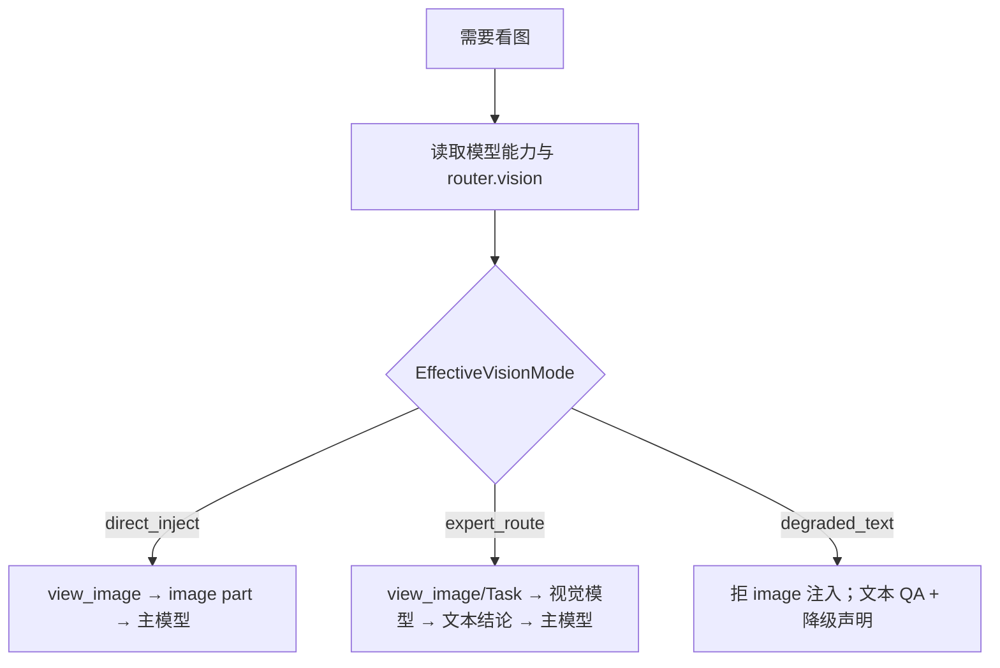

# 多模态输入与视觉能力设计

> 状态：设计稿（实现以前本文为准）  
> 范围：消息多模态、模型视觉能力鉴定、统一调用路径、`view_image`、office-ppt 等视觉 QA  
> 相关：[`参考项目工具清单与文件系统覆盖分析.md`](./参考项目工具清单与文件系统覆盖分析.md)、[`统一执行工作空间、文件权限与产物规范.md`](./统一执行工作空间、文件权限与产物规范.md)、[`2026-07-17-produced-resource-artifact-delivery-architecture.md`](./superpowers/specs/2026-07-17-produced-resource-artifact-delivery-architecture.md)、Skill/Tool 边界设计

---

## 1. 问题与目标

### 1.1 现状缺口

1. `read_file` 对 jpg/png 等二进制**省略 content**，模型拿不到像素。
2. `domain.Message` / eino 适配当前只有纯文本 `Content`，**无 image content parts**。
3. 远程 Skill cwd 中的预览图与宿主 `read_file` **命名空间隔离**；中间态故意不 Delivery 到项目根。
4. `QAPolicy=visual-qa/v1` 名实不符：匹配 SKILL QA 章节的 `run_skill_command` **命令成功**即记 `passed`（含 `markitdown`），**不验证是否看过图**。
5. 配置已有 `llm.router.vision` 路由位，但**未接入**消息装配与工具门控；`LLMModelConfig` 有 `supports_tools`，**尚无**显式 `supports_image`。

### 1.2 设计目标

- 统一三种部署形态下的行为，避免「有时硬塞图、有时静默失败」。
- **配置优先**鉴定视觉能力；运行时只做校验与降级，不做猜测探测。
- 工具面固定：`view_image` 为看图原语；Skill 只负责出图与检查清单；子 Agent 仅作编排增强。
- 视觉 QA 与 ProducedResource / leased session-file 对齐，不把 Skill cwd 全量 sync 回宿主。

### 1.3 非目标

- 不在 Engine 硬编码 LibreOffice / Poppler。
- 不把视觉能力做成 Skill 名当 Tool（禁止 `Skill(visual-qa)` 替代看图）。
- 不把 QA 缩略图自动 Delivery 到用户项目根。
- 不做「根据模型名字符串猜测是否支持视觉」的唯一真相源（仅可作配置缺省时的弱提示）。

---

## 2. 三种能力形态

在一次 Run 内，对**主 Agent 使用的 chat/tool_call 模型**与可选的 **vision 路由模型**求值，得到 `EffectiveVisionMode`：

| 形态 | 条件 | EffectiveVisionMode | 行为摘要 |
|------|------|---------------------|----------|
| **A. 主模型多模态** | 主模型 `supports_image=true` | `direct_inject` | `view_image` 把 image part 注入主 Loop；主模型直接看图决策 |
| **B. 主模型无视觉，有视觉模型** | 主模型 `supports_image=false`，且 `router.vision`（或等价）已配置且该模型 `supports_image=true` | `expert_route` | 不向主模型注入图；`view_image` 或 `Task` 调视觉模型，**只把文本结论**回主 Loop |
| **C. 主模型无视觉，也无视觉模型** | 主模型无图，且 vision 路由未配置 / 不可用 | `degraded_text` | 禁止向任何主会话注入图；视觉 QA **降级为文本/渲染证据**，并显式标记 incomplete/degraded |



### 2.1 形态 A：主模型多模态（默认最佳体验）

- 对齐 Kode（`Read`→image block）与 Codex（`view_image`→`InputImage`）。
- 主 Loop **直接**接收多模态 tool result，可边看边改产物。
- `Task` 子 Agent「新鲜眼睛」为**可选二次评审**，不是读图原语。

### 2.2 形态 B：独立视觉模型

- 主会话始终文本；发送前 **strip** 一切 image part（学 Codex）。
- 推荐编排：`Task(agent=visual-review, model=<vision alias>)`，子 Agent 内 `view_image` + 固定清单 prompt，返回结构化缺陷 JSON/Markdown。
- 也可由 `view_image` 工具在检测到 `expert_route` 时**内部**调用 vision 路由，把结论写成纯文本 tool result（延迟更低，但工具职责略重）。产品可二选一，默认倾向 **Task 编排更清晰**。

### 2.3 形态 C：完全无视觉能力

必须诚实降级，禁止伪装「已视觉通过」：

| 策略 | 说明 | 何时用 |
|------|------|--------|
| **C1. 文本 QA only** | 仅 `markitdown` / grep 类内容检查；`visual-qa` 记为 `skipped` 或 `degraded`，附 reason=`vision_unavailable` | 默认 |
| **C2. 渲染证据 only** | 允许 `thumbnail.py` 成功作为「已生成预览图」的弱证据，**不得**记为 `visual-qa/v1` 的 `passed` | 需审计「渲染链路通」时 |
| **C3. 人工介入** | 审批/用户确认预览（产品 UI 展示图，模型不看） | Desktop/企业需要签字时 |
| **C4. Fail closed** | Profile/`QAPolicy` 声明 `visual_required=true` 时，无视觉能力则 Run **不能** completed | 强合规场景 |

形态 C 下：`view_image` 返回结构化错误 `vision_unavailable`；bridge 提示 Agent 改走文本 QA 或向用户说明无法自动视觉验收。

---

## 3. 能力如何鉴定：配置优先

### 3.1 原则

**主配置能看，代码不猜。**  
运行时以配置声明的模态为准；可选本地能力表仅作「未配置时的建议默认」，不得覆盖显式配置。

### 3.2 模型级声明（推荐新增）

在 `llm.models.<alias>` 增加与 `supports_tools` 同级的显式字段，例如：

```yaml
llm:
  models:
    main:
      provider: deepseek
      model: deepseek-v4-flash
      supports_tools: true
      supports_image: false          # 显式：主模型不看图
    vision-helper:
      provider: openai
      model: gpt-4.1
      supports_tools: true
      supports_image: true           # 显式：可看图
  router:
    default: main
    tool_call: main
    vision: vision-helper           # 可选；未配置则形态 C
```

语义：

| 字段 | 含义 |
|------|------|
| `supports_image` | 该别名对应的 API 调用**允许**携带 image input |
| `router.vision` | 专家视觉路由别名；空 = 无独立视觉模型 |
| （可选）`modalities: [text, image]` | 与 `supports_image` 等价的扩展写法；实现时二选一，避免双源 |

解析规则（Run / 会话装配时一次算清，写入 Run manifest 或 LLM session 元数据）：

```text
main = router.tool_call || router.default
vision = router.vision   # 可空

if main.supports_image:
    mode = direct_inject
else if vision != "" && resolve(vision).supports_image:
    mode = expert_route
else:
    mode = degraded_text
```

### 3.3 缺省与校验

1. **`supports_image` 未写**：默认 `false`（fail-safe，避免向不支持的 API 塞图导致整轮失败）。
2. **配置为 true 但 Provider 实际拒图**：调用失败时映射为 `provider_image_unsupported`，建议用户改配置；可选自动降级到 `expert_route`/`degraded_text` 一次并打 warning（产品策略开关）。
3. **禁止**仅凭模型名子串（如含 `vision`/`gpt-4o`）作为唯一判定；若提供内置能力表，只能在「字段缺失」时填充建议值，且日志标明 `source=builtin_hint`。
4. Profile / AgentApp 可覆盖：例如某 Agent `require_vision: true` → 形态 C 时直接拒绝启动或拒绝带视觉 QA 的任务。

### 3.4 工具可见性与门控

| EffectiveVisionMode | `view_image` 是否对主 Agent 可见 | 调用行为 |
|---------------------|----------------------------------|----------|
| `direct_inject` | 是 | 返回 image part 给主模型 |
| `expert_route` | 是（或仅暴露 `Task` 委派） | 不向主模型回灌图；返回文本结论或委派说明 |
| `degraded_text` | 可隐藏，或可见但调用即 `vision_unavailable` | 引导文本 QA / 人工 |

发送任何 LLM 请求前统一走 **ImageSanitizer**：

- 目标模型 `supports_image=false` → 剥离全部 image part，替换为短占位文本（如 `[image omitted: model does not support image input]`），与 Codex strip 同思路。
- 目标模型 `supports_image=true` → 保留并按 Provider 编码（OpenAI `image_url` / Anthropic `image` 等）。

---

## 4. 统一模型调用路径

无论形态 A/B/C，**只有一条装配流水线**，差异只在 Sanitizer 与路由：

```text
工具/用户输入
  → ContentParts[]（text | image_ref | image_bytes）
  → 解析 image_ref（candidate_id / session-file / 本地 Backend）
  → 缩放与大小限制（防爆上下文）
  → ImageSanitizer(targetModel.supports_image)
  → Provider Adapter（eino / 各家 API）
  → Chat/ToolCall
```

### 4.1 消息模型（目标）

- `domain.Message` 从「单一 `Content string`」演进为可携带 `Parts []ContentPart`（或等价结构）。
- 文本工具结果仍可只填 text part；`view_image` 在 `direct_inject` 下追加 image part。
- Compact / Micro-compact 必须感知 image part：可丢弃旧图、保留摘要文本，避免无限堆积预览图。

### 4.2 与现有 router 的关系

| 路由 | 用途 |
|------|------|
| `default` / `tool_call` / `chat` / `coding`… | 主 Loop 推理 |
| `vision` | 形态 B 的专家看图；也可给 visual-review 子 Agent 默认模型 |
| `summarization` 等 | 与视觉无关；若摘要模型不支持图，Sanitizer 自动剥图 |

子 Agent（`Task`）可指定独立模型别名；其子会话单独计算 `EffectiveVisionMode`，互不污染主会话。

### 4.3 错误码（建议）

| 码 | 含义 |
|----|------|
| `vision_unavailable` | 形态 C，或 vision 路由不可用 |
| `image_input_stripped` | 已剥图并继续（warning） |
| `image_too_large` | 超过限制，需缩小或改候选 |
| `produced_resource_expired` | leased QA 图 session 过期 |
| `provider_image_unsupported` | 配置声称支持但 Provider 拒绝 |

---

## 5. `view_image` 工具契约

对齐 Codex 专用工具；**不**把看图塞进 `read_file`（`read_file` 继续只服务文本）。

### 5.1 入参（目标）

优先资源身份，其次本地相对路径：

```json
{
  "candidate_id": "produced-...",
  "path": "slide-1.jpg",
  "detail": "high"
}
```

规则：

1. remote Skill QA 图：必须先登记为 **leased supporting ProducedResource**，用 `candidate_id` 读取（SessionFileReader）。
2. 宿主 binding 内已有文件：可用 workspace-relative `path`（经 PathResolver + 审批）。
3. 禁止模型传宿主绝对路径或远程 `/workspace/...` 物理路径。

### 5.2 出参（随 EffectiveVisionMode）

| 模式 | Tool Result |
|------|-------------|
| `direct_inject` | multimodal：简短文本元数据 + image part |
| `expert_route` | **纯文本**结构化评审（或「已委派 Task id=…」） |
| `degraded_text` | error=`vision_unavailable` + 下一步建议（文本 QA / 人工） |

### 5.3 与文件系统边界

- 实现放在 media inspection 能力（或 filesystem 旁路的只读 media 工具），I/O 仍经 Backend / SessionFileReader / PathResolver。
- 不引入「Skill cwd 全量 sync」。

---

## 6. office-ppt / 视觉 QA 端到端

### 6.1 职责拆分

| 角色 | 职责 |
|------|------|
| **Skill `office-ppt`** | 可移植流程：生成 pptx、`thumbnail.py` / soffice+pdftoppm、内容 QA（markitdown）、检查清单文案 |
| **Harness** | stage 输入、远程执行、登记 pptx Deliverable + QA 图 leased ProducedResource、Publish/Delivery |
| **`view_image`** | 把 QA 图变成「模型可消费」的输入（图或文本结论） |
| **QAPolicy / Completion** | 按形态记账；禁止伪视觉 passed |
| **React bridge** | 引导：remote 下勿 `read_file` jpg；应 `view_image(candidate_id=…)` |

### 6.2 目标流程

```text
1. Skill 注入 office-ppt
2. write_file 脚本 + run_skill_command 生成 pptx
   → 匹配 Deliverable → Publish → Delivery（用户可见）
3. run_skill_command: thumbnail.py / pdftoppm
   → 生成 thumbnails.jpg / slide-*.jpg（留在 Skill cwd）
   → Harness 登记为 leased supporting 资源，投影 candidate_id
4. 视觉检查：
   A: view_image(candidate_id) → 主模型看图 → 按清单修改 → 必要时再渲染
   B: Task(visual-review) 或 view_image 专家路由 → 文本缺陷列表 → 主模型改稿
   C: 跳过真视觉；仅内容 QA；ledger 标记 visual degraded/skipped
5. Completion：
   - content QA 与 visual QA 分轨记账（见 6.3）
   - visual_required 且形态 C → 不得 completed（或产品允许 degraded complete）
```

### 6.3 QA 证据分轨（纠正伪视觉）

| Evidence 类型 | 如何获得 | 可否满足 `visual-qa/v1` passed |
|---------------|----------|--------------------------------|
| Content QA | `markitdown` / 文本 grep 类命令成功 | **否**（只满足 content 轨） |
| Render proof | thumbnail/pdftoppm 成功 | **否**（仅证明渲染；可记 `render_ok`） |
| Visual QA（真） | 形态 A：至少一次成功 `view_image` 且模型后续未以「无法看图」失败；或形态 B：视觉专家返回可解析结论 | **是** |
| Visual skipped | 形态 C | `skipped`/`degraded`，附 `vision_unavailable` |

`RecordPassed` 不得再因「任意 QA 章节命令成功」一刀切写 `visual-qa/v1=passed`。

### 6.4 远程路径误解（说明）

预览图在远程容器生成，只说明**执行面**有文件。LLM 看见图片还需要：

1. 控制面登记可读 locator（leased ProducedResource）；
2. `view_image` 拉取字节；
3. 按 `EffectiveVisionMode` 注入主模型或专家模型。

宿主 `read_file("slide-1.jpg")` 解析到的是**另一套 binding 工作区**，且即便文件在宿主也会因二进制门禁省略 content——因此不是视觉 QA 通道。

---

## 7. 参考项目对照（决策依据）

| 点 | Kode-CLI | Codex | Genesis 采纳 |
|----|----------|-------|--------------|
| 看图原语 | `Read` 返回 image block | 专用 `view_image` | **专用 `view_image`**（与现有文档缺口、语义清晰） |
| 主 Loop 多模态 | 是 | 是 | 形态 A |
| 独立视觉模型 | 无主路径 | 无主路径 | 形态 B 用 router.vision + Task/工具路由扩展 |
| 无多模态门控 | 较弱 | 硬拒 + strip | **配置 + Sanitizer 硬门控** |
| Office 视觉 QA | 核心无 | 核心无（在 anthropics-skills） | Skill 出图 + Runtime 看图 + 证据分轨 |

---

## 8. 配置与 Profile 示例

### 8.1 形态 A

```yaml
llm:
  models:
    main:
      supports_image: true
  router:
    default: main
    tool_call: main
```

### 8.2 形态 B

```yaml
llm:
  models:
    main:
      supports_image: false
    vision-helper:
      supports_image: true
  router:
    default: main
    tool_call: main
    vision: vision-helper
```

### 8.3 形态 C

```yaml
llm:
  models:
    main:
      supports_image: false
  router:
    default: main
    tool_call: main
    # 不配置 vision
```

可选 Agent/Profile：

```yaml
vision_policy:
  mode: auto              # auto | require | disable
  on_unavailable: degrade # degrade | fail | human
```

---

## 9. 落地阶段（实现时拆分）

1. **模型能力字段 + EffectiveVisionMode 解析**（含 Run 可观测元数据）。
2. **消息 Parts + eino/Provider 适配 + ImageSanitizer**。
3. **`view_image` 工具**（candidate_id / 本地 path；三模式出参）。
4. **Harness：QA 图登记为 leased supporting ProducedResource**。
5. **office-ppt bridge + QA 证据分轨**（废除伪 visual passed）。
6. **形态 B：vision 路由 / Task visual-review**。
7. **形态 C：degrade/fail/human 策略与 Completion 门禁**。

目录侧（输入 CAS 去重等）与本文正交，见工作空间/产物相关计划与规范，不在本文展开。

---

## 10. 验收标准

1. 同一套 `view_image` + 装配流水线，在 A/B/C 三种配置下行为可预测且可测。
2. `supports_image=false` 的模型请求中**永不**残留未剥离的 image part。
3. remote office-ppt：预览图经 `candidate_id` 可读；宿主 `read_file` 不再是视觉路径。
4. ledger：`markitdown` 成功 ≠ `visual-qa/v1` passed；形态 C 为 skipped/degraded 或 fail closed。
5. 用户项目根只出现正式 Deliverable（pptx），无一堆 QA jpg。
